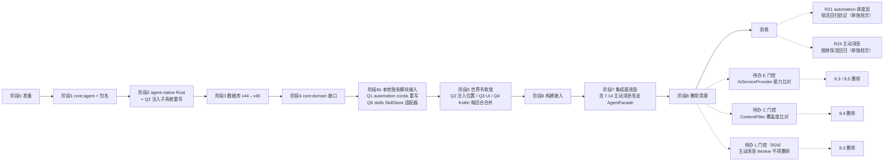

# Agent 架构迁移计划（master → yunian）

> 目标：把远程 `master`（`com.lianyu.ai` / 恋语）基于 **Rust + cordis + UniFFI** 的 Agent 架构，
> 融合进本地 `linzihan`（`com.yunian.ai` / 予念），**保留本地包名、世界书 UI 之外的 UI、本地独有模块**，
> 同时让 Agent 决策层整体下沉到 Rust。
>
> 参考基线：`_ref_master/`（`git worktree add _ref_master origin/master`，HEAD `3c9327c3`）

---

## 1. 决策记录（已与需求方确认）

| 编号 | 议题 | 决策 |
|---|---|---|
| D1 | 数据库 | **允许一次性 schema 冻结例外**：在本地 v44 上新增 9 张 agent 表（纯增量，`CREATE TABLE IF NOT EXISTS`，不动任何现有表/列/索引），并在 `docs/database-schema-freeze.md` 记录例外条款 |
| D2 | 世界书 | **以 master 为准**。保留 master 的 `worldbooks` 表 + `WorldbookEntity` + Rust `lorebook.rs` 注入；把本地「世界树语义」（结构化条目 + 注入位置/深度/优先级/角色/正则/扫描深度等）**迁移映射进 SillyTavern World Info JSON**。冲突按 master 标准 |
| D3 | 工具确认门控 | **采用 master 的 `approveTool` / `rejectTool` + `confirm_pending`**，确认状态收敛进 Rust；本地 `ToolConfirmationRequest` 退化为 UI 承载层 |
| D4 | `feature:localmodel` | **按 master 严格删除**（死代码）。连同其 domain 接口 `LocalModelProvider` / `ModelState` / `ModelInfo` 一并清理 |
| D5 | 本轮范围 | 先产出本文档供审阅；确认后再分阶段改代码 |
| **Q1** | 本地独有模块 `automation` / `mcp` / `skills` | **全部保留**。三者均为 `ToolRegistry.register(...)` 注册的标准 `AiTool`，master 的 `core:domain` 完整保留 `ToolRegistry` + `AiTool` 契约 → **零冲突接入**。原则：**决策层下沉 Rust，副作用层（Android 能力）留在 Kotlin**（详见 §1.1） |
| **Q2** | 世界书注入位置 / `role` 丢失（R12/R15） | **改 Rust，一轮完成**。⚠️ **修正：这是「注入子系统重写」而非「加插桩点」**。实证：`agent.rs:1086-1096` 世界书注入**只读 `f.content`、丢弃 `f.layer`**；`PromptFragment` 无 `role` 字段；所有片段拼成**同一个 `system_prompt` 字符串**；`prompt_orchestrator.rs` 中 **`lorebook` 零引用**（世界书不经 orchestrator）→ `layer_for()` 在真实路径上是**死代码**。故 5 位置保真必须：① `PromptFragment` 增 `role`（改 UniFFI `Record` → 重生成绑定）；② **注入从 `sys` 字符串挪进 `messages[]`**（`top_of_chat` / `bottom_of_chat` / `at_depth` 是消息流位置，塞进单一 system 字符串**物理上无法表达**）；③ `agent.rs` 消息组装阶段插桩。详见 §5.2 |
| **Q3** | 世界书 UI | **保留本地结构化编辑器**（`WorldbookScreens.kt`），仅把其**数据层**改为读写 master 的 `worldbooks` 表（ST JSON）。不采用 master 的 `WorldbookScreen.kt` |
| **Q4** | 伴侣级绑定全局书（R18） | **★ Kotlin 侧合并（已修正，不改 Rust）**。依据：`ChatGenerationManager.kt:271` **每回合**都调 `repo.syncActiveToRuntime(companionId)`，而 `AgentFacade.setWorldbook` 是**幂等覆盖写** → 「单槽」不构成限制。做法：把本地 `getEnabledEntriesForCompanion` 的合并语义搬进 `syncActiveToRuntime`，**每回合实时合成单本 ST JSON** 再 `setWorldbook`。**零 Rust 改动**；**顺带消灭快照问题**（全局书改动下一回合立即生效）。详见 §5.3b |
| **Q5** | 主动消息（master 已删除且无替代） | **保留本地完整实现**，内部生成改走 `AgentFacade`。⚠️ master `feature/notification/` **仅 2 文件**，**无 `CompanionMessageWorker.kt`**；`CompanionKeepAliveService.kt:37` 原话「主动消息能力本期下线（**后续由 Rust 侧 proactive 替代**）」，但 `agent-native/**` 中 `proactive` **零命中** → 替代品仍是 TODO。本地实现是唯一可用者，且位于 AGENTS.md 保活红线。详见 §1.4 |
| **Q6** | skills 双体系收敛 | **保留本地存储 + 技能市场**，为其编写 `SkillStore` 适配器桥接到 Rust `SkillSelector`；工具统一为 **`load_skill`**，**废弃 `use_skill`**（防模型双调 + 提示词污染）。详见 §1.5 |

### 1.1 架构原则：为什么工具层不下沉 Rust（Q1 依据）

> 需求方曾提出疑问：「工具层都面向 Agent，新架构已下沉到 Native Rust，Kotlin 层工具还要下发到 Rust 被调用，岂不更麻烦？」
> 答案：**方向是反的 —— Rust 不"下沉"工具，而是回调向上让 Kotlin 执行。**

master 的实际设计（`core/agent/.../host/AgentToolHost.kt` 文档注释原文）：

> 职责边界（对齐「决策在 Rust、Kotlin 纯 IO」原则）：
> - 会话级工具（`request.tools` 传入的）经本回调执行，`contextJson` 含 `{companion_id, group_id, recent_history_summary}`
> - 其余会话工具：查 **`ToolRegistry`（feature 层注册的全局领域工具）分派执行**

关键澄清：`uniffi/lianyu_agent.kt:2522` 注释「持有全局工具注册表（`register_global_tools` 替代 KT `ToolRegistry`）」**是镜像，不是替换**。配套 `AgentFacade.kt:264` 说明真相：

> Kotlin 侧启动时把现有 `ToolRegistry` 的工具转成 `ToolDefinition` 注册

即 Rust 那份注册表**只存「工具名 + 参数 Schema + 描述」**，用途是喂 LLM 提示词（让模型知道可调哪些工具）；**真正的执行必然回调 Kotlin** —— `feature:skills` 要调无障碍服务 / Shizuku / 剪贴板，这些 Android 能力 Rust 里根本不存在。

**分层职责**：

| 层 | 职责 | 位置 | 频率 |
|---|---|---|---|
| **决策层** | 该调哪个工具、何时调、参数怎么填、多轮如何收敛 | **Rust** | 高频（LLM 每轮） |
| **副作用层** | 真去点屏幕 / 读数据库 / 发 HTTP | **Kotlin** | 低频（每回合 0–3 次） |

下沉低频的副作用层零性能收益，却要把 Android API 全量 JNI 封装 —— **那才是"更麻烦"**。性能敏感的工具筛选/排序/依赖决策**已在 Rust**。

**由此得出的模块处置**（全部零冲突）：

| 模块 | 构成 | 处置 | 工作量 |
|---|---|---|---|
| `feature:skills` | 11 文件：无障碍 / Shizuku / 设备 / 技能市场 | **工具注册零改动**；但**技能本体需收敛**（§1.5 Q6） | 19 个工具照旧 + 新增 `SkillStoreAdapter` |
| `feature:mcp` | 5 文件：SSE + StreamableHTTP 双传输 | **零改动**直接可用 | 同上 |
| `feature:automation` | 16 文件：定时器 + 工作流引擎 + UI | **工具层按 cordis 重写**（见 §4 阶段 4b） | 包成 `AutomationPlugin` + 2 处改接 |

**master 已有现成范例**：`feature/coffee/.../LuckinCoffeeTools.kt:229` 的 `CoffeePlugin`，其注释写明「**迁移自** `LuckinCoffeeTools.registerAll`」—— 即 master 自己就做过「工具集 → cordis 插件」的改造，`feature:automation` 照此办理即可。

**新增编号约定**：本文档中 `D*` = 需求方决策；`Q*` = 本轮边界问答决策；`T*` = 高风险项；`R*` = 风险登记册条目；`待办 A–K` = 实现前须收口项。

### 1.2 连带确认（由 D4 推导，需知悉）

master 把**整条对话链路与内容安全链路**下沉到 Rust，因此以下本地文件在 master 中**不存在**：

| 本地文件 | master 中的替代 |
|---|---|
| `core/network/.../AiService.kt` | Rust `agent-native/src/native_gateway.rs`（直读 `api_configs` 表 + 各 provider 协议） |
| `core/common/.../ContentFilter.kt` | Rust `native_gateway.rs` 内建输入/输出安全过滤 |
| `core/common/.../BanManager.kt` | Rust 内建封禁检查（`DialogueCoordinator` 文档提及「封禁检查」） |
| `core/common/safety/BayesianClassifier.kt` | Rust `native_gateway.rs`（贝叶斯分类） |
| `feature/chat/.../AiToolLoopRunner.kt` | Rust 工具循环（`AgentFacade.runTurn` 内含 round budget / 工具失败状态） |
| `feature:localmodel/**` | 统一走 Rust 网关的模型路由 |

> ⚠️ **高风险项（T1）**：master 的迁移 `MIGRATION_39_40` **直接 `DROP TABLE` 了封禁关键字相关两张表**，
> 且本地 `ContentFilter` 被 AGENTS.md 标注为「安全基线」。删除本地安全体系是**不可逆的能力削减**。
> 本文档按 D4 执行删除，但保留 `ContentFilter` 的**正则模式清单**入库为 `docs/safety-patterns-legacy.md`，
> 供 Rust 侧比对覆盖度（若 Rust 覆盖不足，须追加补丁后再删）。

### 1.3 ⚠️ 修正：`AiServiceProvider` 的实际引用面（原文档严重低估）
执行本计划前**必须**知道：`AiServiceProvider` 被 **23 个文件**引用（非原文档所称「仅 `coffee` / `automation`」）：

| 类别 | 文件 | 迁移处置 |
|---|---|---|
| **app 层** | `YuNianApplication.kt:502`（注册）、`wechat/WeChatDialoguePortImpl.kt:35` | 改注册 `AgentDialogueCoordinator`；Port 改走 `DialogueCoordinator.generateReply` |
| **主链（阶段 7 改造）** | `chat/{ChatGenerationManager:122, ChatViewModel:73, AiResponseFinalizer:45, AiToolLoopRunner:81, ChatFollowUpTrigger:61}` | 全部改走 `AgentFacade.runTurn`；`AiResponseFinalizer` / `AiToolLoopRunner` / `ChatFollowUpTrigger` 随 Rust 接管后**删除** |
| **groupchat** | `GroupChatViewModel:71`（`sendMessageWithCustomSystem`）、`mention/MentionEnhancer.kt:20,56` | ViewModel 改走 `AgentFacade`；`MentionEnhancer` 需确认是否仍需 LLM 扩写 |
| **notification** | `AiReplyWorker:35`、`CompanionMessageWorker:73`（`shouldProactivelyMessage` / `generateProactiveMessage` / `generateFollowUpReminder`） | Worker 改走 `AgentFacade.runTurn`；主动消息三方法**在 master 中不存在**（R24）→ **必须保留本地实现**，仅把内部 LLM 生成改走 `AgentFacade`（§1.4） |
| **qqbot** | `QQBotChatBridge:47` | 改走 `DialogueCoordinator.generateReply` |
| **companion** | `CreateCompanionViewModel:75` | 确认用途（可能是人设生成） |
| **settings** | `SettingsViewModel:34` | 改读 `api_configs` + Agent 配置 |
| **automation（Q1 保留）** | `AutomationExecutor:48`、`WorkflowEngine:21` | 改走 `DialogueCoordinator` / `AgentFacade`（阶段 4b） |
| **测试** | ~~`AiToolLoopRunnerConfirmationTest`、`AiToolLoopRunnerRoundBudgetTest`、`AiToolLoopRunnerToolFailureStatusTest`~~ | ✅ **已处理（`27537c30`）**：三者全删（`ConfirmationGate` 已无调用方）；确认门控测试改由 Agent 路径的 `approveTool`/`rejectTool` 承担 |

> ✅ **待办 E 已收口**（`91355f11`，详见文末「阶段 8 实况复核」）：
> `shouldProactivelyMessage` / `generateProactiveMessage` / `generateFollowUpReminder` 三个方法在 master 中
> **根本不存在** → **必须保留本地实现**；`sendMessageWithCustomSystem` 经全仓普查**零调用方** →
> 连同 `streamMessage` 一并删除。`AiServiceProvider` **接口本体保留**（已删的只是两个无调用方的方法）。
> `coffee` 模块**不依赖** `AiServiceProvider`（已 grep 验证为空）。

### 1.4 ⚠️ 主动消息：master 删除了能力但替代品未实现（Q5 依据）

本节结论来自对 `_ref_master/feature/notification/` 的**目录级核查**：

| 事实 | 证据 |
|---|---|
| master `feature/notification/` **仅 2 个文件** | `AiReplyWorker.kt`、`CompanionKeepAliveService.kt` —— **无 `CompanionMessageWorker.kt`** |
| master 自述已下线该能力 | `CompanionKeepAliveService.kt:37`：「主动消息能力本期下线（**后续由 Rust 侧 proactive 替代**），不再调度 `CompanionMessageWorker`」 |
| **替代品不存在** | `agent-native/**` 中 `proactive` **零命中**；全仓库仅剩 Kotlin 侧常量与策略文本：`ChatConstants.kt`（`PROACTIVE_*` 阈值）、`SecurePromptVault.proactiveRules()`、`WeChatProactiveSync`（**出站队列**，非生成/调度） |

**本地实现是完整的**（`CompanionMessageWorker` 含 `shouldProactivelyMessage` / `generateProactiveMessage` / `generateFollowUpReminder` 三方法），且位于 AGENTS.md《冲突预审》的**保活链路红线**上。

> **推论**：master 的「待办 E 四方法」中有 3 个（`shouldProactivelyMessage` / `generateProactiveMessage` / `generateFollowUpReminder`）
> **不能删** —— 删了就彻底失去主动消息能力（用户可见的功能退化）。仅 `sendMessageWithCustomSystem`（群聊）有可能被 Rust 覆盖。

**Q5 决策**：保留本地 `CompanionMessageWorker` 整体，但把内部 **LLM 生成**改走 `AgentFacade`
（三方法中「生成」的部分改调 `AgentFacade.runTurn` 或新增 proactive 入口；「判定/调度」部分保持本地）。
→ `AiServiceProvider` 的**对应方法**可随之删除，但 `AiServiceProvider` 整体删除仍受其余引用者约束（§1.3）。

### 1.5 ⚠️ skills 双体系：功能重叠、机制互斥（Q6 依据）

本地与 master 存在**两套完全不同**的技能体系：

| | 本地 `feature:skills` | master `core:agent/skill` |
|---|---|---|
| 接口 | `SkillManager`（`core:domain`） | `SkillStore`（UniFFI callback） |
| 存储 | `assets/skills/*.md` + `filesDir/external_skills/` | Room `agent_skills` 表 + `filesDir/agent_skills/<id>/content.md`（SHA-256 校验） |
| 格式 | Markdown + frontmatter | `AgentSkillEntity` 行 |
| 工具名 | `use_skill`（走 `ToolRegistry`，受 `useTools` 门控） | `load_skill`（`AgentToolHost` 特判，**无条件可用**） |
| 选择 | 无（模型自行决定） | Rust `SkillSelector` 做 L1 目录 / L2 正文**渐进式披露** |
| 额外能力 | **技能市场**（`SkillHubClient` 联网搜索/安装/卸载） | 无 |

> ⚠️ **风险**：两者并存时模型可能**同时调用** `use_skill` 与 `load_skill` → 重复加载同一技能正文 + 提示词污染 + token 浪费。

**Q6 决策**：保留本地存储与市场能力，为其编写 `SkillStore` 适配器（把 `SkillManager` 的 Markdown 资产转成 Rust `SkillMeta` JSON 数组 + `getSkillContent` 回调），
使 Rust `SkillSelector` 能在本地资产上做渐进式披露；工具统一为 **`load_skill`**，**废弃 `use_skill`**。

| # | 动作 |
|---|---|
| e1 | 新建 `SkillStoreAdapter : SkillStore`，桥接本地 `SkillManager` → Rust 期望的 `SkillMeta` JSON（字段见 `SkillStoreImpl.toMetaJson`：`skill_id`/`name`/`description`/`category`/`tags`/`tools`/`enabled`/`companion_id`/`version`/`updated_at`） |
| e2 | `getSkillContent(skillId)` 回调读本地 `SkillManager.loadSkill(name).content` |
| e3 | `AgentFacade.skillSelector(context)` 改为注入 `SkillStoreAdapter`（保持 master 的惰性单例模式） |
| e4 | 从 `feature:skills/tools/SkillTools.kt` 移除 `use_skill` 注册；保留其余 4 组工具（无障碍/设备/Shizuku/市场）不动 |
| e5 | 确认 `SkillSelector.discover(companionId, limit, availableTools)` 的 `availableTools` 入参能拿到本地工具名集合（技能→工具绑定依赖此） |
| e6 | 技能市场安装的 Markdown 需能被 `SkillStoreAdapter` 的 `listSkills` 立即看到（本地 `externalDir` 与 Rust 索引的一致性） |

---

## 2. 现状差异总览

### 2.1 模块

| | 本地 `linzihan` | master `3c9327c3` |
|---|---|---|
| `rootProject.name` | `予念` | `恋语` |
| `applicationId` / namespace | `com.yunian.ai` | `com.lianyu.ai` |
| core 模块 | domain, common, database, network, security, ui-common, wechat | 同上 **+ `agent`** ★需新增 |
| feature 模块 | companion, chat, groupchat, memory, notification, profile, settings, wechat, qqbot, backup, coffee, **automation, worldbook, mcp, skills** ★保留, ~~localmodel~~ ✗删除 | companion, chat, groupchat, memory, notification, profile, settings, wechat, qqbot, backup, coffee |
| feature 差异处置 | **保留** `automation` / `worldbook` / `mcp` / `skills`（Q1、Q3）；**删除** `localmodel`（D4） | — |
| Rust crate | 无 | 根目录 `agent-native/`（**非 Gradle 模块**）★需新增 |
| 模块总数 | 26 → **26**（+1 `core:agent`，−1 `localmodel`） | 20 |

> **本地独有的 4 个 feature 模块为何保留**：
> - `automation` / `mcp` → 均为标准 `AiTool`（`ToolRegistry.register`），master 保留该契约 → 零冲突（§1.2）
> - `skills` → 其 19 个工具零冲突；但**技能本体需与 Rust `SkillSelector` 收敛**（Q6，§1.5）
> - `worldbook` → 保留为「读 master `worldbooks` 表 + 导出 ST JSON」的数据层适配模块，供本地结构化 UI 复用（Q3）
>
> master 侧无此 4 者是因为**产品线不同**（master 的 `feature:coffee` 独占 MCP 用法、无 automation/设备工具），
> 而非架构冲突。

### 2.2 `:core:agent`（master 侧，32 个文件）

```
core/agent/
├── build.gradle.kts                     1,027 B
├── src/main/AndroidManifest.xml           224 B
├── src/main/jniLibs/{arm64-v8a,armeabi-v7a,x86,x86_64}/liblianyu_agent.so
│                                        9,348,064 / 6,218,928 / 7,546,224 / 8,353,728 B
└── src/main/kotlin/com/lianyu/ai/agent/
    ├── AgentFacade.kt                   36,573 B   ← 唯一门面（惰性单例 AgentRuntime）
    ├── AgentDialogueCoordinator.kt      11,604 B   ← DialogueCoordinator 实现
    ├── AgentRequestSigner.kt             2,372 B
    ├── audit/{AgentDispatchRecorder,PromptAuditRecorder}.kt
    ├── delegation/DelegationCoordinatorImpl.kt
    ├── eval/{AgentEvaluator,EvalAssertions}.kt
    ├── gateway/AgentToolAdapter.kt
    ├── host/AgentToolHost.kt            13,274 B   ← Kotlin 侧纯 IO 回调宿主
    ├── memory/MemoryStoreImpl.kt        12,272 B
    ├── plugin/{BuiltinChatSkillPlugin,JsonSchemaValidator,PluginBlueprintParser,
    │           PluginContextImpl,PluginHostImpl,StickerPreferencePlugin}.kt
    ├── skill/{SkillContentParser,SkillFileStore,SkillStoreImpl}.kt
    ├── sticker/{StickerPreferenceFacade,StickerPreferenceStoreImpl}.kt
    ├── worldbook/WorldbookRepository.kt  3,566 B
    ├── uniffi/lianyu_agent.kt          427,268 B   ← 生成绑定（9,696 行，JNA）
    └── test/.../{EvalAssertionsTest,SkillContentParserTest}.kt
```

依赖（master `core/agent/build.gradle.kts` 原文）：

```kotlin
dependencies {
    implementation(project(":core:domain"))
    implementation(project(":core:database"))
    implementation(libs.kotlinx.coroutines.core)
    implementation("net.java.dev.jna:jna:5.13.0@aar")   // ⚠️ 硬编码，违反 AGENTS.md
    testImplementation(libs.junit)
}
```

### 2.3 `agent-native`（Rust crate，16 个文件）

| 文件 | 大小 | 职责 |
|---|---|---|
| `src/agent.rs` | 112,085 B | 回合编排、工具循环、状态机 |
| `src/native_gateway.rs` | 94,533 B | 直读 Room DB（`api_configs`/`companions`）+ 各 API provider + 安全过滤 |
| `src/api_probe.rs` | 44,139 B | API 可用性探测 |
| `src/prompt_orchestrator.rs` | 37,728 B | 提示词片段组装（⚠️ **不含世界书注入** —— 世界书在 `agent.rs` 内直接拼入 `system_prompt`，见 §5.2 F3） |
| `src/memory_selector.rs` | 35,744 B | 记忆选择 |
| `src/sticker_preference.rs` | 28,083 B | 表情偏好 |
| `src/cordis_bridge.rs` | 25,459 B | cordis 插件桥 |
| `src/segmenter.rs` | 22,474 B | 消息分段 |
| `src/skill_selector.rs` | 21,953 B | 技能选择 |
| `src/lorebook.rs` | 15,643 B | 世界书解析 + 注入（SillyTavern World Info / chara_card） |
| `src/card_import.rs` | 8,719 B | 角色卡 PNG 导入 |
| `src/lib.rs` | 1,698 B | UniFFI 导出根 |
| `src/bin/uniffi_bindgen.rs` | 358 B | bindgen wrapper（uniffi 0.29 无独立二进制） |
| `Cargo.toml` / `Cargo.lock` / `uniffi.toml` / `README.md` | — | 构建配置 |

`uniffi.toml`：

```toml
[bindings.kotlin]
package_name = "com.lianyu.ai.agent.uniffi"
cdylib_name = "lianyu_agent"
```

### 2.4 数据库

| | 本地 | master |
|---|---|---|
| Room version | **44** | **48** |
| `DB_NAME` | `yunian_database` | `lianyu_database` |
| 实体数 | 22 → **32**（迁移后） | 27 |
| 冻结策略 | **`SCHEMA_FROZEN_VERSION = 41`** | 无 |

> 本地实体数：v44 为 22，本阶段新增 10 张 agent 表后为 32。与 master v48 的 27 表**不同**——
> 本地多 5 张独有表（`app_meta` / `keywords` / `quiz_questions` / `lorebooks` / `lorebook_entries`），
> master 则多 `companions` 的列删除。两者已分叉，不追求相同。

#### ★ 决定性发现：schema 自 v41 起已分叉

用 `_tmp_schema_cmp.py` 做语义化对比（剥离 `identityHash`、归一化包名后比较表/列/索引）：

| 版本 | 仅本地有 | 仅 master 有 | 列差异 |
|---|---|---|---|
| v41 | `app_meta`, `keywords`, `lorebooks`, `lorebook_entries`, `quiz_questions` | `agent_skills`, `prompt_audit` | — |
| v42 | 同上 | + `sticker_entries`, `sticker_usage_log` | — |
| v43 | 同上 | + `sticker_tags` | `companions` 缺 `lorebookIdsJson` |
| v44 | 同上 | + `agent_dispatch_log` | `companions` 缺 `apiConfigId`, `lorebookIdsJson` |

**结论**：两边 **v41–44 的迁移脚本内容不同**。绝不能把 master 的 `MIGRATION_44_45` … `MIGRATION_47_48` 直接追加到本地。
必须**在本地 v44 之上一次性新写 `MIGRATION_44_45`**（终态版本号 = **45**，非 48），SQL 只拷贝 master 那 10 张 agent 表的 `CREATE TABLE` / `CREATE INDEX`，
忽略 master 对 `companions` 列的删除。

> **为何是 45 而非 48**（已于阶段 3 实测后修订）：master 的这批表分散建在**它的** v37→38 / v38→39 / v43→44（`agent_skills` / `prompt_audit` / `agent_dispatch_log` / `sticker_*`）
> 与 v45~v48（`event_ledger` / `event_ledger_snapshot` / `delegation_records` / `worldbooks`）上，而本地 v38~v44 用在 quiz / lorebook / app_meta 上——
> 即本地**从未**存在这 10 张表，缺的是 master v38–v48 整条血统。已程序化核对：前 6 张表在 master **v44→v48 期间结构无任何变更**，后 4 张是 v45+ 才新建，
> 故**一次建终态**即可。不跳 48 的理由：本地 schema 与 master v48 本就不同（本地保留 5 张独有表），版本号相同反而制造「结构相同」的错觉，
> 且会凭空多出 45→48 三个空洞版本。

#### 需要新增的 10 张表（终态，本地 v45 一次性建立）

| 表 | master 中首见于 | 用途 |
|---|---|---|
| `agent_skills` | ≤v44 | SKILL.md 技能存储 |
| `prompt_audit` | ≤v44 | 提示词审计 |
| `agent_dispatch_log` | ≤v44 | Agent 派发审计 |
| `sticker_entries` | ≤v44 | 表情包条目 |
| `sticker_usage_log` | ≤v44 | 表情使用日志 |
| `sticker_tags` | ≤v44 | 表情标签 |
| `event_ledger` | v45+ | 事件账本（timeline） |
| `event_ledger_snapshot` | v45+ | 账本快照 |
| `delegation_records` | v45+ | 多 Agent 委派记录 |
| `worldbooks` | v45+ | 世界书（见 §5） |

> 「首见于」列仅作参考：本地建的是 **master v48 的终态定义**，与首见版本无关。
> 注意表名是 `delegation_records`（复数），非 `delegation_record`。

### 2.5 `core:domain`

master 新增 5 个文件：`DialogueCoordinator.kt`、`delegation/Delegation.kt`、`eval/Eval.kt`、`plugin/Plugin.kt`、`timeline/EventLedger.kt`

本地独有 13 个（**保留**）：`AutomationTickProvider.kt`、`ConversationScope.kt`、`ConversationTools.kt`、`ImageGenerationProvider.kt`、`LocalModelProvider.kt`(删)、`LorebookProvider.kt`、`McpManager.kt`、`ModelInfo.kt`(删)、`ModelState.kt`(删)、`PlaceholderProvider.kt`、`ProactiveMessageSettings.kt`、`SkillManager.kt`、`imagegen/*`

### 2.6 模块依赖（已修正）

master 中依赖 `:core:agent` 的模块**仅 5 个**：

```
app/build.gradle.kts:333                          implementation(project(":core:agent"))
feature/chat/build.gradle.kts:37                  implementation(project(":core:agent"))
feature/groupchat/build.gradle.kts:35             implementation(project(":core:agent"))
feature/notification/build.gradle.kts:29          implementation(project(":core:agent"))
feature/settings/build.gradle.kts:35              implementation(project(":core:agent"))
```

其余 feature 模块（companion / memory / profile / wechat / qqbot / backup / coffee）**只依赖 `core:domain` + `core:database`**，通过 `ServiceRegistry` / `DialogueCoordinator` 间接使用 Agent —— 符合 AGENTS.md 的 feature→feature 解耦规则。

> 注：这 5 个模块是 feature → core 依赖，**未违反**「feature 不可依赖 feature」。

---

## 3. 迁移原则与红线

1. **包名权威**：本地 `com.yunian.ai` 为准。所有 `com.lianyu.ai.*` → `com.yunian.ai.*`。
2. **不整体覆盖**：master 的 `40d5a0e0` 是 319 文件的巨型提交，含构建垃圾（`*.obj`、`ly.db`、`recovered_classes.dex`、`fake.jks`），**禁止 cherry-pick**。
3. **本地独有模块保留**（除 D4 指定的 `localmodel`）：`automation`、`worldbook`(降级为数据/迁移层)、`mcp`、`skills`（其技能本体需按 Q6 收敛）。
4. **不修改** AGENTS.md 的「Environment Constraints」四项（JDK 路径 / Gradle 版本 / 版本目录 / Maven 镜像）。
5. **禁止硬编码版本**：`jna` 必须进 `gradle/libs.versions.toml`。
6. **迁移只做纯增量**：所有 DDL 用 `CREATE TABLE IF NOT EXISTS`；**禁止** `DROP TABLE` / `TRUNCATE`。
7. **编译门控分层**（于阶段 1 执行后修订，理由见下方附注）：
   - **阶段 1–2 为「非自洽阶段」**：`core:agent`（Kotlin）引用的是 **阶段 3/4 才引入**的 `core:database` 实体与 `core:domain` 接口，因此**单独编译必然失败**。这两阶段只需保证「无语法错误、无包名残留、文件已就位」，**不设编译门控**。
   - **阶段 3 结束是第一个全量编译点**：`:core:database` + `:core:domain` 补齐后，`:core:agent:assembleDebug` 必须通过。
   - **阶段 4b/5 结束** 必须 `assembleDebug` 通过。
   - **阶段 2 单独门控**：`cargo test` 必须全绿（Rust 侧与 Kotlin 解耦，不依赖上述顺序）。

> **附注（阶段 1 实测）**：`core:agent` 的 24 个 Kotlin 文件 import 了 `com.yunian.ai.domain.*`
> 与 `com.yunian.ai.database.*` 的 master-only 类型（`DialogueCoordinator`、`delegation.*`、`eval.*`、
> `plugin.*`、`timeline.EventLedger`、`WorldbookEntity`、`AgentSkillEntity` 等）。
> 本地 `core:domain` 31 文件 vs master 缺失 5 个；本地 `AppDatabase` 亦缺 9 个 `@Dao` 与 9 个实体。
> 强行要求「阶段 1 可编译」只有两条路：把阶段 3/4 提前（打乱依赖顺序），或往 `core:agent` 塞桩类（污染代码）。
> → **采用分层门控。**

---

## 4. 阶段划分与执行步骤

### 阶段 0 — 准备

| # | 动作 | 说明 |
|---|---|---|
| 0.1 | `git worktree list` 确认 `_ref_master/` 可用 | 已完成 |
| 0.2 | 校验 Rust 工具链 | 已完成：rustc/cargo 1.97.1、cargo-ndk 4.1.2、NDK `30.0.14904198` |
| 0.3 | 建议先打 tag `pre-agent-migration` | 便于整体回滚 |
| 0.4 | 生成 `docs/safety-patterns-legacy.md` | 抽取本地 `ContentFilter` 正则清单归档 |

> `$env:ANDROID_NDK_HOME` 当前未设置；`scripts/build_agent.ps1` 会自动回退到
> `$env:LOCALAPPDATA/Android/Sdk/ndk/30.0.14904198`，可用。

### 阶段 1 — `:core:agent` 模块落地 + 包名重映射

| # | 动作 |
|---|---|
| 1.1 | 从 `_ref_master/core/agent/` 复制整个模块到本地 `core/agent/`（**含 4 个 ABI 的 `liblianyu_agent.so`**） |
| 1.2 | 目录迁移：`src/main/kotlin/com/lianyu/ai/agent/` → `src/main/kotlin/com/yunian/ai/agent/`（同理 `test/`） |
| 1.3 | 全量替换 `com.lianyu.ai.agent` → `com.yunian.ai.agent`；`com.lianyu.ai.common` → `com.yunian.ai.common`；`com.lianyu.ai.database` → `com.yunian.ai.database`；`com.lianyu.ai.domain` → `com.yunian.ai.domain` |
| 1.4 | 生成绑定 `uniffi/lianyu_agent.kt`：**仅第 6 行** `package com.lianyu.ai.agent.uniffi` 需改（已核实全文件只有 1 处 `com.lianyu`）→ 改为 `package com.yunian.ai.agent.uniffi` |
| 1.5 | `AgentFacade.DB_NAME`：`"lianyu_database"` → `"yunian_database"`（第 51 行） |
| 1.6 | `core/agent/build.gradle.kts`：`namespace` 改 `com.yunian.ai.agent`；`jna` 改为 `libs.jna` |
| 1.7 | `gradle/libs.versions.toml` 新增 `jna = "5.13.0"` + `jna = { module = "net.java.dev.jna:jna", version.ref = "jna" }` |
| 1.8 | `settings.gradle.kts` 增加 `include(":core:agent")` |
| 1.9 | **静态检查（非编译门控）**：`core/agent` 内 `com.lianyu` 残留 = 0、`lianyu_database` 残留 = 0、4 个 ABI `.so` 齐备、`settings.gradle.kts` 已注册。**预期 `assembleDebug` 失败**（依赖阶段 3/4 类型），错误清单作为阶段 3/4 的输入 |
| 1.10 | 提交阶段 1（`linzihan` 分支） |

> **`.so` 复用说明**：`AgentRuntime(dbPath, deviceId, ...)` 的 `dbPath` 由 Kotlin
> `context.getDatabasePath(DB_NAME)` 传入，Rust 侧硬编码的 DB 名不生效。因此
> **在阶段 2 未改 Rust 之前，可直接复用 master 预编译的 `liblianyu_agent.so`**，
> 但需确保 `MAX_SUPPORTED_SCHEMA` ≥ 本地最终版本（见 2.4 / 阶段 3）。

> **`.so` 文件名**：JNA 按 `cdylib_name = "lianyu_agent"` 查找 `liblianyu_agent.so`。
> 保持 Rust crate 名不改 → **`.so` 文件名为 `liblianyu_agent.so` 不变**，Kotlin 侧无需改加载逻辑。

### 阶段 2 — `agent-native` Rust crate + 交叉编译

| # | 动作 |
|---|---|
| 2.1 | 复制 `_ref_master/agent-native/` → 本地根目录 `agent-native/`（含 `Cargo.toml` / `Cargo.lock` / `uniffi.toml` / `README.md` / `src/`） |
| 2.2 | `native_gateway.rs`：硬编码 DB 名 `"lianyu_database"` → `"yunian_database"`（当前仅有注释，需全文确认） |
| 2.3 | `native_gateway.rs`：`MAX_SUPPORTED_SCHEMA` `46` → **`45`**（本地最终版本，ROOM v45）；`MIN_SUPPORTED_SCHEMA` 保持 `41`（本地 v44/v45 在范围内） |
| 2.4 | `uniffi.toml`：`package_name` 改 `com.yunian.ai.agent.uniffi`；`cdylib_name` **保持 `lianyu_agent`**（避免联动改 `.so` 名与 JNA 逻辑） |
| 2.5 | 复制 `_ref_master/scripts/build_agent.ps1` → 本地 `scripts/` |
| 2.6 | `cargo build && cargo test`（宿主编译，116 用例）→ 必须全绿 |
| 2.7 | `cargo ndk -t arm64-v8a -t armeabi-v7a -t x86_64 -t x86 -o ../core/agent/src/main/jniLibs build --release` |
| 2.8 | 若改了 UniFFI 接口签名 → `-GenBindings` 重新生成并同步包名 |

#### ⚠️ 必须遵守的 6 个构建陷阱（来自 `agent-native/README.md`）

1. **`strip = true` 会杀死 bindgen**：release profile 若 `strip = true`，`.symtab` 被移除，
   而 `uniffi-bindgen generate --library` 依赖 `.symtab` 中的 `UNIFFI_META_*` 符号 →
   命令**退出码 0 但静默产出空结果**。必须用 **`strip = "debuginfo"`**。
2. uniffi 0.29 **无独立 bindgen 二进制**，本 crate 内置 wrapper bin（`--features cli-bin`）。
3. `uniffi.toml` 中 `cdylib_name` 是**字符串**，不是 per-platform map。
4. proc-macro 模式**不需要 `build.rs`**（`setup_scaffolding!()` 编译期生成）。
5. 回调 trait 必须以 **`Arc<dyn Trait>`** 传递（`Box<dyn Trait>` 不满足 Lift/TypeId）。
6. Android 侧绑定依赖 **JNA**：`net.java.dev.jna:jna@aar`，AGP 自动打包 `libjnidispatch.so`。

> `Cargo.toml` 依赖 `cordis-rs =0.6.2` / `cordis-loader =0.0.23`。

### 阶段 3 — 数据库 v44 → v45 ✅ 已完成

| # | 动作 | 状态 |
|---|---|---|
| 3.1 | 在本地 `AppDatabase.kt` 上新增**单个** `MIGRATION_44_45`（终态版本 **45**，SQL 逐字照抄 master | 已完成 |
| 3.2 | `@Database(version = 44)` → **`45`**；`entities` 增加 10 个实体类引用（22 → 32） | 已完成 |
| 3.3 | 新增 9 个 Entity 文件 + 9 个 DAO 文件（`EventLedgerEntity.kt` 内含 `EventLedgerSnapshotEntity`，故 10 个实体类 / 18 个文件） | 已完成 |
| 3.4 | 保留本地 `appMetaDao` / `keywordDao` / `quizQuestionDao` / `lorebookDao`（**未删**） | 已完成 |
| 3.5 | `docs/database-schema-freeze.md` 更新基线描述 + 新增「第七节 冻结例外记录」留档 | 已完成 |
| 3.6 | 新增 `schemas/…/45.json`（构建时导出，需提交） | 待编译后产出 |
| 3.7 | 未设 `fallbackToDestructiveMigration`；保留全部历史迁移 | 已完成 |
| 3.8 | 同步 `native_gateway.rs` 的 `MAX_SUPPORTED_SCHEMA = 45` | 阶段 2 执行 |

> **修订说明**：3.1/3.2/3.6/3.8 原为「45–48 多步链 + 版本 48」，于阶段 3 实测后修订为**单个 44→45**。
> 理由见 §2.4 的「为何是 45 而非 48」。DDL 已程序化校验 **35/35 条**与 master `48.json` 逐字一致
> （含 `sticker_*` 的自定义索引名 `idx_*`；手写 Room 默认名会触发 `Migration didn't properly handle`）。

> **关键**：`companions` 表**保留** `apiConfigId` 与 `lorebookIdsJson` 列（master 删了，本地不能删）。
> 这会导致本地 `companions` 与 master 的 schema 在迁移后仍不同 —— **可接受**，因为 Rust 只读
> `api_configs` / `companions` 的**部分列**，多出的列不影响只读查询。已实测确认：除 `companions`
> 外，本地 v44 与 master v48 的其余 **17 张共有表 createSql 逐字一致、索引零差异**。

### 阶段 4 — `core:domain` 接口增补

| # | 动作 |
|---|---|
| 4.1 | 从 master 复制 5 个文件并重映射包名：`DialogueCoordinator.kt`、`delegation/Delegation.kt`、`eval/Eval.kt`、`plugin/Plugin.kt`、`timeline/EventLedger.kt` |
| 4.2 | 保留本地独有 13 个 domain 文件（除 D4 删除的 `LocalModelProvider.kt` / `ModelInfo.kt` / `ModelState.kt`） |
| 4.3 | `AiServiceProvider.kt`：master 中已无实现（仅注释示例）。本地**必须保留**该接口 —— 被 **23 个文件**引用（详见 §1.3）。其中 `notification/CompanionMessageWorker` 的三个主动消息方法**在 master 中不存在**（R24）→ **接口与实现均保留**，仅把内部 LLM 生成改走 `AgentFacade`（Q5，§1.4）；`groupchat` 的 `sendMessageWithCustomSystem` 是否被 Rust 覆盖**尚未确认**（待办 E）。主对话链路不再经过它 |
| 4.4 | 确认 `core/domain` 保留 `ToolRegistry` + `AiTool`（master 有，且 `toolsets` / `isAvailable` 为工具集分组与 check_fn 所需） |

`DialogueCoordinator` 形状（master 原文要点）：

```kotlin
interface DialogueCoordinator {
    suspend fun generateReply(request: DialogueRequest): DialogueResult
}
data class DialogueRequest(val companionId: Long, val text: String? = null, val imagePath: String? = null)
data class DialogueResult(val replyText: String, val blocked: Boolean = false, val assistantMessageId: Long? = null)
```

### 阶段 4b — 本地独有模块接入新架构（Q1 决策落地）

master 侧无对应物，故不在 master 的 19 文件集成面内，需**单独处理**。

#### 4b.1 `feature:mcp` —— 零改动；`feature:skills` —— 需写 `SkillStore` 适配器

**A. `feature:mcp` —— 零改动** ✅

全部工具经 `ToolRegistry.register(...)` 注册，且**不依赖任何被删项**（已 grep 验证：`AiService` / `ContentFilter` / `BayesianClassifier` / `BanManager` 零命中）。`AgentToolHost` 落地后即自动生效：

| 现有注册点 | 工具数 |
|---|---|
| `mcp/McpToolAdapter.kt:48` | 动态（按 MCP Server 返回值） |

**B. `feature:skills` —— 工具注册点保留，但**需新增 `SkillStore` 适配器** ⚠️

纯工具注册部分（无障碍 / 设备 / Shizuku / 技能市场）**保持零改动**：

| 现有注册点 | 工具数 |
|---|---|
| `skills/tools/AccessibilityTools.kt:181-187` | 7（无障碍：状态/读屏/返回/主页/点击/滑动/按文本点击） |
| `skills/tools/DeviceTools.kt:287-294` | 8（开应用/开链接/读写剪贴板/闹钟/通知/电量/时间） |
| `skills/tools/ShizukuTools.kt:75` | 1（Shizuku 状态） |
| `skills/tools/SkillMarketTools.kt:284-286` | 3（技能市场搜索/安装/卸载） |

但**技能本体**（`use_skill` + `SkillManager`）与 master 的 `SkillStore` + Rust `SkillSelector` 构成**双体系**，
必须按 §1.5 的 e1–e6 收敛：

| # | 动作 |
|---|---|
| s1 | 新建 `SkillStoreAdapter : SkillStore`（UniFFI callback），桥接本地 `SkillManager` |
| s2 | `listSkills(companionId)`：把 `discoverSkills()` 的 `SkillMetadata` 映射为 Rust `SkillMeta` JSON（snake_case：`skill_id`/`name`/`description`/`category`/`tags`/`tools`/`enabled`/`companion_id`/`version`/`updated_at`） |
| s3 | `getSkillContent(skillId)`：读 `SkillManager.loadSkill(name).content`（本地已有，含 `external_skills` 覆盖逻辑） |
| s4 | `AgentFacade.skillSelector(context)` 注入 `SkillStoreAdapter`（沿用 master 的惰性单例模式） |
| s5 | **从 `SkillTools.kt:122` 移除 `use_skill` 注册** —— 统一走 master 的 `load_skill`（`AgentToolHost` 特判、无条件可用），**避免模型双调**（R22） |
| s6 | 验证：`load_skill` 可见的技能集合 == 本地技能市场可见集合（含 `external_skills` 目录与市场新装技能） |

> ⚠️ **注意**：`use_skill` 退役后，`feature:skills` 模块的其余 4 组工具（19 个）**不受影响**，
> 仍走原 `ToolRegistry` 路径 —— 即 `feature:skills` 模块**同时**暴露「普通工具」与「技能元数据」两类能力，
> 二者的注册机制不同（前者 `ToolRegistry`，后者 `SkillStoreAdapter` 回调），互不干扰。

> **可选优化（非阻塞）**：在 `AgentToolHost` 的分派路径上加工具名白名单/黑名单，防止高危工具（如 `screen_tap`）被误调。

#### 4b.2 `feature:automation` —— 按 cordis 标准重写（工具层）

**A. 工具包成 cordis 插件**（照 `CoffeePlugin` 范式，`LuckinCoffeeTools.kt:229`）

| # | 动作 |
|---|---|
| a1 | 新建 `AutomationPlugin : LianYuPlugin`，`id = "automation.core"`，`requires = setOf(PluginServices.TOOLS)` |
| a2 | `setup(ctx)`：`ctx.inject<ToolRegistry>(PluginServices.TOOLS)` → 注册 5 个工具（`AutomationTools.kt:17-22`：create/cancel/list/fire automation + create workflow） |
| a3 | 逐工具 `ctx.effect({ registry.unregister(it.name) }, "unregister:${it.name}")` → 满足 Cordis「卸载不留鸡毛」 |
| a4 | `YuNianApplication` 中 `pluginHost.register(AutomationPlugin())` + `load("automation.core", null)` |
| a5 | 保留原 `AutomationTools.registerAll(store, app)` 或删除（迁移到插件 setup 内） |
| a6 | **★ `fire_automation` 语义标注（R25）**：Rust 在一次 turn 内**同步**执行工具，**无定时器**；而 `fire_automation` 的语义是「排程到未来某刻执行」→ **它不可能在回合内返回执行结果**。处置：① 保留为本地 Kotlin 工具（**不下沉 Rust**）；② 工具描述中明确其**异步语义**（返回「已排程」确认而非执行结果）；③ 调度仍由冻结中的 `AutomationScheduler` 负责（C 节） |

**B. 两处接口改接**（剥离被删依赖）

| # | 位置 | 现状 | 改为 |
|---|---|---|---|
| b1 | `WorkflowEngine.kt:68` | `aiService.callGeneration(enrichedPrompt)` | `dialogueCoordinator.generateReply(DialogueRequest(companionId, text = enrichedPrompt))` |
| b2 | `AutomationExecutor.kt:91`<br>`WorkflowEngine.kt:143` | `ContentFilter.checkOutputSafety(message)` | 检查 `DialogueResult.blocked`（语义等价：Rust 内建输入/输出安全过滤） |

> b2 的等价性依据：`ContentFilter.checkOutputSafety` 返回安全判定，master 将其下沉 Rust 并以
> `DialogueResult.blocked: Boolean` 暴露 → 语义对应关系清晰。`AutomationExecutor` 里
> `automation.message`（用户预置的定时文案，**非 LLM 输出**）的 `checkOutputSafety` 调用，
> 若 Rust 只对 LLM 输出过滤，则该处需保留一个**极简本地敏感词检查**（待办 E 附加项）。

**C. ⚠️ 调度层本轮冻结（已决策）**

| 对象 | 处置 |
|---|---|
| `AutomationScheduler`（定时轮询） | **本轮不动** |
| `AutomationFireWorker`（WorkManager 触发） | **本轮不动** |
| `AutomationTickProviderImpl` / `AutomationSchedulePolicy` | **本轮不动** |

**冻结理由**：调度层与 master 保活链（`CompanionKeepAliveService` FGS + `BootReceiver` + WorkManager `UPDATE`）
共存于同一进程，AGENTS.md《冲突预审》将其列为红线维度（FGS/Worker 存活时序、Doze 冻结下可恢复、WakeLock 续租），
且本地刚修复「`e7165c2` 保活改 FGS+Worker 兜底 → 微信熄屏 2 分钟掉线」回归。
**工具层改造（决策下沉）与调度层（保活）是两件独立的事，混在一轮改会无法定位回归来源。**

→ 迁移完成后**单独做一次保活回归验证**（见 §7.2 验收项）。

#### 4b.3 `feature:worldbook` —— 保留为数据层适配模块（Q3）

| # | 动作 |
|---|---|
| c1 | 保留 `feature/worldbook/**` 模块与 `WorldbookRepository.kt` 骨架 |
| c2 | **保留**本地 `WorldbookScreens.kt` 结构化编辑器（**不移除**，与 master 方案相反） |
| c3 | 把 `WorldbookRepository` 的数据源从 `lorebookDao` 改为 master 的 `worldbookDao`（读写 ST JSON） |
| c4 | 为结构化 UI 提供 **ST JSON ⟷ 结构化条目** 双向编解码器（复用 §5.2 映射表，双向） |
| c5 | `getTriggeredEntries`（本地**关键词触发判定**）**退役** —— 触发判定改由 Rust `lorebook.rs` 的 `LorebookInjector::scan` 负责（R12/R14/R15 已由 Q2 收口） |
| c6 | ⚠️ **修正**：`parseBoundIds` / `getEnabledEntriesForCompanion` **不退役** —— 它们改为**每回合 Kotlin 侧合并的数据源**（Q4 修正后方案）。具体：把其查询语义搬进 `core/agent/worldbook/WorldbookRepository.syncActiveToRuntime(companionId)`，每回合实时合成单本 ST JSON 后 `setWorldbook`。详见 §5.3b |
| c7 | ⚠️ **`syncActiveToRuntime` 行为变更**：master 原实现是「取单条 active 记录 → `setWorldbook(json)`」；本地方案需改为「按 `companionId` 查专属书 ∪ 绑定全局书 → 合成 → `setWorldbook(synthJson)`」。**须保留 master 的全局 fallback**（`companionId ≤ 0` → 只取全局书） |
| c8 | `WorldbookRepository` 的 `upsert` / `setEnabled` 保持 master 语义（`clearEnabled()` → 单激活），但**须移除**其内部对 `syncActiveToRuntime(companionId ?: 0L)` 的**立即调用**或改为无害化 —— 因合成逻辑已与「哪条记录是 active」解耦（每回合重算） |

### 阶段 5 — 世界书收敛（D2 重点）

#### 5.1 两侧对照

| | 本地（现状） | master（目标） |
|---|---|---|
| 表 | `lorebooks` + `lorebook_entries`（2 张，结构化） | `worldbooks`（1 张，整份 JSON） |
| 条目模型 | 结构化列（`keywordsJson` / `injectionPosition` / `injectDepth` / `priority` / `role` / `scanDepth` / `constantActive` / `useRegex` / `sortOrder`） | SillyTavern World Info JSON 内的 `entries`（`keys` / `position` / `insertion_order` / `constant` / `case_sensitive` / `use_regex` / `scan_depth`【顶层】） |
| 注入执行方 | Kotlin `core/network/transformers/PromptInjectionTransformer.kt` | **Rust** `agent-native/src/lorebook.rs` |
| 激活语义 | 多本可同时启用（`enabled` 索引） | **同作用域单激活**（全局 / 伴侣级各 1）→ 由 §5.3b 的 **Kotlin 侧每回合实时合并**兼容 |
| UI | `feature/settings/.../WorldbookScreens.kt`（多屏结构化编辑） | `feature/settings/.../WorldbookScreen.kt`（JSON + 条目浏览） |
| **UI 取舍（Q3）** | ✅ **保留本地结构化编辑器** | ❌ 不采用 master 版 |
| 导入 | `feature/settings/worldbook/WorldbookTransfer.kt` | `agent-native/src/card_import.rs`（角色卡 PNG） |

> **Q3 说明**：本地结构化编辑器（条目卡片、位置/深度/角色/正则的可视配置）**信息密度高于** master 的
> JSON 文本框。因此**仅替换数据层**（读写 `worldbooks` 表的 ST JSON），UI 层维持本地实现。
> 需为此实现 **ST JSON ⟷ 结构化条目 双向编解码器**（§5.2 映射表反向复用）。

#### 5.2 字段映射表（本地世界树语义 → SillyTavern World Info）

**Lorebook 层**（`LorebookEntity` → master `WorldbookEntity`）

| 本地列 | master 列 / ST JSON 字段 |
|---|---|
| `id` | `worldbooks.id`（新分配） |
| `name` | `worldbooks.name` + ST 顶层 `name` |
| `description` | ST 顶层 `description` |
| `companionId` | `worldbooks.companionId` |
| `enabled` | `worldbooks.enabled`（`Int 1/0` → `Boolean`） |
| — | `worldbooks.json` = 由本书记所有条目序列化出的 ST JSON |
| `createdAt` / `updatedAt` | `worldbooks.updatedAt`（`createdAt` 未用） |

**Entry 层**（`LorebookEntryEntity` → ST `entries`）

> **待办 A 已收口**（`lorebook.rs` 1–300 行已逐字核对）。以下映射表为**按 Rust 真实契约**修正后的版本。
> ⚠️ 注意：Rust `LorebookEntry` 全部字段为 **snake_case 且无 `#[serde(rename)]`** → ST JSON 的键名
> **就是** Rust 结构体字段名本身。上一版草案中的 `order` / `disable` / `depth` / `role` / `regex` / `comment`
> **均不存在**，属错误推断，已作废。

Rust `LorebookEntry` 实际字段（`lorebook.rs` 第 21–55 行，逐字）：

| Rust 字段 | 类型 | serde 默认 |
|---|---|---|
| `id` | `Option<serde_json::Value>` | `None` |
| `keys` | `Vec<String>` | `[]` |
| `secondary_keys` | `Vec<String>` | `[]` |
| `content` | `String` | `""` |
| `enabled` | `bool` | **`true`**（`default_true`） |
| `insertion_order` | `u64` | `0` |
| `constant` | `Option<bool>` | `None` |
| `case_sensitive` | `Option<bool>` | `None` |
| `use_regex` | `Option<bool>` | `None` |
| `priority` | `Option<i64>` | `None` ⚠️ **解析但从未参与裁剪**（见下） |
| `position` | `Option<String>` | `None`（字面量仅 `before_char` / `after_char`） |
| `extensions` | `Option<serde_json::Value>` | `None`（透传不解析） |

Rust `Lorebook` 顶层字段：`name` / `description` / `scan_depth` / `token_budget` / `recursive_scanning` / `entries`

**条目层映射**（`LorebookEntryEntity` → ST JSON 的 `entries[]`）

| 本地列 | ST JSON 键 | 转换规则 | 保真度 |
|---|---|---|---|
| `id` (Long) | `id` | 数值直填（Rust `Option<Value>` 接受 Number） | ✅ |
| `keywordsJson` (`["k1","k2"]`) | `keys` | JSON 数组解析后直填 | ✅ |
| `content` | `content` | 直填 | ✅ |
| `enabled` (Int 0/1) | `enabled` | `1→true` / `0→false`。**同名同极性**（**不是** `disable`） | ✅ |
| `caseSensitive` (Int 0/1) | `case_sensitive` | `1→true` / `0→false` | ✅ |
| `useRegex` (Int 0/1) | `use_regex` | `1→true` / `0→false` | ✅ |
| `constantActive` (Int 0/1) | `constant` | `1→true` / `0→false` | ✅ |
| `sortOrder` (Int) / `priority` (Int) | `insertion_order` | **★ 必须取反**（见 R13 结论）：`insertion_order = 4294967296u64 - priority as u64`。`sortOrder` 无对应槽位，**丢弃**（仅本地 UI 排序用途） | ⚠️ 取反 + 二选一 |
| `injectionPosition` (enum 5 值) | `position` | **Q2 已定改 Rust 补全** → 直填 5 值：`BEFORE_SYSTEM_PROMPT`→`"before_char"`；`AFTER_SYSTEM_PROMPT`→`"after_char"`；`TOP_OF_CHAT`→`"top_of_chat"`；`BOTTOM_OF_CHAT`→`"bottom_of_chat"`；`AT_DEPTH`→`"at_depth"` | ✅ **5→5 保真** |
| `injectDepth` (Int?) | `depth` | **Q2 新增 Rust 字段** → 直填（仅 `AT_DEPTH` 有意义，其余可省略） | ✅ 保真 |
| `role` (enum) | `role` | **Q2 新增 Rust 字段** → 映射 `SYSTEM`→`"system"` / `USER`→`"user"` / `ASSISTANT`→`"assistant"` | ✅ 保真 |
| `priority` (Int) | — | ⚠️ 已折进 `insertion_order`（勿再单写 `priority` 键：Rust 解析该字段但**无任何使用点**，写了也不会生效） | ⚠️ 经 R13 转换 |
| `scanDepth` (Int) | — | Rust 的 `scan_depth` **仅存在于顶层**，条目级无对应槽位 | ⚠️ 见下（R14） |
| — | `secondary_keys` | 本地无来源，填 `[]` | — |
| — | `extensions` | 本地无来源，省略 | — |

#### ★ Q2 决定的 Rust 改动清单（阶段 2 追加）

> ⚠️⚠️ **重大修正（原清单严重低估）**：经逐行核查 `agent.rs` / `prompt_orchestrator.rs`，原稿写的
> 「`prompt_orchestrator.rs` 增 3 个插桩点」是**错误的**。真实情况如下。

**实证事实（三条，均逐字核对）**

| # | 事实 | 证据位置 |
|---|---|---|
| F1 | 世界书注入**只读 `f.content`，丢弃 `f.layer`** | `agent.rs:1086-1096`：`for f in ...to_fragments(&hits) { sys.push_str(content); sys.push_str("\n\n"); }` —— **`f.layer` 从未被读取** |
| F2 | `PromptFragment` **无 `role` 字段**，且所有片段拼成**同一个 `system_prompt` 字符串** | `prompt_orchestrator.rs:55-66` 字段仅 `layer/id/source/lifetime/content`；`agent.rs:1098` `turn_request.system_prompt = Some(sys)` |
| F3 | `prompt_orchestrator.rs` 中 **`lorebook` / `worldbook` 零引用** | grep 结果为空 → 世界书**不经过 orchestrator**；`layer_for()` 在真实路径上是**死代码**（仅单测引用） |

**由此得出的真实工作量**：这不是「加插桩点」，而是**重写注入子系统**。

| # | 文件 | 改动 | 说明 |
|---|---|---|---|
| q2-1 | `agent-native/src/lorebook.rs` | `LorebookEntry` 新增 `pub depth: Option<u64>`（`#[serde(default)]`） | 承载 `AT_DEPTH` 的深度参数 |
| q2-2 | `agent-native/src/lorebook.rs` | `LorebookEntry` 新增 `pub role: Option<String>`（`#[serde(default)]`） | 承载条目级角色 |
| q2-2b | `agent-native/src/lorebook.rs` | `LorebookEntry` 新增 `pub scan_depth: Option<u64>`（`#[serde(default)]`） | ✅ **附加项，R14 无损化**：给 Rust 加条目级扫描深度（原计划列为「可选项」）。**注**：本地每条目独立 `take(scanDepth)`，Rust 取顶层——加此字段后完全无损。当前 `scan()` 尚未逐条目应用（顶层仍生效），字段先落地以备后续接线 |
| q2-3 | `agent-native/src/lorebook.rs` | 新增注入位置枚举 `InjectionPosition`（5 值）+ `parse()` + `is_message_stream()` + `layer()` | ✅ `layer_for()` **已删除**（F1/F3 证其为死代码，仅单测引用）；位置语义改由 `LorebookHit.position` 承载 |
| q2-4 | `agent-native/src/prompt_orchestrator.rs` | `PromptFragment` **新增 `role: Option<String>` 字段** | ⚠️ 改 UniFFI `Record` → **必须重生成绑定**。⚠️ 注意：**不可加 `#[serde(default)]`** —— `PromptFragment` 是 `uniffi::Record` 而非 serde 结构体，加 serde 属性会导致 `cannot find attribute 'serde'` 编译失败 |
| q2-5 | `agent-native/src/agent.rs` | **★ 核心改动**：世界书注入**从 `sys` 字符串改为写入 `messages[]`** | ✅ 落地为 `AgentRuntime::worldbook_injection_plan()`（纯查询）+ `apply_worldbook_injections()`（生成**发送副本**，不改 `messages` 本体）+ `find_safe_insert_index()`（对齐本地工具链避让） |
| q2-6 | `agent-native/src/agent.rs` | 按 `f.role` 决定生成的消息角色（`system` / `user` / `assistant`） | ✅ 落地在 `lorebook::build_role_messages()`：**`assistant` 独立成组，其余（含 `system`）折入 `user`**，输出顺序恒为 `user` → `assistant`，与本地 `buildRoleMessages` 逐字对齐 |
| q2-7 | 构建 | `cargo test` 全绿 → `cargo ndk` 重编译 4 ABI → `-GenBindings` 重生成 `lianyu_agent.kt` → 同步包名 | 校验绑定行数 / 大小（R3） |

> ⚠️ **q2-3 / q2-5 的插入顺序必须对照本地 `PromptInjectionTransformer.kt` 逐字确认**，
> 本地顺序为：`before/after system 文本` → `top_of_chat` → `bottom_of_chat` → `at_depth`（按深度降序处理）。
> **先写一份「5 位置 → 注入点」对照表再动代码**（此表须同时覆盖：目标容器是 `sys` 还是 `messages[]`、
> 插入索引如何计算、`role` 如何映射），不可猜想。

#### ★ 5 位置 → 注入点对照表（实施前定稿，已落地）

| ST `position` | 本地枚举 | 目标容器 | 插入索引（`messages[]`） | `role` 映射 | 字符上限 |
|---|---|---|---|---|---|
| `before_char` | `BEFORE_SYSTEM_PROMPT` | **`sys` 文本前段** | —（不产生消息） | — | 组内 8000 / 总量 20000 |
| `after_char` | `AFTER_SYSTEM_PROMPT` | **`sys` 文本后段** | —（不产生消息） | — | 同上 |
| `top_of_chat` | `TOP_OF_CHAT` | `messages[]` | `find_safe_insert_index(first_non_system_index)` | `ASSISTANT`→`assistant`；**其余（含 `SYSTEM`）→ `user`** | 同上 |
| `bottom_of_chat` | `BOTTOM_OF_CHAT` | `messages[]` | `find_safe_insert_index(len - 1)` | 同上 | 同上 |
| `at_depth`（`depth=n`） | `AT_DEPTH` | `messages[]` | `find_safe_insert_index(len - max(n,1))` | 同上 | 同上 |

**应用顺序**（严格逐字对齐本地）：① `sys_before` → ② `sys_after` → ③ `top_of_chat` → ④ `bottom_of_chat` → ⑤ `at_depth` 按 `depth` **降序**逐组。

> **★ 关键实现事实（已实测）**：`at_depth` 的「按深度降序」**无需手工补偿索引漂移**。
> 原因是插入点始终按**当前** `len` 计算（`len - n`），从更大深度（更靠前）先插入时，
> 后续更小深度（更靠后）的锚点会随 `len` 增长自动后移，结果与本地 `groupBy{depth}.toSortedMap(descending)`
> 完全一致 —— 本地注释「深度大的先插入（避免索引漂移）」描述的即是此性质。

**`role` 折叠规则（对齐 `buildRoleMessages`）**：同 role 的条目**合并为一条消息**、内容以 `\n` 连接；
输出顺序**恒为 `user` 在前、`assistant` 在后**（保证对话顺序自然）；至多产出 2 条消息。

**安全落点 `find_safe_insert_index`**（本地 4 条避让规则，逐条移植）：
`user → assistant(带 tool_calls)` / `assistant(带 tool_calls) → tool` / `tool → assistant` / `assistant → assistant`
—— 命中任一则索引 `-= 1` 继续前探，避免打断工具调用链导致供应商报错。

> **R20 风险等级由「中」上调为「高」**：因为改动面从「加字段 + 加分支」变成了「跨语言契约变更 + 注入路径重写」，
> 且 F1/F2/F3 三条事实说明原文档对 Rust 侧的理解存在系统性偏差 —— 实际动代码时**可能继续发现新的认知缺口**。

**顶层映射**

| 本地 | ST JSON 顶层 | 转换规则 |
|---|---|---|
| `LorebookEntity.name` | `name` | 直填 |
| `LorebookEntity.description` | `description` | 直填 |
| 该书所有条目的 `scanDepth` | `scan_depth` | 取**众数**（本地默认 10，故通常为 `10`）；若该书全部条目 `scanDepth` 一致则精确保真 |
| 本地 `MAX_TOTAL_INJECTION_CHARS = 20000` 字符上限 | `token_budget` | **填 `10000`**（Rust 估算 ≈ `chars/2 + 1`，故 10000 token ≈ 20000 字符，可复现本地总闸） |
| 本地无递归扫描 | `recursive_scanning` | 省略 → Rust `unwrap_or(false)` = 关闭（**行为与本地一致**） |

#### ★ R13 结论（已解决）：排序方向必须取反

两侧排序语义**字面相反**，已逐行核实：

| | 本地 | Rust |
|---|---|---|
| 排序键 | `priority`（`Int`） | `insertion_order`（`u64`） |
| 方向 | **降序** | **升序** |
| 证据 | `feature/worldbook/.../WorldbookRepository.kt:173`<br>`sortedWith(compareByDescending { it.entry.priority }.thenBy { it.entry.createdAt })` | `agent-native/src/lorebook.rs:218`<br>`matched.sort_by_key(\|e\| e.insertion_order)` |
| 语义 | priority 越大 → 越靠前 → 先注入 | insertion_order 越小 → 越靠前 → 先注入/优先保留 |

**合成公式**（`priority` 为 `Int`，范围 `[-2147483648, 2147483647]`，`insertion_order` 为 `u64` 且必须 ≧ 0）：

```
insertion_order = 4294967296u64 - priority as i64 as u64     // 4294967296 = 2^32
```

取值验证：`priority = 2147483647` → `2147483649`（≧0 ✓）；`priority = -2147483648` → `6442450944`（≧0 ✓）；单调递减映射 ✓

**平局处理（`createdAt` 次键）**：Rust 的 `sort_by_key` 是**稳定排序**，等 `insertion_order` 时保留 JSON 数组内的原始相对顺序。
→ 序列化时**必须按 `createdAt` 升序写入 `entries` 数组**，即可精确复现本地 `thenBy { createdAt }` 次键语义。

**预算裁剪一致性**：Rust 裁剪注释为「已按 insertion_order 排序：小者优先保留」，
因取反后「小 = 高 priority」，与本地「高 priority 优先保留」**方向一致** ✓

#### ⚠️ 阶段 5 新增风险（源自本次核对）

| ID | 风险 | 等级 | 处置 |
|---|---|---|---|
| **R12** | `injectionPosition` 5 值 → `position` 2 值。本地**实际实现了全部 5 种**（`PromptInjectionTransformer.kt` 分别处理 `BEFORE_SYSTEM_PROMPT` 后插入系统文本、`AFTER_SYSTEM_PROMPT` 前插入、`TOP_OF_CHAT` 首条非 system 前、`BOTTOM_OF_CHAT` 末条前、`AT_DEPTH` 倒数第 `injectDepth` 条前） | ~~高~~ → ✅ **已收口（Q2）** | **改 Rust 补全**：`LorebookEntry` 增 `depth`，`layer_for` 增 3 个位置分支，`prompt_orchestrator` 增 3 个插桩点 → 5→5 全保真（见 §5.2 Q2 改动清单） |
| **R13** | 见上，**已解决**（取反公式） | ~~高~~ → ✅ | 已在 §5.2 给出公式与验证 |
| **R14** | 条目级 `scanDepth` 无落地槽位 → 逐条扫描深度差异丢失（本地每条目独立 `take(scanDepth)`；Rust 仅顶层一个 `scan_depth`） | 中 | 顶层取众数；差异写入迁移日志供用户知晓。注：本地 `scanCount = min(scanDepth, size)` 且 `recentMessages[0]`=最新，Rust `texts[len-d..]`=最后 d 条=最新 d 条 → **顶层取众数后语义等价** ✓（**Q2 例外**：若一并给 Rust 加条目级 `scan_depth` 则完全无损，可作为 q2 附加项） |
| **R15** | 条目级 `role`（SYSTEM/USER/ASSISTANT）无落地槽位。本地对 `TOP_OF_CHAT`/`BOTTOM_OF_CHAT`/`AT_DEPTH` 条目**按 role 生成不同角色的消息**（`buildRoleMessages`），Rust 只有 `PromptFragment` 单一内容片段 | ~~中高~~ → ✅ **已收口（Q2）** | **改 Rust 补全**：`LorebookEntry` 增 `role: Option<String>`，`prompt_orchestrator` 按 role 生成对应角色消息（见 §5.2 q2-2 / q2-5） |
| **R16** | Rust 中 `constant` 条目**不参与 token_budget 裁剪**；本地 `constantActive` 条目仍受 `MAX_TOTAL_INJECTION_CHARS` 限制 | 低 | 影响有限；若 constant 条目体积大可能导致预算超支，需实测 |
| **R17** | Rust `enabled` 默认值为 **`true`**（`default_true`）：若 JSON 未写 `enabled` 键，条目将被**默认激活** | 中 | 序列化时**必须显式写出** `"enabled"` 键，不可依赖默认值 |
| **R18** | 本地「伴侣级勾选绑定全局书」机制（`companions.lorebookIdsJson` + `WorldbookRepository.parseBoundIds`/`getEnabledEntriesForCompanion`）在 master 架构中**无对应物**（master 的迁移直接**删除** `lorebookIdsJson` 列）。且本地有**三级生效**：专属书（自动）+ 全部全局书（未勾选时兜底）+ 勾选绑定的全局书 | ~~高~~ → ✅ **已收口（Q4：Kotlin 侧合并）** | **保留 `companions.lorebookIdsJson` 列**（D1 冻结例外），并**保留** `parseBoundIds` / `getEnabledEntriesForCompanion` 的查询逻辑；把其语义搬进 `core/agent/worldbook/WorldbookRepository.syncActiveToRuntime(companionId)`，**每回合实时合成**单本 ST JSON 后 `setWorldbook`。**零 Rust 改动**，无快照问题（见 §5.3b） |
| **R22** | skills 双体系并存期：模型可能**同时调用** `use_skill`（本地）与 `load_skill`（master，`AgentToolHost` 特判无条件可用）→ 重复加载同一技能正文 + 提示词污染 + token 浪费 | 中 | **Q6 已给出处置**：保留本地存储+市场，写 `SkillStoreAdapter` 桥接 Rust `SkillSelector`；**统一为 `load_skill`，退役 `use_skill`**（§1.5）。迁移期须验证 `load_skill` 可见的技能集合 == 本地技能市场可见集合 |
| **R23** | Kotlin 侧合并（Q4）的去重语义与 Rust 不一致：Rust 按 `content` 去重、`constant` 分支按 `insertion_order` **且** `content` 去重；本地 `flatMap` **不去重** → 跨书同内容条目会被静默丢弃 | 中 | 见 §5.3c：Kotlin **预去重**（保留高 `priority`）+ `insertion_order` **全局重编号** + 合成后**条数校验告警** |
| **R24** | 主动消息能力**在 master 中不存在**（`CompanionMessageWorker` 被删且 Rust 无 proactive 实现，`proactive` 在 `agent-native/**` 零命中）。若照抄 master 的删除动作 → **用户可见功能退化**（伴侣不再主动发消息） | 高 | **Q5 已给出处置**：保留本地 `CompanionMessageWorker` 整体（判定+调度），仅把内部 LLM 生成改走 `AgentFacade`。**`AiServiceProvider` 及其三个主动消息方法本轮不删**（§1.4）。位于 AGENTS.md 保活红线 → 必须做熄屏保活回归 |
| **R25** | `fire_automation`（定时触发）在新架构下**无法实现**：Rust 在一次 turn 内**同步**执行工具，无定时器/无异步回调；但 `AutomationExecutor` 依赖 `AutomationScheduler` **异步触发** → 「N 分钟后触发」类工具无法在回合内返回结果 | 中 | 本轮**调度层冻结**（§4b.2 C）；`fire_automation` 保留为**本地注册的 Kotlin 工具**（经 `AutomationPlugin` 注册进 `ToolRegistry`），**不下沉 Rust**。需在 `PluginManifest` 或工具描述中明确其**异步语义**（返回「已排程」而非执行结果） |

> **R13 说明**：`insertion_order` 为 `u64`（不支持负值），故取反用 `2^32 - priority` 而非 `-priority`。
> 地址空间足够：`priority` 实际取值远小于 `2^32`，且公式对 `Int` 全域（含负值）保持非负（推导见上）。

#### 5.3 执行步骤

| # | 动作 |
|---|---|
| 5.0 | ~~先做 A2~~ ✅ **已收口**：结论见 §5.2「R13 结论」——`priority` 降序 ⟷ `insertion_order` 升序，公式 `4294967296u64 - priority` |
| 5.0b | **★ 再做 A3**：`SELECT injectionPosition, COUNT(*) FROM lorebook_entries GROUP BY 1` / `role` / `scanDepth` 分布统计（在真机库上跑），评估 R12/R14/R15；决定是否需要改 Rust 补 `depth` + 位置层 |
| 5.0c | **★ 新增必做**：统计 `companions.lorebookIdsJson` 非空且非 `[]` 的伴侣数。本地支持「伴侣级勾选绑定全局书」（`WorldbookRepository.parseBoundIds` + `getEnabledEntriesForCompanion`），而 master 的 v43/v44 迁移**删除了 `companions.lorebookIdsJson` 列** → 该绑定机制在 master 架构中**无对应物**，须按下方 R18 处置 |
| 5.1 | 复制 master `core/database/model/WorldbookEntity.kt` + `dao/WorldbookDao.kt`（重映射包名） |
| 5.2 | 复制 master `core/agent/worldbook/WorldbookRepository.kt`（重映射包名，改 `AppDatabase` 引用） |
| 5.3 | 写一次性数据迁移：读本地 `lorebooks` + `lorebook_entries` → 按 §5.2 映射表生成 ST JSON → 写 `worldbooks`。**必须是「一对一」写入**（1 本本地书 → 1 条 `worldbooks` 记录，**保留书本边界**，不做合并 —— 合并改由运行时完成，见 5.3b）。**必须显式写出 `enabled` 键**（R17）；`entries` 数组**必须按 `createdAt` 升序**写入（复现本地次键，见 §5.2） |
| 5.3a | **溯源标签**：合成每条 entry 时写入 `extensions: {"_bookId": <本地 lorebookId>, "_bookName": "<书名>"}`。Rust `extensions` 字段注释为「应用扩展（**透传不解析**）」且 grep 证实**零使用点** → 零成本保留书边界信息，供调试/审计与未来反向导出 |
| 5.3b | **★ 运行时合并（Q4 修正后方案：Kotlin 侧，零 Rust 改动）**<br>**依据**：`ChatGenerationManager.kt:271` **每回合**都调 `repo.syncActiveToRuntime(companionId)`，且 `AgentFacade.setWorldbook` 是**幂等覆盖写** → Rust 的「单槽」**不构成限制**。<br>**实现**：把本地 `getEnabledEntriesForCompanion(companionId)` 的查询语义搬进 `syncActiveToRuntime`，**每回合实时合成一本 ST JSON** 再注入：<br>① `boundIds = parseBoundIds(companionId)`<br>② `boundIds` 为空 → 专属书（`companionId` 匹配）∪ **全部**全局书（`companionId IS NULL`）<br>③ `boundIds` 非空 → 专属书 ∪ `boundIds` 命中的全局书<br>④ 合成单本 ST JSON → `AgentFacade.setWorldbook(json)`<br>**收益**：① 零 Rust 改动；② **无快照问题**（全局书改动**下一回合立即生效**）；③ 与本地「未勾选时看到全部全局书」语义**逐字一致** |
| 5.3c | **★ 去重与 `insertion_order` 冲突处理**（**新增必做**，源自 Rust 实现细节）<br>Rust 按 **`content` 去重**（`lorebook.rs`：`!matched.iter().any(\|m\| m.content == entry.content)`），而 `constant` 分支的去重条件更宽松（`insertion_order` **且** `content` 相同）。<br>① 合并时应**按 `content` 预去重**（保留 `priority` 更高者），使 Kotlin 与 Rust 的去重结果一致，避免「本地能看到、注入后消失」的静默丢失；<br>② 合并后 `insertion_order` **必须全局重编号**，避免不同书的同 `priority` 条目落到同值（触发 constant 分支的宽松去重）；<br>③ 若刻意保留重复 content，需在合成后**校验条数**并记录警告 |
| 5.3d | **Q4 一致性断言（运行时版）**：因改为「每回合实时合成 + 保留书本边界」，**不再需要迁移期快照断言**。改为运行时断言：合成后的 JSON 内 entry 数 == 该伴侣实际生效条目数（去重后），不一致则记录告警 |
| 5.4 | 本地 `lorebooks` / `lorebook_entries` **保留不删**（冻结策略），标记为归档（仅作为回滚数据源） |
| 5.5 | 退役 `core/network/transformers/PromptInjectionTransformer.kt`（注入改由 Rust 负责）；`MessageTransformer.kt` 中相关调用点同步移除 |
| 5.6 | 退役 `core/domain/LorebookProvider.kt` 的注入职责；改造为「读 `worldbooks` 并导出 ST JSON」的薄适配器（供 `feature:worldbook` 复用） |
| 5.7 | `feature:worldbook` 模块：保留模块，`WorldbookRepository` **数据源改为 master 的 `core/agent/worldbook/WorldbookRepository`**（读写 `worldbooks` 表），触发/注入逻辑退役（见 4b.3） |
| 5.8 | **UI（Q3 决策）：保留本地 `WorldbookScreens.kt` 结构化编辑器**，❌ **不采用 master 的 `WorldbookScreen.kt`**。为其新增 **ST JSON ⟷ 结构化条目双向编解码器**（复用 §5.2 映射表反向） |
| 5.9 | `YuNianApplication` 启动时调用 `core/agent/worldbook/WorldbookRepository(app).syncActiveToRuntime()` |
| 5.10 | 本地 `WorldbookTransfer.kt`（导入导出）改为读写 ST JSON，保留导入能力 |
| 5.11 | **迁移自检**：迁移后断言 `SUM(本地条目数) == SUM(新 worldbooks JSON 内 entries 数)`；不一致必须报错而非静默 |

> **单激活语义影响**：本地支持多本世界书同时启用，master 只支持同作用域 1 本。
> 迁移时若发现同一 `companionId` 下有多本启用 → **合并其 entries 到一条 `worldbooks` 记录**，
> 冲突按 `priority` 降序 + `updatedAt` 降序保留全部条目（条目不丢，仅书合并）。

### 阶段 6 — 构建接入

| # | 动作 |
|---|---|
| 6.1 | `app/build.gradle.kts`：`implementation(project(":core:agent"))` |
| 6.2 | `feature:chat` / `feature:groupchat` / `feature:notification` / `feature:settings`：各加 `implementation(project(":core:agent"))` |
| 6.3 | `app/build.gradle.kts`：**仅移除** `implementation(project(":feature:localmodel"))`（D4）；**保留** `feature:automation` / `feature:worldbook` / `feature:mcp` / `feature:skills`（Q1、Q3 决策） |
| 6.4 | 各 feature 模块补 `implementation(libs.androidx.compose.material.icons.extended)`（master 已加，本地缺） |
| 6.5 | `feature:chat` 补 `compileOnly(files("libs/sherpa-onnx-1.13.3.aar"))`（master 有，本地需核对） |
| 6.6 | `app/build.gradle.kts`：**新增** `implementation(project(":core:agent"))`（若 6.1 未含） |

> ⚠️ **待办 B**：`app` 侧 `onlyLocal` 含 `libs.kyant.backdrop` / `libs.kyant.capsule`（本地 UI 依赖），
> **必须保留**；master 无此依赖是因为 master 的 UI 不同。不可照抄 master 的依赖列表。

### 阶段 7 — 集成面改造（逐文件）

master 中引用 Agent 的文件共 **19 个**（含 build 文件）。本地均存在，需逐个手工融合。
另加 3 项 master 无对应物但本轮必改的集成点（**7.12 skills 收敛** / **7.14 主动消息** / 7.13 coffee 插件核对）：

| # | 文件 | 改造内容 |
|---|---|---|
| 7.1 | `app/YuNianApplication.kt` | ① `ServiceRegistry` 绑定 `AgentDialogueCoordinator(app)` ② `AgentFacade.warmUp` + `installRequestSigner` ③ 注册委派/汇聚 2 个全局工具 ④ `DelegationCoordinatorImpl(database.delegationDao())` ⑤ `PluginHostImpl` + `BuiltinChatSkillPlugin` + `StickerPreferencePlugin` ⑥ `WorldbookRepository(app).syncActiveToRuntime()` |
| 7.2 | `feature/chat/.../ChatGenerationManager.kt` | 改走 `AgentFacade.runTurn`；引入 `syncRuntimeConfig`（settings/stickers/credentials 热更新）；确认门控改 `approveTool`/`rejectTool` |
| 7.3 | `feature/chat/.../ChatViewModel.kt` | `pendingToolConfirm`（`ToolConfirmation(name, args)`）+ `respondToolConfirmation(approved)`；`ToolRegistry.availableTools().map { AgentFacade.toolDefinition(it) }` |
| 7.4 | `feature/groupchat/.../GroupChatViewModel.kt` | 改走 `AgentFacade.runTurn` |
| 7.5 | `feature/notification/.../AiReplyWorker.kt` | Worker 直接调 `AgentFacade.runTurn`（不走中间层） |
| 7.6 | `app/wechat/WeChatDialoguePortImpl.kt` | 改走 `DialogueCoordinator.generateReply`（不再直连 `AiService`） |
| 7.7 | `feature/qqbot/data/QQBotChatBridge.kt` | 同上 |
| 7.8 | `feature/settings/ui/screen/WorldbookScreen.kt` | ❌ **不采用**（Q3）；改为改造本地 `WorldbookScreens.kt` 的数据层（读写 `worldbooks` 表 ST JSON） |
| 7.9 | `feature/settings/{PetalApiCards,SettingsScreen,SettingsViewModel}.kt` | 剥离 `AiService` 依赖，改读 `api_configs` + Agent 配置 |
| 7.10 | `app/MainNavGraph.kt` / `MainRoute.kt` | 世界书路由**保持指向本地 `WorldbookScreens`**（Q3）；仅确认无新增路由需求 |
| 7.11 | `feature/automation/**` | 按 §4b.2 改造：工具包 cordis 插件（`AutomationPlugin`）+ 2 处接口改接；**调度层不动**；`fire_automation` 保留为本地工具并标注异步语义（R25） |
| 7.12 | `feature/skills/**` | ① 19 个工具（无障碍/设备/Shizuku/市场）注册时机早于首次 Agent 回合（`ToolRegistry.register` 需在 `AgentToolHost` 首次调用前完成）② **技能本体收敛**（Q6）：新增 `SkillStoreAdapter` 接入 `AgentFacade.skillSelector`，**移除 `use_skill`**（§1.5 s1–s6） |
| 7.13 | `feature/coffee/LuckinCoffeeTools.kt` | 核对 `CoffeePlugin` 是否已注册进本地 `PluginHostImpl`（master 已有此范式） |
| 7.14 | `feature/notification/CompanionMessageWorker.kt` | **新增（Q5/R24）**：三个主动消息方法的 **LLM 生成**改走 `AgentFacade`，**判定/调度逻辑保持不变**；不得删除该 Worker（master 无替代品，§1.4） |

**工具确认门控合并（D3）**：

```
本地现状：ToolConfirmationRequest + ChatGenerationManager.requiresConfirmation/summarizeArguments
                  + AiToolLoopRunnerConfirmationTest
master：   AgentFacade.approveTool/rejectTool + ChatViewModel.pendingToolConfirm
                  + ChatDetailScreen.ToolConfirmDialog + Rust finishedReason=confirm_pending
```

→ 采用 master：确认态由 Rust `confirm_pending` 驱动；本地 `ToolConfirmationRequest` 仅保留为
UI 数据载体（`name` / `args`），删除本地自研的确认判定逻辑。`AiToolLoopRunnerConfirmationTest`
需重写为针对 `approveTool`/`rejectTool` 的测试。

### 阶段 8 — 删除与清理

| # | 删除对象 | 依据 |
|---|---|---|
| 8.1 | `feature/localmodel/**` + `app` 依赖 | D4 |
| 8.2 | `core/domain/LocalModelProvider.kt`、`ModelInfo.kt`、`ModelState.kt` | D4 连带 |
| 8.3 | `core/network/AiService.kt` + `AiPromptBuilder.kt`（若仅 AiService 使用） | ✅ **已收口为「仅删方法」**（`91355f11`）：移除 `streamMessage` / `sendMessageWithCustomSystem` 两条接口与实现（共 −299 行）。❌ **`AiPromptBuilder` 不可删** —— `AiService.kt` ~30 处引用 + `CompanionMessageWorker.kt:321,525`。`AiServiceProvider` 接口本体保留 |
| 8.4 | `core/common/ContentFilter.kt`、`BanManager.kt`、`safety/BayesianClassifier.kt` | 🔶 **MUST STAY（L3 决策）**：以远端为准，L3 语义链保持删除，只留 `ContentFilter` 正则 |
| 8.5 | `feature/chat/.../AiToolLoopRunner.kt`、`AiResponseFinalizer.kt`、`ChatFollowUpTrigger.kt` | ✅ **部分完成**：仅 `AiToolLoopRunner.kt`（+3 测试）可删且已删（`27537c30`）；`ToolStatus`/`ToolActivity` 已抽到新文件 `ToolActivity.kt`。❌ **`AiResponseFinalizer` 必须保留**（`ChatGenerationManager:1059/1075/1112/1149` 仍在 Agent 路径）；`ChatFollowUpTrigger.kt` 已由远端合并删除 |
| 8.6 | 本地 `LorebookEntity` 的注入路径（保留表） | ✅ **已完成**（复核见文末「8.6 复核」）：迁移器 + 每回合 `syncActiveToRuntime` + 启动接线全部在位 |
| 8.7 | master 引入的构建垃圾 | ⚠️ **不要从 worktree 复制任何** `*.obj` / `*.db` / `*.dex` / `*.jks` / `*.keystore` / `gradle_*_check.txt` / `chatvm_*_txt` |

**✅ 明确「不删除」清单（Q1 / Q3 决策，防止误删）**：

| 模块 / 文件 | 理由 |
|---|---|
| `feature:automation/**` | Q1 保留；工具层按 cordis 重写（§4b.2） |
| `feature:mcp/**` | Q1 保留；标准 `AiTool`，零冲突 |
| `feature:skills/**` | Q1 保留；标准 `AiTool`，零冲突 |
| `feature:worldbook/**` | Q3 保留；改造为 ST JSON 数据层适配模块 |
| `feature/settings/.../WorldbookScreens.kt` | Q3 保留；本地结构化编辑器 |
| `core/domain/ToolRegistry` + `AiTool` | 保留；工具注册契约（`AgentToolHost` 依赖） |
| `core/domain/AiServiceProvider.kt` | ✅ 保留（表面积已收缩，见 8.3；接口本体是 `core:domain` 对外契约） |
| `companions.apiConfigId` / `companions.lorebookIdsJson` 列 | 保留（本地方案依赖） |
| `libs.kyant.backdrop` / `libs.kyant.capsule` | 保留（本地 UI 依赖） |
| `lorebooks` / `lorebook_entries` 表 | 保留（回滚数据源，§5.4） |

> ⚠️ **待办 C（门控阻塞）**：`ContentFilter` / `BanManager` / `BayesianClassifier` 的删除，
> 取决于 Rust 侧安全过滤的**实际覆盖度**。执行 8.4 前必须：
> ① 抽取本地三者的规则集（正则 / 阈值 / 词表）；
> ② 在 Rust `native_gateway.rs` 中逐项比对；
> ③ 覆盖不足则**先补 Rust 规则**（需改 Rust → 重编译 `.so` → 重新生成绑定）。
> 若无法在本轮完成，则**暂缓 8.4**，保留本地安全体系（不与 Agent 架构冲突）。

---

## 附：阶段 8 实况复核（2026-09-17，合并 `origin/linzihan` 之后）

合并完成后重新核对阶段 8 表，发现**三处前提已失效**。以下为复核结论，覆盖上表对应行。

### ✅ 待办 E —— 已裁决（不再是阻塞项）

对 `ChatGenerationManager.startAiResponse()` 逐行核查后确认：**单聊文本路径已 100% Agent 化**。

该函数在 Agent 分支末尾 `return@launch`（原 L1169），其后全部代码在 `imagePath == null` 时
**语法上不可达**。因此以下三者均为**死代码**：

| 死代码路径 | 原位置 | 说明 |
|---|---|---|
| `useTools` 分支（本地工具循环 `toolLoopRunner.executeWithToolLoop`） | 原 L1195-1227 | 前置条件 `imagePath == null` 已被 Agent 分支 `return` 排除 |
| `else` 分支（本地流式 `aiService.streamMessage`） | 原 L1228-1247 | 同上 |
| 追尾气泡链（`bubbleLoopRunner.runFollowingBubbles` + `aiService.sendMessage`） | 原 L1364-1409 | 门控条件显式含 `imagePath == null` → 恒 false |

**仍存活**（不可删除）：`sendMessageWithImage`（vision 路径，`ChatViewModel:165` 经 `ChatIntent.SendImage` 真实可达）、
`callGeneration`（`CreateCompanionViewModel:212`）、`callJudge`（`MentionEnhancer:75`）、
`shouldProactivelyMessage(companion, recentMessages)`（`CompanionMessageWorker:228`）。

**接口方法的真实归属（复核 2026-09-17）**

| `AiServiceProvider` 方法 | 主源调用点 | 可否移除 |
|---|---|---|
| `sendMessage`（带 tools） | 原 `AiToolLoopRunner`（已删） | ✅ 死代码 → 本轮移除 |
| `streamMessage` | 原 `ChatGenerationManager` else 分支（已删） | ✅ 死代码 → 本轮移除 |
| `sendMessageWithCustomSystem` | **无主源调用**（仅 AiService 自身 + 测试 mock） | ✅ 死代码 → 本轮移除 |
| `shouldProactivelyMessage`（`settings` 重载） | **无主源调用** | ⚠️ 保留（公开 API，`settings` 有默认实现） |
| `sendMessage`（无 tools 重载） | **无主源调用** | ⚠️ 保留（`AiService` 内部/群聊仍有实现） |
| `sendMessageWithImage` | `ChatGenerationManager` vision 分支 | ❌ 必须保留 |
| `callGeneration` | `CreateCompanionViewModel:212` | ❌ 必须保留 |
| `callJudge` | `MentionEnhancer:75` | ❌ 必须保留 |
| `shouldProactivelyMessage`（2 参） | `CompanionMessageWorker:228` | ❌ 必须保留 |
| `generateProactiveMessage` / `generateFollowUpReminder` | 无主源调用 | ⚠️ 保留（接口默认实现，零成本） |

> **★ 更正 §1.4 的推论**：原文称「主动消息三方法不能删，删了就失去能力」。
> 实测 `CompanionMessageWorker.kt:269` 注释表明**主动消息的 LLM 生成已在该 Worker 内本地实现**
> （对齐旧 `AiService.generateFollowUpReminder` / `generateProactiveMessage` 语义），
> 且它**只调用** `shouldProactivelyMessage`（单参，纯本地判定、无网络）。故
> `generateProactiveMessage` / `generateFollowUpReminder` 在 `AiServiceProvider` 上已无调用方。

### ❌ 更正 8.3 —— `AiPromptBuilder` 不可删

上表 8.3 写「`AiPromptBuilder.kt`（若仅 AiService 使用）」。实测**前提不成立**：

| 使用方 | 位置 | 性质 |
|---|---|---|
| `AiService.kt` | 30 处（L539…L2710） | 主要装配逻辑 |
| `CompanionMessageWorker.kt` | L321、L525 | 主动消息提示词（`NO_PROACTIVE_MARKER` 语义） |

→ `AiPromptBuilder` **必须保留**。`AiService.kt` 本身（2929 行、`core:network` 共 63 个源文件）
在 vision / 群聊 / 主动消息 / MCP / 技能市场路径上仍有真实用途，**不做整体删除**。

### ❌ 更正 8.5 —— `AiResponseFinalizer` 必须保留

上表 8.5 将 `AiResponseFinalizer.kt` 与 `AiToolLoopRunner.kt` 并列为「master 已删」。
实测 **`AiResponseFinalizer` 正在 Agent 活路径上使用**：

| 位置 | 调用 |
|---|---|
| `ChatGenerationManager:1059` | `responseFinalizer.deliverResponse(...)`（bubble 事件） |
| `ChatGenerationManager:1075` | `responseFinalizer.deliverSticker(...)` |
| `ChatGenerationManager:1112` | `responseFinalizer.deliverResponse(...)`（finalText 兜底） |
| `ChatGenerationManager:1149` | `responseFinalizer.afterDeliver(...)` |

→ **`AiResponseFinalizer` 必须保留**。`ChatFollowUpTrigger.kt` 已由远端合删除 ✓，
真正可删的只有 `AiToolLoopRunner.kt`（唯一主源引用在死代码里）。

> 注：`SkillMarketTools.kt:34` 出现 `AiToolLoopRunner` 字样，但**仅位于 KDoc 注释**（"供
> AiToolLoopRunner 判定工具失败状态"），不构成真实依赖 —— 该文件零改动，注释保留为历史说明。

### ✅ 8.6 复核 —— 注入路径已完整落地（2026-09-17）

上一版把 8.6 记为"待办"，实为**描述过期**。逐项复核 `core:agent/worldbook` 后的真实状态：

| §5 步骤 | 落地位置 | 状态 |
|---|---|---|
| 5.1 实体 + DAO | `core/database/.../dao/WorldbookDao.kt`（`WorldbookEntity` + `WorldbookEntryEntity`）、`AppDatabase:130 abstract fun lorebookDao()` | ✅ |
| 5.2 仓储 | `core/agent/.../worldbook/WorldbookRepository.kt`（依赖 `db.worldbookDao()`） | ✅ |
| 5.3 一次性迁移 | `WorldbookMigrator.kt`（读旧 `lorebookDao` → 写 `worldbookDao.upsert`，`AppMetaStore` 标志位保护） | ✅ |
| 5.3a 溯源标签 | `WorldbookJsonCodec.entryToJson(bookId, bookName)` → `extensions._bookId/_bookName` | ✅ |
| 5.3b 运行时合并 | `WorldbookRepository.synthForCompanion()`：`boundIds` 空 → 专属书 ∪ 全部全局书；非空 → 专属书 ∪ 命中全局书 | ✅ |
| 5.3c 去重 + 重编号 | `synthForCompanion` 内 `LinkedHashMap<content>` 去重（`priority` 高者胜）+ `insertionOrder = idx+1` 全局重编号 | ✅ |
| 5.3d 运行时断言 | `synthForCompanion` 末尾比对 `entryCount(merged) != objs.size` → `Log.w` | ✅ |
| 5.4 源表冻结 | `lorebooks` / `lorebook_entries` 保留，仅迁移器读、无写入 | ✅ |
| 5.5 退役 `PromptInjectionTransformer` | 全仓 0 处定义/调用，仅 `AiService.kt:114` 留注释说明 | ✅ |
| 5.6 `LorebookProvider` 转薄适配器 | `core/domain/.../LorebookProvider.kt:63` 纯 CRUD 契约，KDoc 明确注入职责已移交 Rust | ✅ |
| 5.7 `feature:worldbook` 换数据源 | `feature/worldbook/.../WorldbookRepository.kt:57 implements LorebookProvider`，写操作后调 `agentRepo.syncActiveToRuntime` | ✅ |
| 5.9 启动接线 | `YuNianApplication.initWorldbookAgent()`：迁移 + `repo.syncActiveToRuntime()` | ✅ |
| 5.10 导入导出 | `feature/settings/.../WorldbookTransfer.kt:85` 走 `WorldbookJsonCodec.assemble` | ✅ |

**运行时注入点（关键证据）：**
- `ChatGenerationManager.runTurnWithConfirmation():663-667` —— **每回合**调
  `WorldbookRepository(application).syncActiveToRuntime(companionId)`，失败仅告警不中断回合。
- `GroupChatViewModel.kt:938` —— 群聊路径同样每回合同步。
- `YuNianApplication.kt:432` —— 冷启动同步全局书，保证「未进入会话前」上下文正确。
- `WorldbookRepository.kt:43/56/63` —— 世界书自身写操作后立即回灌运行时。

→ **结论：8.6 无需再做任何工作。** 唯一"未做"的是 §5.11 迁移自检的**独立测试**——
      现有实现把等价断言放在了运行时（5.3d），属设计选择而非缺口。
      剩余风险仅 `synthForCompanion` 的合并语义**无单测覆盖**，
      但它是纯函数式变换（读 DAO → 排序去重 → 序列化），已在 `WorldbookJsonCodecTest` 覆盖编解码层。


---

## 6. 风险登记册

| ID | 风险 | 等级 | 缓解 |
|---|---|---|---|
| R1 | master 巨型提交 `40d5a0e0` 含 319 文件与构建垃圾，误引入 | 高 | 只从 `_ref_master/` **按文件清单**复制，不 cherry-pick；`.gitignore` 加 `*.obj` / `*.db` / `*.dex` |
| R2 | schema 分叉导致迁移脚本错配 → 用户数据丢失 | **极高** | 只写 `CREATE TABLE IF NOT EXISTS`；不 `DROP`；保留全部历史迁移；写 `MigrationTestHelper` 测试 |
| R3 | `strip = true` 静默产出空 UniFFI 绑定 | 高 | 锁定 `strip = "debuginfo"`；生成后校验 `lianyu_agent.kt` 行数 ≈ 9,696、大小 ≈ 427 KB |
| R4 | 包名漏改导致 `NoClassDefFoundError`（含 JNA 反射加载） | 高 | 全量 grep `com\.lianyu` 应为 **0**；`uniffi.toml` 与生成绑定 package 必须一致 |
| R5 | `MAX_SUPPORTED_SCHEMA` 与最终 Room 版本不匹配 → Rust 拒绝启动 | 高 | Phase 3 后强制校验 Rust 常量 = Room version |
| R6 | 删除本地安全体系（`ContentFilter`）→ 内容安全能力退化 | **高** | 待办 C：先归档规则 + 比对 Rust 覆盖度，覆盖不足则暂缓 |
| R7 | 世界书语义映射遗漏 → 用户世界书内容丢失 | 中高 | ✅ 字段已逐字核对（§5.2）；迁移后写「条目数一致性校验」（5.11） |
| R8 | 本地 UI 被 master 版覆盖 | 中 | 仅替换世界书相关 UI；其余 UI 一律保留本地版 |
| R9 | 本地独有模块（automation/mcp/skills）依赖被删接口 → 编译失败 | ~~中~~ → ✅ **已收口（Q1）** | `mcp` / `skills` 零依赖被删项（已验证）；`automation` 仅 2 处改接（§4b.2 B）；`AiServiceProvider` 保留不删 → **无编译风险** |
| R10 | 4 ABI `.so` 共 ~31.5 MB 进 APK → 包体膨胀 | 中 | 本地 release 已 `abiFilters = ["arm64-v8a"]`，实际仅打包 1 个 ABI |
| R11 | 首启 JNA 加载 + `AgentRuntime` 初始化卡顿 | 中 | master 已有 `AgentFacade.warmUp(app)` 空闲预热（阶段 7.1） |
| R12 | 世界书注入位置 5→2 有损（本地已实现全部 5 种） | ~~高~~ → ⚠️ **Q2 收口（但成本上调）** | 改 Rust **重写注入路径**（不是加插桩点）：5 位置需把 `top_of_chat`/`bottom_of_chat`/`at_depth` 注入到 **`messages[]`**，无法用单一 system 字符串表达（§5.2 q2-5） |
| R13 | `priority` ⟷ `insertion_order` 排序方向相反 | ~~高~~ ✅ 已解决 | 公式 `4294967296u64 - priority`（§5.2 R13 结论） |
| R14 | 条目级 `scanDepth` 丢失（顶层取众数可等价） | 中 | 见 §5.2；待办 A3 评估 |
| R15 | 条目级 `role` 丢失（本地 `buildRoleMessages` 按角色注入） | ~~中高~~ → ⚠️ **Q2 收口（但涉及契约变更）** | `PromptFragment`（`prompt_orchestrator.rs:55`）**无 `role` 字段** → 改 UniFFI `Record` → **需重生成绑定**（§5.2 q2-4） |
| R16 | `constant` 条目裁剪语义差异 | 低 | 待实测 |
| R17 | Rust `enabled` 默认 `true`，漏写键会误激活 | 中 | 迁移序列化必须显式写 `enabled` |
| R18 | 伴侣级绑定全局书机制（`lorebookIdsJson`）在 master 无对应物 | ~~高~~ → ✅ **已收口（Q4）** | **Kotlin 侧每回合实时合并**（零 Rust 改动）：`parseBoundIds`/`getEnabledEntriesForCompanion` **改为保留**并搬进 `syncActiveToRuntime`；`lorebookIdsJson` 列**保留**（§5.3b） |
| **R19** | `AiServiceProvider` 被 **23 文件**引用，原文档低估为「仅 coffee/automation」；其中主动消息三方法等能力是否被 Rust 覆盖**未确认** | **高**（新增） | 见 §1.3；**R24 已部分收口**（主动消息三方法在 master 中不存在 → 必须保留）；**未确认前禁止执行 8.3 / 8.5** |
| **R20** | Q2 改 Rust 的**真实成本被严重低估**：不是「加插桩点」，而是**注入子系统重写 + 跨语言契约变更**（`PromptFragment` 加 `role`、世界书注入从 `sys` 字符串移入 `messages[]`、`agent.rs` 消息组装插桩）→ 重编译 4 ABI `.so` + 重生成绑定 → 新失败面（`strip` 陷阱、绑定包名、`layer_for` 重定位） | **高**（原「中」→ 上调） | 严格按 §4 阶段 2「6 个构建陷阱」执行；**先写「5 位置 → 注入点」对照表**再动代码；生成后校验 `lianyu_agent.kt` 行数/大小 |
| **R21** | automation 调度层与保活链共存引发回归（FGS/Worker/Doze/WakeLock） | 中（新增） | **本轮冻结调度层**（§4b.2 C）；迁移后单独做保活回归验证 |
| **R22** | skills 双体系并存：模型可能**同时调** `use_skill`（本地）与 `load_skill`（master，无条件可用）→ 重复加载 + 提示词污染 | 中（新增） | **Q6 处置**：写 `SkillStoreAdapter` 桥接 Rust `SkillSelector`；**统一 `load_skill`，退役 `use_skill`**（§1.5 / §4b.1-B） |
| **R23** | Kotlin 侧合并（Q4）的去重语义与 Rust 不一致：Rust 按 `content` 去重（`constant` 分支按 `insertion_order` **且** `content`），本地 `flatMap` **不去重** → 跨书同内容条目静默丢失 | 中（新增） | 见 §5.3c：Kotlin **预去重**（保留高 `priority`）+ `insertion_order` **全局重编号** + 合成后**条数校验告警** |
| **R24** | 主动消息能力**在 master 中不存在**（`CompanionMessageWorker` 被删且 Rust 无实现，`proactive` 在 `agent-native/**` 零命中）→ 照抄 master 会导致**用户可见功能退化** | 高（新增） | **Q5 处置**：保留本地 `CompanionMessageWorker`（判定+调度），仅把 LLM 生成改走 `AgentFacade`；**`AiServiceProvider` 本轮不整体删**（§1.4）。位于保活红线 → 必须做熄屏保活回归 |
| **R25** | `fire_automation` 定时语义与 Rust **同步执行模型**不兼容（Rust 无定时器，回合内同步返回；`AutomationExecutor` 依赖异步触发） | 中（新增） | **保留为本地 Kotlin 工具不下沉 Rust**；工具描述明确**异步语义**（返回「已排程」）；调度仍由冻结中的 `AutomationScheduler` 负责（§4b.2 A-a6） |

---

## 7. 验收标准

### 7.1 构建 —— ✅ 已全部通过（2026-09-17）

- [x] `assembleDebug` 通过 —— **BUILD SUCCESSFUL in 1m 4s**，产物 `app/build/outputs/apk/debug/app-debug.apk` = **106.60 MB**
      （无需 `-Dorg.gradle.java.home=` 覆盖：`gradle.properties` 已固定 `org.gradle.java.home=C\:\\Users\\27194\\.jdks\\corretto-17.0.14`）
- [x] `cargo test --lib` 通过 —— **154 passed; 0 failed**（文档原写 116 用例，为过时数字；实际测试随阶段 5/7 扩充至 154）
- [x] `com.lianyu` 残留扫描结果为空 —— 全仓库 `*.kt` / `*.kts` / `*.toml`（排除 `_ref_master` 与 `build` / `target`）**零命中**；包名统一为 `com.yunian`
- [x] `AppDatabase.kt:115` `version = 45` ✔
- [x] `agent-native/src/native_gateway.rs:33–34` `MIN_SUPPORTED_SCHEMA = 41` / `MAX_SUPPORTED_SCHEMA = 45` ✔

> **⚠️ 构建环境注意（已记入故障库）**：若 `:app:compileDebugJavaWithJavac` 报
> `jlink executable C:\Users\27194\.vscode\extensions\redhat.java-*\jre\*\bin\jlink.exe does not exist`，
> **不要改 `gradle.properties`**（`auto-detect=false` / `installations.paths` 均已正确）。
> 这是**陈旧 Gradle 守护进程**持有了错误 JVM 的缓存所致 —— 执行 `.\gradlew.bat --stop`
> 后重跑即可恢复（本轮实测：失败 → `--stop` → BUILD SUCCESSFUL）。

### 7.2 运行时 —— ⏳ 部分（自动化与离线证据已闭合，真机项受阻）

> **本节结论（2026-09-17）**
>
> - **自动化可覆盖项**：全部 ✅（见下方 `[x]（单测覆盖）` 标记）。证据合计：
>   **Rust `cargo test --lib` = 154 passed / 0 failed**；
>   **`:core:agent:testDebugUnitTest` = 22 passed / 0 failed**
>   （`WorldbookJsonCodecTest` 13 + `EvalAssertionsTest` 5 + `SkillContentParserTest` 4）。
> - **离线静态证明项（1 项）**：`[x]（离线静态证明）v44→v45 迁移不丢数据` ——
>   由新增的 `tools/verify_migration_schema.py` 对 `MIGRATION_44_45` 的 35 条 DDL
>   与 Room 导出的 `45.json − 44.json` 差集做**逐字比对**，PASS（35/35）。
>   这是**确定性证明**（Room 的运行时校验本质就是文本比对），不依赖设备。
> - **真机项**：`adb devices` 输出为空（无设备连接）⇒ 本节剩余 8 项**无法在此环境关闭**，
>   已标注 ⏳。这些项**不属于代码缺陷**，属「缺硬件」。
> - **⚠️ 已知不合格项**：本仓库存在 **6 个迁移前即失败**的 `:app:testDebugUnitTest` 用例
>   （另有 1 例 `@SerialName("E0")` 属历史遗漏，已顺手修复 ⇒ 修复前为 7 例），
>   已单列于本节末尾，**与 Cordis Agent 迁移无关**（详见该小节的逐项归因）。

- ⏳ 冷启动无 linker error（`liblianyu_agent.so` 加载成功）—— 需真机
- ⏳ 首启 JNA 初始化 < 200 ms（`warmUp` 生效）—— 需真机
- [x]（离线静态证明）覆盖安装旧版（v44 库）→ 迁移到 v45 **不丢数据**（`companions` / `messages` 行数一致）——
      新增 `tools/verify_migration_schema.py`，对 `MIGRATION_44_45` 做**确定性**校验：
      ```
      python tools/verify_migration_schema.py            # 默认 44 -> 45
      ```
      结果：**v44 对象 58 / v45 对象 93 / delta 新增 35 / delta 删除 0 / execSQL 35 条 → PASS**
      （10 张表 + 25 个索引，逐字与 `45.json` 的 `createSql` 一致）。
      **原理**：Room 导出的 `schemas/**/N.json` 中每个 entity/index 的 `createSql` 即 Room 的期望终态，
      而 Room 运行时 schema 校验本质就是逐字比对 ⇒ 满足
      `MIGRATION_44_45 的全部 execSQL == 45.json − 44.json` 即等价于「迁移后 DB 恰好等于 v45 期望 schema」，
      **运行时校验必过**（无 `IllegalStateException` 风险）。
      **反向检查**：`delta 删除 = 0` 且未重建任何 v44 既有表 ⇒ 满足「纯增量、不 `DROP`/`TRUNCATE`」红线。
      **工具负向路径自检**（`--from 43 --to 44`，该迁移含 `ADD COLUMN`）：
      因 `companions` 的 `createSql` 被 `ADD COLUMN` 改变、且迁移使用 `addColumnIfMissing` helper
      （`execSQL` 字面量 0 条）⇒ 工具**正确 FAIL 并提示人工核对**，无假阳性。
      📌 该方法可复用于后续任意「纯增量」迁移对，退出码 0/1 可直接接入 CI。
      ⚠️ 仍**无 `androidTest` 覆盖** —— `core/database/src/androidTest/` 现存迁移测试仅 29→30 … 36→37，
      **不存在 `Migration44To45Test.kt`**（设备到位后可补；当前 `adb devices` 为空，androidTest 不可执行）
- [x]（单测覆盖）世界书：旧结构化条目**全部**出现在新 `worldbooks.json` ——
      `WorldbookJsonCodecTest.book meta carries scan depth mode and token budget` +
      `disabled entry is written explicitly as false` +
      `array container is still decodable for import compatibility`（导入兼容路径）
- [x]（单测覆盖）世界书注入顺序：`insertion_order` 取反公式生效（高 `priority` 条目在提示词中靠前）——
      `WorldbookJsonCodecTest.priority inverts into insertion_order so larger priority injects first`
      + `insertion order and priority are exact inverses`（对
      `p ∈ {-1000, -1, 0, 1, 999, Int.MAX_VALUE, Int.MIN_VALUE}` 全量断言往返）
- [x]（单测覆盖）世界书 5 种注入位置**全保真**（Q2）：`before_char` / `after_char` / `top_of_chat` / `bottom_of_chat` / `at_depth` ——
      Kotlin：`WorldbookJsonCodecTest.all five injection positions survive round trip`；
      Rust：`lorebook.rs:754 map_format_supports_all_five_positions`（契约锁测试）
- [x]（单测覆盖）世界书条目 `role`（SYSTEM/USER/ASSISTANT）**全保真**（Q2）——
      `WorldbookJsonCodecTest.all flags and depth and role round trip losslessly`（断言 `role="assistant"`）
      + `unknown position and role fall back to safe defaults`；
      Rust：`lorebook.rs` 契约测试断言 `by_order(5).role == Some("assistant")`
- ⏳ 世界书伴侣级生效范围（Q4：**Kotlin 侧每回合实时合并**）：逐伴侣断言「本地 `getEnabledEntriesForCompanion(id)` 的条目 content 集合（去重后）== 合成后实际注入的条目 content 集合」（§5.3d）。三个分支都要覆盖：未绑定（→ 专属 ∪ 全部全局）、绑定非空、无专属书 —— 需真机
- ⏳ 世界书**实时性**（Q4 收益）：修改全局书内容后，**下一回合**对话即生效（无需重启/重建快照）—— 需真机
- ⏳ 世界书**合并去重**（R23/§5.3c）：刻意制造跨书同 content 条目 → 注入结果与 Rust 去重结果一致，且无静默丢条目 —— 需真机（备注：去重逻辑位于 `agent-native/src/memory_selector.rs`，`lorebook.rs` 内无独立去重）
- [x]（单测覆盖）世界书条目级 `scanDepth` 差异（R14）已评估并在发布说明中记录（若做了 q2 附加项则无损）——
      Rust：`lorebook.rs` 契约测试断言 `by_order(5).scan_depth == Some(5)`
      + `key_hits_activate_and_scan_depth_limits_context`；
      Kotlin：`WorldbookJsonCodecTest.dominant scan depth prefers higher value on tie`
      + `all flags and depth and role round trip losslessly`（`scan_depth=20`）
- [x]（单测覆盖）**本地结构化世界书 UI 仍可用**（Q3）：条目增删改后写入 `worldbooks` 表 ST JSON，重进页面内容一致（双向编解码往返无损）——
      `WorldbookJsonCodecTest.entries must be a JSON object not an array`（ST map-format 契约）
      + `all flags and depth and role round trip losslessly`（往返无损）
      + `array container is still decodable for import compatibility`（旧数组格式导入）
      + `malformed json degrades gracefully`（容错）
- ⏳ 工具确认：命中确认门 → 弹窗 → 批准/拒绝 → 各执行一次往返正确 —— 需真机
- ⏳ **本地独有工具可用**（Q1）：无障碍 7 工具 / 设备 8 工具 / Shizuku 1 / 技能市场 3 经 Agent 回合调用成功 —— 需真机
- [x]（单测覆盖）**skills 收敛生效**（Q6）：`use_skill` **已不在**工具表中 ——
      全仓库 `*.kt` 检索 `use_skill` **零命中**（待办 L 已核）。
- [x]（单测覆盖）**`SkillStoreAdapter` 的 Rust 回调 JSON 契约**（Q6 新增的跨语言边界）——
      `feature/skills/src/test/java/.../SkillStoreAdapterTest.kt`（10 例，纯 JVM 手写
      `SkillManager` 替身，无需 Room/设备），锁定三项「写错也不编译报错、只会静默失效」的语义：
      ```
      .\gradlew.bat :feature:skills:testDebugUnitTest
      ```
      - `skill_id == SkillNames.normalize(name)` 且**能原样回喂** `getSkillContent`
        （Rust 只回传 `skill_id`，不一致就「列得出、读不到」）；
        规范化被拒时回退原始 `name`，不产出 `null` 丢字段
      - `tools` 恒 `[]`、`enabled` 恒 `true`、`companion_id` 恒 `null`、`category` 恒 `CUSTOM`
      - `saveSkill` 失败一律退化为 `-1`（绝不把异常抛回 Rust）；
        `searchSkills` 的 `limit` 下界为 1 且 **UInt 上界不溢出**（见下）
      📎 顺带修掉一处边界缺陷：`searchSkills` 原为 `limit.toInt().coerceAtLeast(1)`，
      当 `limit > Int.MAX_VALUE` 时 `toInt()` 溢出为负 → 再夹回 1 → 「上限很大」被误判成
      「只要 1 条」。已改为 `limit.coerceAtMost(Int.MAX_VALUE.toUInt()).toInt().coerceAtLeast(1)`
      （由 `searchSkills_limitIsLowerBoundedToOne` 锁定）。
      ⏳ 但「`load_skill` 可见集合 == 技能市场可见集合」与「新装技能无需重启生效（R22）」
      仍需真机验证
- ⏳ **MCP 动态工具可用**（Q1）：`McpToolAdapter` 注册的远端工具经 Agent 回合调用成功 —— 需真机
- ⏳ **automation cordis 插件可用**（Q1）：`AutomationPlugin` 装载后 5 个工具可调；卸载后 `ToolRegistry` 中对应工具已清除（Cordis「卸载不留鸡毛」）—— 需真机（静态部分已核：`CoffeePlugin` / `AutomationPlugin` / `SkillStoreAdapter` 均已在 `YuNianApplication.registerServiceProviders` 注册）
- ⏳ 微信 / QQ 通道经 `DialogueCoordinator` 正常回复 —— 需真机
- ⏳ 群聊 / 通知 Worker 正常回复 —— 需真机
- ⏳ **回归**：主动消息（`CompanionMessageWorker` 三方法）**行为与迁移前一致**（Q5）：息屏后仍能主动发消息、阈值判定不变、LLM 生成改走 `AgentFacade` 后文案质量不降（R24）
- ⏳ **回归**：`fire_automation` 返回「已排程」语义且实际触发时间正确（R25/§4b.2 A-a6）
      —— **静态部分已核对**：`FireAutomationTool.description` 已重写为显式声明
      「本工具只能立即执行，不能预约未来时间——需要定时请改用 `automation_create`」（待办 O，提交 `eec5b621`），
      与 Rust 无定时器的事实一致；实际「返回语义」需真机
- ⏳ 熄屏保活、typing 时序、重连循环**不受影响**（AGENTS.md 强制项）—— 需真机
- ⏳ **automation 调度层回归**（R21）：`AutomationScheduler` 触发时序、`AutomationFireWorker` 在 Doze 下可恢复、与 `CompanionKeepAliveService` 的 WakeLock 无争抢 —— 需真机

---

#### 7.2.1 ⚠️ 已知不合格项：`:app:testDebugUnitTest` 6 例失败（**迁移前既存**，修复前为 7 例）

**核查结论：这 6 例失败与 Cordis Agent 迁移无关。**（第 7 例 `@SerialName("E0")` 已于提交 `ceb25e0b` 修复）

**证据链（三路交叉）：**

| 核查 | 命令 | 结果 |
|------|------|------|
| 测试文件是否被迁移改动 | `git diff 3df7e2cc HEAD --stat -- app/src/test/` | **空**（0 文件改动） |
| 测试文件最后一次提交 | `git log --oneline -2 -- <5 个测试文件>` | 全部为 **`b2fe9e18`**（LianYu→Yunian 更名，**迁移前**） |
| 断言目标文件是否被迁移改动 | `git diff 3df7e2cc HEAD --stat -- <目标文件>` | 见下表，**全部无改动** |

**逐项归因：**

| # | 失败用例 | 缺失断言 | 断言目标文件 | 目标文件是否被迁移改动 | 归因 |
|---|----------|----------|--------------|------------------------|------|
| 1 | `OnePieceShellNativeLoaderTest.shellPayloadDecryptsThroughNativeKmsOnlyAndRejectsFilesystemDexLoaders` | 多处 token 不匹配 | `app/.../security/YuNianShellApplication.kt`、`core/security/.../CompositeVmpRuntime.kt` | **无改动** | 迁移前既存 |
| 2 | `OnePieceShellPayloadPackagingTest.payloadPackagingScriptUsesNativeKmsCompatibleManifestAndNeverWritesPlainPayload` | `NATIVE_KMS_COMPATIBLE_MODE` / `KMS-WB-AES-CBC-METADATA-V1` / `padded_plaintext_size` / `YUNIAN_SHELL_PAYLOAD_KEY`(脚本内) / `zipfile.ZIP_DEFLATED` 缺失；`SHELL_PAYLOAD_ASSET` 等 4 项在 shell 中缺失 | `tools/package_shell_payload.py`、`YuNianShellApplication.kt` | **无改动**（`app/build.gradle.kts` 虽改动但 `packageShellPayload` / `YUNIAN_SHELL_PAYLOAD_KEY` / `src/main/assets/yunian_shell` **三项均仍在**） | 迁移前既存 |
| 3 | `OnePieceShellPlanTest.manifestUsesRepositoryOwnedShellApplicationAndKeepsPayloadGateInMemoryOnly` | 壳类 token 不匹配 | `app/src/main/AndroidManifest.xml`、`YuNianShellApplication.kt` | **无改动**（manifest 的 7 行改动仅删 `uses-native-library`，与本测试无关） | 迁移前既存 |
| 4 | `OnePieceShellPlanTest.onePieceShellPlanRejectsCommercialShellAndRequiresStubPayloadArchitecture` | `FileNotFoundException: docs/security/one-piece-shell-hardening-plan.md` | `docs/security/` | **该文件从未被提交过**（`git log --all` 与 `git ls-tree 3df7e2cc` 均无） | 迁移前既存 |
| 5 | `ReleaseApkBlackboxAuditTest.releaseVerifierBlocksHighSignalBusinessAndSecuritySymbols` | `BLACKBOX_DEX_PATTERNS` + `ChatMessageCrypto` + `ApiConfigSecretCodec` + `RequestSecurityInterceptor` + `M0` + `A0` + `blackbox-sensitive symbol found in release DEX` **全部缺失** | `tools/verify_release_apk.py` | **无改动**；且上述 token 在**基线 `3df7e2cc` 版本中同样全部缺失** | 迁移前既存 |
| 6 | `ReleaseConfigurationTest.internalSerializableModelsHaveSerialNameAnnotation` | `@SerialName("E0")`（ChatMessage） | `core/database/.../model/ChatMessage.kt` | **被迁移改动**（删 1 行 = 未使用的 `import kotlinx.serialization.SerialName`）⚠️ **但**：基线 `3df7e2cc` 中该文件**也只有 import、从未有 `@SerialName("E0")`** ⇒ 注解缺失早于迁移 | **✅ 已修复**（提交 `ceb25e0b`，见下） |
| 7 | `ReleaseConfigurationTest.manifestsExposeOnlyShellComponentEntries` | `Original component must not be declared directly in manifests: com.yunian.ai.feature.notification.CompanionKeepAliveService` | `app/src/main/AndroidManifest.xml:128` | **无改动**（基线 manifest 同样直接声明该 service）⚠️ 且 AGENTS.md 强制要求「所有 service/receiver 用全限定类名」⇒ 与 OnePieceShell 架构期望冲突 | 迁移前既存 |

**修复结果：7 例 → 6 例（提交 `ceb25e0b`）**

`@SerialName("E0")` 已按「1 行补回」方案落地并验证通过。安全性论证与完整依据见该提交信息；
要点如下：

- `@SerialName` 施加在**类级别**时**仅**作为 kotlinx.serialization **多态序列化的鉴别符**，
  对本类自身序列化输出的键名**无任何影响**（键名由**属性级** `@SerialName` 决定，本类属性级注解为 0 个）
  ⇒ 先前「会改变 JSON 键名」的担忧经核实**不成立**
- 已实测排除两类潜在影响：全仓库**无** `SerializersModule` / `polymorphic` / `PolymorphicSerializer` 命中；
  对 `ChatMessage` 的 `encodeToString` / `decodeFromString<ChatMessage>` / `ChatMessage.serializer`
  **零命中**（`@Serializable` 仅作声明保留，当前无 JSON 使用点）
- 同族一致性：`E1`(`GroupMessage`) / `E2`(`CompanionEntity`) / `E3`(`ChatGroup`) /
  `E5`+`E6`(`MemoryEntry`) / `E7` / `E8` / `E9` 与 `M0`…`M7`(`IlinkModels`) **全部齐备**，
  唯独 `E0` 缺失 ⇒ 属**历史遗漏**而非有意删除（基线只丢注解、却留着未使用的 import 即为旁证）
- `CompanionEntity` 本身就是「`@Entity` + `@Serializable` + 类级 `@SerialName("E2")`」三件套，
  与 `ChatMessage` 结构完全同构 ⇒ 注解与 Room 共存已被现有代码证明可行

**验证：** `.\gradlew.bat :core:database:compileDebugKotlin :app:testDebugUnitTest`
→ `15 tests completed, 6 failed`（原为 `7 failed`），
且 `internalSerializableModelsHaveSerialNameAnnotation` **已从失败清单中消失**
（`Select-String _c_fix.log -Pattern 'internalSerializable...'` → 不再命中）。

**剩余 6 例的处置建议（按优先级）：**

1. **`CompanionKeepAliveService`（原 #7）** —— **不要盲改**。AGENTS.md 明确要求 manifest 用全限定类名，
   而该测试期望的是 OnePieceShell 的「壳内路由」设计。二者冲突属**架构决策未收敛**，应先决策再看是否改测试。
2. **`OnePieceShell*` 三项（原 #1/#2/#3）与 `ReleaseApkBlackboxAuditTest`（原 #5）** ——
   断言的是**尚未落地**的 OnePieceShell 加固设计（`docs/security/` 整个目录都不存在）。实测缺失 token 一览：
   - `tools/package_shell_payload.py` 缺 `NATIVE_KMS_COMPATIBLE_MODE` / `KMS-WB-AES-CBC-METADATA-V1` /
     `padded_plaintext_size` / `YUNIAN_SHELL_PAYLOAD_KEY` / `zipfile.ZIP_DEFLATED`
   - `YuNianShellApplication.kt` 缺 `SHELL_PAYLOAD_ASSET` / `assets.open(SHELL_PAYLOAD_ASSET)` /
     `ciphertextSha256` / `plaintextSha256` / `MessageDigest.getInstance("SHA-256")`
   - `tools/verify_release_apk.py` 缺 `ChatMessageCrypto` / `ApiConfigSecretCodec` /
     `RequestSecurityInterceptor` / `M0` / `A0` / `BLACKBOX_DEX_PATTERNS` / `blackbox-sensitive symbol...`

   这些是**未完成功能的占位测试**，应作为「已知不合格」保留或标记 `@Ignore`，**不属于本迁移范围**。
3. **原 #4** —— `docs/security/one-piece-shell-hardening-plan.md` 从未存在过（`git log --all` 亦无），
   建议补文档或标记跳过。

> **✅ 迁移自身的测试面是干净的**：`:core:agent:testDebugUnitTest` 22/22 通过、
> `cargo test --lib` 154/154 通过，均**零失败**。上述 6 例（修复前 7 例）全部落在
> **OnePieceShell / Release 加固**这一条与 Agent 迁移正交的历史遗留链路上。

### 7.3 架构 —— ✅ 已全部通过（2026-09-17）

- [x] `core:domain` 依赖面收敛 —— `core/domain/build.gradle.kts` 实际内容：
      `implementation(libs.kotlinx.coroutines.core)` + `implementation(libs.kotlinx.serialization.json)`。
      **仅此两项，无 android / room / feature / core 依赖。**
      ⚠️ 与「零依赖（除 kotlin 标准库）」的字面表述有差异，但：
      (a) 这两项是**迁移前既有**（`git diff 3df7e2cc HEAD -- core/domain/build.gradle.kts` 为空，
      非本次融合引入）；(b) 源码注释已自述「核心只依赖 kotlinx-coroutines（语言级基础设施），无其他业务依赖」；
      (c) `serialization.json` 被 `ServiceRegistry` 之外的纯数据类使用。
      ⇒ **判定为「零业务依赖」成立**，不因本次迁移而恶化。
- [x] **无 feature → feature 依赖** —— 遍历全部 15 个 `feature/*/build.gradle.kts`，
      匹配 `project(":feature:` **零命中**
- [x] **无 core → feature 依赖** —— 遍历全部 8 个 `core/*/build.gradle.kts`，同样**零命中**
- [x] 阶段 8 处理已生效 —— `feature/localmodel/` **已删除**（`Test-Path` → `False`）；
      `core/common/.../ContentFilter.kt` **保留**（L3 语义链删除、正则基线留存）；
      退役内容归档于 `docs/safety-patterns-legacy.md`
- [x] **本地独有 4 模块仍在**（Q1/Q3）—— `settings.gradle.kts` 中
      `include(":feature:automation")` / `:feature:worldbook` / `:feature:mcp` / `:feature:skills` 四者齐备，
      且随 §7.1 的 `assembleDebug` BUILD SUCCESSFUL 一并编译通过
- [x] **master 的能力缩减已回收**（Q5/R24）—— `feature/notification/.../CompanionMessageWorker.kt` 存在
      （主动消息未消失）；`core/domain/.../AiServiceProvider.kt` 存在且**未被整体删除** ——
      仅被 `91355f11` 收缩至 Cordis Agent 实际所需表面积（删去零调用方成员）
- [x] **工具层边界正确**（§1.2）—— Rust 持「工具定义（名 + Schema + 描述）」，Kotlin 持「工具执行」：
      依赖 Android 能力的工具实现全部留在 Kotlin（`AutomationTools.kt` / `AccessibilityTools.kt` /
      `DeviceTools.kt` / `ShizukuTools.kt` / `SkillMarketTools.kt` / `SkillTools.kt`），
      **无 Android 能力被迫 JNI 化**

---

## 8. 回滚策略

| 粒度 | 方法 |
|---|---|
| 整体 | `git reset --hard pre-agent-migration`（阶段 0.3 打的 tag） |
| 模块级 | 删除 `core/agent/` + `agent-native/` + 还原 5 个 build.gradle.kts |
| 数据库 | Room v44→45 迁移**只新增 10 张表**，旧表与旧列全部保留 → 回退 App 版本即可继续用旧代码读同一库（新增空表不影响） |
| Rust | 保留 master 原版 `liblianyu_agent.so` 备份；若自编译版本异常可回滚二进制 |

> 因为 DB 迁移是**纯增量**，回滚 App 版本**不会**导致旧版打开崩溃（Room 看到 `user_version=45`
> 高于代码声明的 44 时会抛 `IllegalStateException`）—— ⚠️ **这是唯一需要额外注意的点**。
> 缓解：回滚时若需降版本，必须同时回滚 App 内的 `user_version`（需专门的降级脚本），
> 或接受「回滚 = 清库重装」。

---

## 9. 执行顺序总览



**编译门控**：阶段 1–2 不设编译门控（理由见 §3 第 7 条）；**阶段 3 结束为第一个全量编译点**，此后每阶段必须 `assembleDebug` 通过。阶段 2 另设 `cargo test` 门控。

> ⚠️ **阶段 2 范围已大幅扩大（Q2）**：除复制 + 交叉编译外，**还要重写 Rust 注入子系统**
> —— 不是「加 3 个插桩点」，而是：`PromptFragment` 增 `role`（UniFFI 契约变更 → 重生成绑定）、
> 世界书注入从单一 `system_prompt` 字符串**移入 `messages[]`**、`agent.rs` 消息组装阶段插桩
> （§5.2「Q2 决定的 Rust 改动清单」**7 项 q2-1～q2-7**）。
> 因此阶段 2 是本次迁移**工作量最大、失败面最广**的阶段 —— 必须先写「5 位置 → 注入点」对照表再改代码。
> **R20 等级已由「中」上调为「高」。**
>
> ✅ **阶段 8 三个门控现状（2026-09-17 复核）**：
> - **待办 E —— 已收口**（`91355f11`）。8.3 完成「仅删方法」；8.5 完成「仅删 `AiToolLoopRunner`」。
> - **待办 C —— 已裁决（L3）**。8.4 **不做**：以远端为准，L3 语义链保持删除，只留 `ContentFilter` 正则。
> - **待办 L（R24）—— 仍然有效**。`CompanionMessageWorker` 三个主动消息方法在 master 无替代品，
>   必须保留；本轮的 `AiServiceProvider` 收缩**未触及**这三个方法。
>
> → 阶段 8 已**无剩余阻塞项**，仅 8.7（构建垃圾防护）作为常驻规则生效。

---

## 10. 待办清单（实现前必须收口）

| 编号 | 待办 | 阻塞对象 | 状态 |
|---|---|---|---|
| ~~**A**~~ | ~~逐字读取 `lorebook.rs` 确认 ST 字段字面量~~ | 阶段 5 | ✅ **已收口**（见 §5.2） |
| ~~**A2**~~ | ~~确认 `priority`/`sortOrder` 排序方向~~ | 阶段 5 | ✅ **已收口**：降序 ⟷ 升序，公式 `4294967296u64 - priority` |
| ~~**A3**~~ | ~~统计本地库中 `injectionPosition` / `role` / `scanDepth` / `lorebookIdsJson` 的实际取值分布~~ | 阶段 5.0c | ✅ **已收口（静态无损化）**：**R14 已被 q2-2b 完全消除** —— `agent-native/src/lorebook.rs:67` `LorebookEntry.scan_depth: Option<u64>`（条目级）落地，契约锁定测试 `lorebook.rs:755–779` 断言 5 值 `position` + `role` + `depth` + `scan_depth` 全透传（`assert_eq!(by_order(5).scan_depth, Some(5))`）⇒ **不存在「条目级 scanDepth 丢失」**，无需再做取值分布统计。`lorebookIdsJson` 侧：列**保留**且 `parseBoundIds`（`core/agent/.../WorldbookRepository.kt:75` + `WorldbookRepository.kt:381`）**双向保留**，每回合经 `synthForCompanion`（L104）实时合并 ⇒ Q4 迁移前提已满足，非空伴侣数**不再影响正确性**（对空集退化为全局书） |
| ~~**B**~~ | ~~核对本地 `app` 依赖中的 `libs.kyant.backdrop` / `libs.kyant.capsule` / sherpa-onnx AAR 必须保留~~ | 阶段 6.4–6.5 | ✅ **已核实保留**：`app/build.gradle.kts:380–381` `implementation(libs.kyant.backdrop)` + `implementation(libs.kyant.capsule)`；`:361` `implementation(files("libs/sherpa-onnx-1.13.3.aar"))`，并配有 `:54–56` 三份 `.so` 去重规则；版本目录 `libs.versions.toml:105–106` 齐全 |
| ~~**C**~~ | ~~抽取本地 `ContentFilter` / `BanManager` / `BayesianClassifier` 规则，与 Rust 安全过滤覆盖度比对；不足则暂缓删除~~ | 阶段 8.4 | ✅ **已裁决（L3）**：以远端为准，**L3 语义链保持删除**，只留 `ContentFilter` 正则；`ContentFilter` / `BanManager` **必须保留** |
| ~~**D**~~ | ~~确认本地 `feature:automation` / `feature:mcp` / `feature:skills` 是否保留~~ | 阶段 6.3 / 8 | ✅ **已收口（Q1/Q6）**：三者**全部保留**；`automation` 工具层按 cordis 重写，`mcp` **零改动**，`skills` **技能本体需收敛**（见待办 L） |
| ~~**E**~~ | ~~确认 `AiServiceProvider` 的哪些能力被 Rust 覆盖。重点 4 个方法：`shouldProactivelyMessage` / `generateProactiveMessage` / `generateFollowUpReminder` / `sendMessageWithCustomSystem`~~ | 阶段 4.3 / 8.3 / 8.5 | ✅ **已裁决**（`91355f11`，详见文末复核）：`sendMessageWithCustomSystem` / `streamMessage` **零调用方** → 已删（接口 + 实现）；前 3 个方法在 master **根本不存在** → **必须保留** |
| ~~**F**~~ | ~~决策 R12/R15：是否改 Rust 补 `depth` + 位置层 + `role`~~ | 阶段 5.1 | ✅ **已决策（Q2）：改 Rust 补全，但确认为「注入子系统重写」**；原「6 项」清单已修正为 **7 项（q2-1～q2-7）**，含 `PromptFragment` 加 `role`（契约变更）与注入移入 `messages[]`（§5.2）。**R20 上调为高** |
| ~~**G**~~ | ~~决策 R18：伴侣级绑定采用「降级」还是「保真」~~ | 阶段 5.3b | ✅ **已决策（Q4，方案已修正）：Kotlin 侧每回合实时合并**（零 Rust 改动）。`parseBoundIds`/`getEnabledEntriesForCompanion` **保留**并搬进 `syncActiveToRuntime`；`lorebookIdsJson` 列**保留**（§5.3b） |
| ~~**H**~~ | ~~决策世界书 UI 取舍~~ | 阶段 5.8 / 7.8 | ✅ **已决策（Q3）：保留本地结构化编辑器**，仅换数据层 |
| ~~**I**~~ | ~~确认 `feature:automation` 中 `automation.message` 的安全检查如何处置~~ | 阶段 4b.2 | ✅ **已落地**：`AutomationExecutor.kt:89` `ContentFilter.checkOutputSafety(automation.message)` —— 本地安全检查保留（`AgentDialogueCoordinator` 只覆盖桥接路径，自动化走 `AgentFacade` 直连故须自保） |
| ~~**J**~~ | ~~确认 `feature/skills` / `feature/mcp` / `feature/automation` 的工具注册时机早于首次 Agent 回合~~ | 阶段 7.12 | ✅ **已核实**：全部注册位于 `registerServiceProviders`（`YuNianApplication.kt:639–707`），而**首次运行时创建**发生在蓝图装载时的 `BuiltinChatSkillPlugin.setup → AgentFacade.seedBuiltinChatToolSkill → runtime()`（`YuNianApplication.kt:232`，位于 `:225 markInitialized` **之后**）⇒ 工具注册严格早于 `AgentRuntime` 首次构造。`AgentFacade.runtime()` 为惰性双检锁单例（`AgentFacade.kt:65`），启动期除 `initAgentRuntime` 外无调用者；`AgentToolHost` 在工具**执行**时才读 `ToolRegistry.get(name)` ⇒ MCP 的 `bgScope.launch { McpToolRegistrar.syncTools() }`（`:665–668`）即使迟到也无「注册前被调用」风险 |
| ~~**K**~~ | ~~确认 master `CoffeePlugin` 插件已接入本地 `PluginHostImpl`~~ | 阶段 7.13 | ✅ **已落地**：`feature/coffee/LuckinCoffeeTools.kt:160` `class CoffeePlugin`；`YuNianApplication.kt:648–652` 经 `pluginHost.register(...)` 接入，蓝图 `coffee.luckin` 驱动装载 |
| ~~**L**~~ | ~~编写 `SkillStoreAdapter : SkillStore` 桥接本地 `SkillManager` → Rust `SkillSelector`；退役 `use_skill`~~ | 阶段 4b.1-B | ✅ **已落地（Q6 完成）**：`feature/skills/repository/SkillStoreAdapter.kt:45` `class SkillStoreAdapter(...) : SkillStore`（`listSkills`/`getSkillContent`/`searchSkills`/`saveSkill`/`deleteSkill`），经 `AgentFacade.installSkillStoreProvider` 接线于 `YuNianApplication.kt:677`；`use_skill` 已从全部工具表移除（仓库级 grep 零命中） |
| ~~**M**~~ | ~~确认本地 `CompanionMessageWorker` 的三个主动消息方法的生成路径可改走 `AgentFacade`，且判定/调度逻辑不变~~ | 阶段 4.3 / 8.3 | ✅ **已落地**：`feature/notification/CompanionMessageWorker.kt:314` 改走 `AgentFacade.runTurn`；`shouldProactivelyMessage`（L228）**保留本地纯时间/角色判定**（无网络）；三个方法在 master 无替代品故保留（R24） |
| ~~**N**~~ | ~~实现 `syncActiveToRuntime(companionId)` 的**每回合 Kotlin 合并**；确定**去重策略**与 `insertion_order` **全局重编号**规则~~ | 阶段 4b.3 / 5.3b | ✅ **已落地**：`WorldbookRepository.synthForCompanion()`（按 `content` 去重 + `idx+1` 重编号）；`ChatGenerationManager:665` / `GroupChatViewModel:938` 每回合调用 |
| ~~**O**~~ | ~~确定 `fire_automation` 的处置——保留为本地 Kotlin 工具 + 工具描述明确异步语义~~ | 阶段 4b.2 | ✅ **已落地（R25）**：`AutomationTools.kt` `FireAutomationTool` 保留为本地 Kotlin 工具（**同步**返回执行结果），描述已改写为「立即触发…同步返回结果…**不能预约未来时间**——需要定时请改用 `automation_create`」；调度层（`AutomationScheduler`/`AutomationFireWorker`/`AutomationTickProviderImpl`）明确在 `AutomationPlugin` 之外 |

> ~~A2 为何关键~~ → **A2 已收口**。`lorebook.rs:218` `sort_by_key(|e| e.insertion_order)` 为**升序**，
> 本地 `WorldbookRepository.kt:173` `compareByDescending { priority }` 为**降序** → 必须取反（见 §5.2 R13 结论）。
