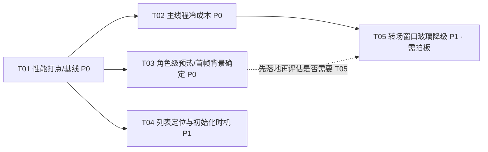

# 予念 · 进入聊天页转场掉帧 —— 诊断与优化方案

> 角色：软件架构师（高见远）　范围：Android / Kotlin / Jetpack Compose，`H:\susu`
> 性质：**诊断与设计文档**（不含代码改动）。所有涉及运行时耗时的结论均标注「确定 / 待真机验证」。
> 环境说明：本机**无法运行 Profiler / 真机**，凡属推断一律标注「待真机验证」，不作为结论。

---

## 0. TL;DR

1. **"进入聊天页卡一下" 的主因不是转场动画本身，而是"转场首帧要同时交付一大堆一次性成本"。**
   刚做完的「背景首帧修复」把这些成本从"首帧之后"**前移到了首帧**（这正是你要我评估的副作用）——**确认为真**，但**不回退**，改为降低单帧成本。
2. **团队假设「转场期每帧重新捕获整屏背景 + 每帧重模糊」经字节码取证 —— 不成立**（见 §2.1 / 附录 A）。
   转场是 `graphicsLayer{ translationX/alpha }` 纯图层变换，backdrop 层与气泡玻璃层只被**录制一次**，之后仅以新矩阵重新合成。
   **但有两个"条件命中"的例外会退化成近似"每帧重录 + 每帧重模糊"**（R4/R5，见 §2.4/§2.5）。
3. **另有一条被忽略的高置信度主线程阻塞**：`HardwareInfo.tier` 冷探测（3 次 `Runtime.exec("getprop")` + 最多 16 次 sysfs 读）**恰好发生在转场起帧的那一帧**，且全仓只在转场/聊天页被读 → 启动未预热（R2）。
4. 优化优先级：**先做三件"零观感"的事**（tier 预热 / 进入前预热 / 列表与初始化时机），再评估唯一需要你拍板的取舍（**转场窗口内的玻璃降级**）。

---

## 1. 根因排序（按对"进入卡顿"的实际影响从大到小）

| # | 根因 | 影响面 | 置信度 | 关键证据 |
|---|------|--------|--------|----------|
| **R1** | **首帧一次性渲染成本被"背景首帧修复"前移到转场首帧**：全屏自定义背景纹理上传 + 全屏 backdrop 层录制 + 每个可见玻璃的一次性离屏 blur/lens | 首帧（所有档位，尤其 MEDIUM/HIGH） | 机理**确定**，幅度**待真机** | `ChatScreen.kt:744-748,761-788`；`GlassSurface.kt:37-60`；`AppBubbleShape.kt:69-86`；`ChatTopBarRegion.kt:118`；`ChatInputRegion.kt:91` |
| **R2** | **`HardwareInfo.tier` 冷探测阻塞主线程，且触发点正好是转场起帧**（3× `Runtime.exec("getprop")` + ≤16 次 sysfs 读） | 首次进入 / 进程重启后首次进入 | 代码路径**确定**，耗时**待真机** | `PageTransitions.kt:19`；`HardwareInfo.kt:19-25,39-61,143-154,156-168`；`MainNavGraph.kt:94-101`；全仓仅在转场/聊天页读 tier |
| **R3** | **首屏消息不在首帧就位**（冷缓存会话）：列表内容在转场窗口内异步到达 → 一次性大重组 + 首次 measure/place + 首次 blur 落在动画中段 | 冷缓存会话（非 last-opened / 非 top-2） | 代码路径**确定**，命中与否**待真机** | `ChatViewModel.kt:76-78`；`ChatRepository.kt:29,32,76`；`YuNianApplication.kt:251-282`；`ChatScreen.kt:345-356` |
| **R4** | **per-companion 背景在 DataStore 首帧后翻转** → `chatBackdrop` key 变化 → 背景层重建（+ 位图可能异步解码）→ 转场中段再来一次全量重录 + 重模糊，**且首帧会闪回退底** | 设了"角色独立背景"的会话 | 代码路径**确定**，命中**条件性** | `ChatScreen.kt:444-448,676-704,744-748,766-772`；`ChatDetailSettingsStore.kt:56-66`；`YuNianApplication.kt:243-245` |
| **R5** | 进入窗口内 ~20 路 `collectAsStateWithLifecycle` 初始值/首帧值连续到达 → 多轮大重组；`animateColorAsState(300ms)` 若在窗口内变动会经 key 再放大成 R4 | 所有档位 | 确定（存在性）/ 幅度**待真机** | `ChatScreen.kt:342-398`（约 20 个 collect）、`706` |
| **R6** | 首帧冗余 `scrollToItem(0)`：reversed 列表初始就在 index 0，多处 effect 在进入窗口重复请求滚动 → 额外 measure/layout | 所有档位 | 冗余**确定**，显著性**待真机** | `ChatScreen.kt:476,819,563-575,577-581,599-603,607-611,614-620` |
| **R7** | ~~`contentPadding.top=112.dp` 引起额外测量~~ → **排除**（仅一次测量，非热点） | — | — | `ChatTopBarRegion.kt:44-49`；`ChatScreen.kt:839-844` |

> **未回退任何既有修复**：R1 的结论是「降低首帧成本」，不是「把背景改回异步」。§3 的 B5/A0 反而**加固**了首帧正确性（把 per-companion 背景也变成首帧确定）。

---

## 2. 逐项根因分析

### 2.1 【回答 Q1】转场期是否会"每帧重新捕获整屏背景 / 每帧重模糊"？—— **不成立**（附反例）

**取证对象**：运行时依赖 `io.github.kyant0:backdrop`（catalog 声明 `1.0.0`；缓存中 1.0.0 与 2.0.1 我都反编译过，**关键语义完全一致**，见附录 A）。

**backdrop 库的重绘语义（字节码确证）**：

| 事实 | 字节码证据 |
|------|-----------|
| 背景捕获节点 `LayerBackdropNode.draw()` = `drawContent()` **然后** `recordLayer(graphicsLayer)` → **每次它被绘制都会整体重录一层** | `LayerBackdropNode.draw` 调 `DrawScope.record()` → `GraphicsLayer.record()`（丢弃旧内容重录） |
| `LayerBackdrop.isCoordinatesDependent` **硬编码为 true**（构造器 `iconst_1; putfield isCoordinatesDependent`） | 说明玻璃是按**屏幕绝对坐标**采样背景 |
| `LayerBackdrop.drawBackdrop()` 在绘制时**实时查询** `positionInWindow()` 差值再 `translate` + `drawLayer()`，**不依赖回调刷新** | 位置补偿是"绘制期实时读取"，不是"靠 onGloballyPositioned 逐帧刷新" |
| 玻璃节点 `DrawBackdropNode.draw()` 调 `effects`（`vibrancy()+blur()`）+ `drawBackdropLayer`（把 backdrop 层经 `RenderEffect` 画出） | `DrawBackdropNode.draw` 逐条调用链 |

**转场实现（字节码确证）**：`PageTransitions.enterTransition()` = `slideInHorizontally + fadeIn`，由 compose `EnterExitTransitionKt$createGraphicsLayerBlock` 落成 **`Modifier.graphicsLayer{ alpha; scaleX/Y; translationX/Y; transformOrigin }`**（composition-animation 1.7.5 字节码）。这是**图层属性动画**，不是布局位移。

**推理链 → 结论**：
- 纯 `graphicsLayer` 平移/透明度变化 **不触发重新布局/重新放置**，因此不会重新派发 `onGloballyPositioned`；在 compose-ui 1.7.5 中**根本不存在 `onLayerPositionChanged` 之类的钩子**（全量 class 字符串检索为空）。
- 玻璃的 `draw()` 只在其绘制期读取的**快照状态**变化时才失效；其唯一相关状态是 `LayerBackdrop.layerCoordinates`，而它只在 `LayerBackdropNode.onGloballyPositioned`（即放置阶段）被写。
- ⇒ **转场各帧只是把已录制好的层用新矩阵/alpha 重新合成**；不会"每帧重录整屏背景"，也不会"每帧把每个气泡重新模糊"。

> **置信度**：机理**确定**（基于依赖字节码，非猜测）。**但请真机复核**（附录 B 给出方法与预期信号），因为 `onGloballyPositioned` 的派发时机属 Compose 内部实现细节，我未逐一反编译放置管线。

**两个会退化成"近似每帧重录 + 每帧重模糊"的条件例外 —— 这才是真正要打的**：

- **例外 ①（条件命中 ⇒ 每帧）**：当 `chatBackdrop` 的 `key(...)` 因 `backgroundColor`（`animateColorAsState(tween(300))`）在窗口内变化而每帧变化时，`rememberLayerBackdrop` 每帧新建层 → 每帧全量重录 + 所有玻璃重绑重模糊。
  `ChatScreen.kt:744-748` 的 key 组 = `(resolvedBgKey, isCustomBg, customBgPainter, chatBgGradient, backgroundColor)`；`706/707-711` 让 `backgroundColor = chatBgColor`（**渐变/纯色背景**路径）。首帧 `animateColorAsState` 初值即目标值 → 不会动；**但只要窗口内 `targetBgColor` 变化（如 R4 的设置到位）就会 300ms 逐帧改 key**。
- **例外 ②（条件命中 ⇒ 一次，非每帧）**：`customBgPainter` 由 `rememberBackgroundBitmap()` 异步回填，**缓存未命中时首帧为 null → 先回落退底（透明/渐变）→ 位图到位后 painter 身份变化 → key 变化 → 整层重建一次**（`ChatScreen.kt:697,744-748,766-772`；`BackgroundBitmapState.kt:47-56,91-96`）。这既是性能尖峰，也是**背景闪烁修复在"未预热"路径上的破口**。

---

### 2.2 R1 · 首帧一次性渲染成本（**主因**）

**修复前的时序**：首帧背景走"默认/纯色"（`isCustomBg=false` → 不画大图），自定义背景在 IO 回填后才出现 ⇒ **首帧很轻**。
**修复后（现状）**：`ChatScreen.kt:697` 无条件调用 `rememberBackgroundBitmap` + `766-772` 首帧即 `Image(painter, ContentScale.Crop, fillMaxSize)`，且 `744-748` 首帧即建立背景捕获层。⇒ 首帧必须一次性完成：

1. **背景位图 GPU 纹理上传**：解码规格 `REQ 1080×1920`、`RGB_565`（`ChatBackgroundCache.kt:36-37,124-133`）⇒ 最坏约 **1080×1920×2B ≈ 4MB** 纹理上传（`YuNianApplication.kt:243-245` 启动预热的只是**全局 key**，解码已省，但**上传/录制仍发生在首帧**）。
2. **全屏 backdrop 层录制**：`LayerBackdropNode.draw()` 把整屏 `Image` 录进一个离屏 `GraphicsLayer`（`ChatScreen.kt:761-764`）。
3. **每个可见玻璃一次离屏 `RenderEffect` pass**（每个都采样上面的全屏纹理）：
   - 顶部栏玻璃 `drawGlass` = `vibrancy() + blur(24dp) + lens(16dp)`（`GlassSurface.kt:41-48`；`ChatTopBarRegion.kt:118`）
   - 输入栏玻璃 `drawGlass` 同上（`ChatInputRegion.kt:91`，可能 112/182 同时可见）
   - 每个气泡 `appBubbleGlass` = `vibrancy() + blur(20/12dp)`（`AppBubbleShape.kt:69-86`；`ChatMessageFrame.kt:82-92`），N ≈ 可见气泡数
4. LazyColumn 首屏 measure/place + 可见气泡文本排版。

> **`lens` 是 AGSL `RuntimeShader`**（`LensKt` 用 `obtainRuntimeShader(...)` + `RenderEffect.createRuntimeShaderEffect`，受 `Build.VERSION.SDK_INT >= 33` 门控 — `PlatformKt.isRuntimeShaderSupported`）。它比 `blur` 更贵：顶部栏/输入栏各是 **2 个 shader pass**。`blur` 门控为 API ≥ 31（`isRenderEffectSupported`）。

**机理**：转场从第一帧起就要按 60/120Hz 出帧，而首帧要串行完成上面全部工作 ⇒ 首帧远超帧预算，表现为**进入瞬间"顿一下"**，随后动画继续。这与"动画曲线不平滑"是两回事——**是首帧被拉长，不是缓动函数问题**。

**置信度**：机理**确定**；单帧耗时与主导项（纹理上传 vs. N 次 blur vs. lens）**待真机 Perfetto / gfxinfo**。

---

### 2.3 R2 · `HardwareInfo.tier` 冷探测在主线程转场起帧处

```kotlin
// PageTransitions.kt:19  —— 每个 enter/exit/pop 变体都读一次
val tier = HardwareInfo.tier
```
```kotlin
// HardwareInfo.kt:19-25  懒计算 + 缓存（未加锁）
val tier: Tier get() { if (_tier == null) { _tier = detectTier() }; return _tier!! }

// HardwareInfo.kt:143-154  ← 每次 = fork 一个子进程
private fun safeReadProp(key: String, default: String): String {
    val process = Runtime.getRuntime().exec(arrayOf("getprop", key)) ...
}
// detectTier() 至少触发 hardware / chipset / socModel 三次 exec；
// 兜底分支还会读 maxFreqMhz（HardwareInfo.kt:156-168，最多 16 个 sysfs 文件）
```

**触发点**：`MainNavGraph.kt:94-101` 把 `PageTransitions.*Transition()` 作为 **NavHost 全局**转场；导航在主线程，`enterTransition` lambda 的求值同步跑在**转场起帧的那一帧**。
**为什么启动没预热**：全仓 `HardwareInfo` 引用仅 6 处（`PageTransitions` / `ChatMessageFrame` / `ChatScreen` / `GroupChatScreen` / `StickerImportOverlay` / 自身），**app 启动路径（`YuNianApplication`、`MainActivity`、`MainScreen`）一处都没有**。
**为什么"只有第一次卡"**：`_tier` 计算后缓存，之后（含再次进入）不重复；**进程重启后复现** —— 与用户"卡卡的"体感（尤其首启首次进入）吻合。

**额外风险**：`_tier` 是**非同步可空 var**。若按建议做后台预热，必须同时改为线程安全（见 T02），否则出现双写竞态（虽幂等，但会重复跑重活）。

**置信度**：发生位置**确定**；单次耗时区间（`getprop` ×3 + sysfs 读，典型数十毫秒级）**待真机验证**。

---

### 2.4 R3 · 首屏消息不在首帧就位（冷缓存会话）

- `ChatViewModel` 构造期同步读内存缓存：`getCachedRecent(companionId)`（`ChatViewModel.kt:76-78` → `ChatRepository.kt:29` → `MessageCache`，**冷则返回 null**）。
- 启动预热只覆盖 **last-opened + 最近 2 个会话**：`YuNianApplication.kt:251-282`（`warmRecentChatCaches` / `hydrateRecent`）。
- 冷会话 ⇒ 首帧 `messageMetadata` 为空 ⇒ 列表在 DB 结果到达后才填充；而 `observeMessageMetadata` / `observeCachedMessages` 在 `viewModelScope`（= `Dispatchers.Main.immediate`）里 `collect` 并在 **Main 线程**做 `distinctBy/sortedWith/publishLoadedMessages`（`ChatViewModel.kt:360-386, 388-431`）。
- 后果：**列表"内容 + 首次 measure/place + 首次 blur"打包落在转场中段**，是第二个尖峰。

**置信度**：机制**确定**；是否命中取决于该会话是否被预热过 —— **待真机**（可用 §B 的 logcat 打点区分）。

---

### 2.5 R4 · per-companion 背景在 DataStore 首帧后翻转（**首帧正确性破口**）

```kotlin
// ChatScreen.kt:446-448  首帧 = 默认设置
val detailSettings by detailSettingsFlow.collectAsStateWithLifecycle(
    initialValue = CompanionChatDetailSettings()   // useGlobalBackground = true
)
// ChatScreen.kt:688-697  首帧 → 解析成全局 key
val resolvedBgKey = resolveEffectiveChatBackgroundKey(...)
val customBgPainter = rememberBackgroundBitmap(customBgKey)
// ChatScreen.kt:744-748  该 key 组决定背景层身份
val chatBackdrop = key(resolvedBgKey, isCustomBg, customBgPainter, chatBgGradient, backgroundColor) {
    rememberLayerBackdrop { drawContent() }
}
```

若该角色设了**独立背景**（`useGlobalBackground=false` + 自定义 key）：
1. 首帧 `resolvedBgKey = 全局 key` → `isCustomBg=false` → **画的是全局背景**；
2. DataStore 首次发射到达（`ChatDetailSettingsStore.kt:56-66`，异步）→ `resolvedBgKey` 变 → `isCustomBg=true`、`customBgKey` 变；
3. `customBgPainter` 若**未预热** → 先 `null` → 判定分支 `ChatScreen.kt:766` 落到 `else` → 画 `Color.Transparent`（**闪回退底**）→ 异步解码完成 → key 再变一次；
4. 每次 key 变化 = `rememberLayerBackdrop` **重建离屏层** → 全屏重录 + 所有玻璃重绑重模糊。

启动预热只覆盖**全局 key**（`YuNianApplication.kt:243-245` 用 `getChatBackgroundKey(app)`），**不覆盖 per-companion key** ⇒ 该路径必然走"未预热 → 闪 + 重建"。
**结论：背景首帧修复在"角色独立背景"这条路径上并未真正闭环** —— 这既是性能问题，也是观感问题。修复它属于**零观感**优化，且**不回退**任何既有改动。

---

### 2.6 R5 / R6 / R7 · 次级项

- **R5**：`ChatScreen.kt:342-398` 约 **20 路 `collectAsStateWithLifecycle`**；进入窗口内 `themeMode / detailSettings / userName / userAvatar / availableApis / currentApi / ttsConfig / draftText …` 的初始值与首帧值密集到达 → 多轮 ChatScreen 体量级重组。`ChatRowRenderer` 的 skipping 已做（`ChatScreen.kt:477-510` 的稳定化注释），但**首轮填充无法 skip**。`animateColorAsState(targetBgColor, tween(300))`（`706`）在窗口内变动会**经 R4 放大**（例外 ①）。
- **R6**：`listState = LazyListState()`（`476`）+ `reverseLayout = true`（`819`）⇒ 初始已在 index 0；但 `563-575 / 577-581 / 599-603 / 607-611 / 614-620` 五处 `scrollToItem(0)` 在进入窗口可能重复触发（`bottomItemContentReady` 由 false→true 也会再触发一次，`563`）。**冗余确定**，但 `scrollToItem` 到"已在该位置"时是否仍强制重测量取决于内部实现 → **待真机验证**。
- **R7**：`contentPadding`（`839-844`）的 `top = 112.dp`（`ChatTopBarRegion.kt:48`）只参与一次测量，**排除**。

---

## 3. 优化方案

分三组。每项标注：做法 / 预期收益 / **代价与观感影响** / 风险 / **是否需要你拍板**。
**优先推荐「零观感变化」项**（标 ★）；玻璃降级项（标 ⚑）必须由你决定。

### A 组 · 转场期成本控制

| ID | 做法 | 预期收益 | 代价 / 观感 | 风险 | 拍板 |
|----|------|----------|-------------|------|------|
| **A0** ★ | **消灭"转场窗口内的层重建"**：把 R4 的 key 抖动从根上消除——(a) 进入前预热 per-companion 背景位图与设置快照；(b) `chatBackdrop` 的 key 移除 `backgroundColor`（动画色），改用"稳定身份"`(resolvedBgKey, isCustomBg, painter)` | 消除例外②（重建一次）与例外①（逐帧重建）；转场窗口内**不再有任何 backdrop 重录** | **零观感变化**（层内容仍由 `drawContent()` 反映真实背景） | 需确认 `backgroundColor` 从 key 移除后，纯色/渐变背景**在色值变化时仍能重录**——由层自身失效驱动，需真机确认 | 否（★ 推荐） |
| **A1** ★ | 承接 §B1：把 `HardwareInfo.tier` 预热移出主线程 → 转场起帧不再被 `exec` 阻塞 | 消除 R2 的首帧尖峰 | **零观感变化**（同设备档位不变） | 需保证 `_tier` 线程安全，避免竞态 | 否（★ 推荐） |
| **A2** ⚑ | **转场窗口内临时关闭页面级玻璃的 `lens`**（保留 `blur(24dp)` + 玻璃面色），转场结束立即恢复 | 去掉顶部栏/输入栏共 ~2 个 `RuntimeShader` pass | **有观感变化**：转场期玻璃"折射"缺失。缓解：整页 alpha 从 0 淡入，前段几乎不可察 | 中：需精确的"转场中/后"信号；状态抖动会让玻璃忽明忽暗 | **是（需拍板）** |
| **A3** ⚑ | 备选/更保守替代 A2：**转场窗口内气泡 blur 由 `20dp` 降到 `12dp`**（沿用现有 `bubbleBlurRadiusFor` 的降级值） | 降低 N 次气泡 pass 的采样成本 | **有观感变化**：淡入期气泡背景略"硬" | 中：同上 | **是（需拍板）** |
| **A4** ★ | **更保守的替代（若你否决 A2/A3）**：不动任何玻璃外观，只把"尚未完成的首帧重活"从窗口里挪走 —— 即 A0 + B2 + B5 全部落地后**再实测**，用数据决定是否还需要 A2/A3 | 目标：把 R1 的首帧成本降到帧预算内，同时**零观感变化** | 零 | 低；收益上限取决于 R1 的实际主导项（待真机） | 否（★ 首选路径） |

> **架构约束提示**：A2/A3 会引入"**转场期**玻璃变化"。你此前明确拒绝的是「**滚动期**改变玻璃」——A2/A3 只作用于**进入/退出转场窗口**，**不触碰滚动路径**。但"进入瞬间玻璃折射消失"仍属对外观的可感知改动，**必须你拍板**；不拍板则执行 A4。

### B 组 · 首帧一次性成本

| ID | 做法 | 预期收益 | 代价 / 观感 | 风险 | 拍板 |
|----|------|----------|-------------|------|------|
| **B1** ★ | `HardwareInfo`：`_tier` 改线程安全（`@Volatile` + 双重检查，或 `lazy(SYNCHRONIZED)`），并暴露 `warmUp()`；`YuNianApplication` 启动时在 `bgScope` 预热；`PageTransitions` 只读不触发计算 | 消除 R2（最高性价比） | 零观感 | 低 | 否 |
| **B2** ★ | 在 `MainScreen.openCompanionChat()`（`MainScreen.kt:72-79`，已在存 `LastOpenedCompanionStore`）里**追加后台预热**：目标角色的自定义背景位图（`ChatBackgroundCache.preload`）+ 目标角色的 detail settings 快照 | 让 R4 走"已预热"路径；首帧即确定 | **零观感**（且**修好**角色独立背景的首帧闪退底） | 低；预热放后台，注意不要引入新的主线程 IO | 否 |
| **B3** ★ | 背景解码规格按**视口上限**收敛（当前固定 `1080×1920`，`ChatBackgroundCache.kt:36-37,158-174`）：如 `reqW = min(1080, 屏宽px)`、`reqH = min(1920, 屏高px)` | 降低纹理上传与各玻璃采样成本 | **近乎零观感**：1080p 屏无差异；1440p 屏为降采样换取流畅 | 低；需你确认是否接受"1440p 略微变软" | **轻度（建议确认）** |
| **B4** ★ | 见 A0(b)：`chatBackdrop` key 改用稳定身份，移除 `backgroundColor`（动画色） | 消除例外①的逐帧重建 | 零观感 | 中：需真机确认纯色/渐变场景仍正确刷新 | 否 |
| **B5** ★ | **per-companion detail settings 提供"同步内存快照"**（仿 `ChatBackgroundCache` 的 `getCachedBitmap` 模式），`ChatScreen` 首帧即用快照解析 `resolvedBgKey`，DataStore 到达后再校准 | 首帧即正确背景；消除 R4 的 key 翻转 | **零观感**（更正确） | 低；需处理"快照过期"（DataStore 到达后以远端为准） | 否 |

### C 组 · 列表 / 初始化时机

| ID | 做法 | 预期收益 | 代价 / 观感 | 风险 | 拍板 |
|----|------|----------|-------------|------|------|
| **C1** ★ | 合并 5 处 `scrollToItem(0)`（`ChatScreen.kt:563-575/577-581/599-603/607-611/614-620`）为一个 effect，并加 `if (firstVisibleItemIndex != 0 || firstVisibleItemScrollOffset != 0)` 守卫 | 去掉首帧冗余滚动重测量（R6） | 零观感 | 低；须覆盖"新消息到达自动到底/触屏回底"全部既有场景（回归测试） | 否 |
| **C2** ★ | `LaunchedEffect(Unit){ markAsRead(); refreshCompanionData() }`（`ChatScreen.kt:450-453`）**延后到转场结束**执行（二者均已在 `Dispatchers.IO`，只影响"何时发起"，不影响观感） | 把 DB 写/查从进入窗口挪走 | **零观感**（未读清零晚 ~350ms，页面本身不显示该状态） | 低 | 否 |
| **C3** ★ | 确认不动：果冻入场首屏不批量播（`jellyWatermarkId` 首帧 null + `jellyQualifiesForEntrance` 要求 `id > watermark`）——**设计正确，无需改** | — | — | — | 否 |
| **C4** | `contentPadding` / `PerformanceTrace` 每帧调用 —— **排除，不改** | — | — | — | 否 |

---

## 4. 任务分解（有序 · 含依赖 · ≤5 个）

> 说明：本项目为**存量工程**，不存在"从零建基础设施"的场景，故首个任务改为"性能打点与基线"（它服务于后续所有任务的验收）。每个任务 ≥3 个文件，按实现顺序排列。

### T01 · 性能打点与基线采集（P0，依赖：无）
- **文件**
  - `core/common/src/main/java/com/yunian/ai/common/PerformanceTrace.kt`
  - `core/ui-common/src/main/java/com/yunian/ai/uicommon/utils/PageTransitions.kt`
  - `feature/chat/src/main/java/com/yunian/ai/feature/chat/ui/screen/ChatScreen.kt`
- **内容**：新增分段打点（`tierDetect` / `chatFirstCompose` / `chatBackdropRecord` / `chatListReady` / `chatTransitionEnd`），仅供调试读取，不改任何布局/绘制。
- **验收要点**：`PerformanceTrace` 为纯 `AtomicLong`（既有约定）；打点不引入 snapshot 读、不触发重组；可在 logcat 或调试面板读出分段耗时；**零观感变化**。

### T02 · 消除主线程冷成本（tier 预热 + 线程安全）（P0，依赖：T01）
- **文件**
  - `core/common/src/main/java/com/yunian/ai/common/HardwareInfo.kt`
  - `core/ui-common/src/main/java/com/yunian/ai/uicommon/utils/PageTransitions.kt`
  - `app/src/main/java/com/yunian/ai/YuNianApplication.kt`
  - `app/src/main/java/com/yunian/ai/MainScreen.kt`（如需在进入主界面后补一次预热）
- **内容**：`_tier` 线程安全化 + `warmUp()`；在 `bgScope` 后台预热；`PageTransitions` 只读缓存值。
- **验收要点**：进入聊天页转场首帧期间**不再发生 `Runtime.exec` / 文件 IO**；**同设备档位与改前一致**（必须打印 tier 前后对比）；并发调用无竞态；**零观感变化**。

### T03 · 角色级预热与首帧背景确定性（P0，依赖：T01）
- **文件**
  - `feature/chat/src/main/java/com/yunian/ai/feature/chat/data/ChatDetailSettingsStore.kt`
  - `core/ui-common/src/main/java/com/yunian/ai/uicommon/component/ChatBackgroundCache.kt`
  - `app/src/main/java/com/yunian/ai/MainScreen.kt`（`openCompanionChat` 追加预热）
  - `feature/chat/src/main/java/com/yunian/ai/feature/chat/ui/screen/ChatScreen.kt`
- **内容**：B2 + B5 + A0(b) —— 进入前预热目标角色背景位图与设置快照；设置提供同步内存快照；`chatBackdrop` key 稳定化。
- **验收要点**：**设置"角色独立背景"的会话，首帧即显示正确背景**（无闪退底、无跳变）；转场窗口内不出现 backdrop 重建（可用 T01 打点断言）；**零观感变化**。
- **架构约束**：per-companion 背景解析依赖 `feature:chat` 的类型，**预热编排只能放在 `app` 模块**（core 不得依赖 feature）。`ChatBackgroundCache` 只提供按 key 的通用预热能力。

### T04 · 列表定位与初始化时机（P1，依赖：T01）
- **文件**
  - `feature/chat/src/main/java/com/yunian/ai/feature/chat/ui/screen/ChatScreen.kt`
  - `feature/chat/src/main/java/com/yunian/ai/feature/chat/ui/viewmodel/ChatViewModel.kt`
  - `feature/chat/src/main/java/com/yunian/ai/feature/chat/ui/screen/ChatInputRegion.kt`（如涉及输入栏时序需联动）
- **内容**：C1 + C2 —— `scrollToItem(0)` 合并 + 守卫；`markAsRead / refreshCompanionData` 延后到转场结束。
- **验收要点**：首帧无冗余滚动重测量；发送/接收/流式/加载更早/新消息自动到底/未读气泡等既有行为全部回归通过；**零观感变化**。

### T05 · 转场窗口玻璃成本控制（P1，**依赖 T01、T02，且需用户拍板**）
- **文件**
  - `core/ui-common/src/main/java/com/yunian/ai/uicommon/component/glass/GlassSurface.kt`（`lens` 可条件关闭）
  - `core/ui-common/src/main/java/com/yunian/ai/uicommon/theme/AppBubbleShape.kt`（气泡 blur 可条件降级）
  - `core/ui-common/src/main/java/com/yunian/ai/uicommon/utils/PageTransitions.kt` 或新增 `core/ui-common/.../utils/TransitionWindow.kt`（转场中/后信号）
  - `feature/chat/src/main/java/com/yunian/ai/feature/chat/ui/screen/ChatTopBarRegion.kt`
  - `feature/chat/src/main/java/com/yunian/ai/feature/chat/ui/message/ChatMessageFrame.kt`
- **内容**：A2 和/或 A3，**默认关闭**，仅在用户拍板后启用；HIGH/ULTRA 默认保持零变化。
- **验收要点**：转场期生效、转场结束**立即恢复**；提供开关便于真机 A/B；**不触碰滚动路径**；若用户否决 → T05 不实现，仅保留 T01–T04。

### 依赖图



---

## 5. 待明确事项（需你决策）

1. **【必须拍板】是否允许"仅在转场窗口内"降低玻璃成本？**
   - 方案 A2（关 `lens`）/ A3（气泡 blur 20→12dp）。
   - 若否决 → 执行 A4（零观感路径），代价是"可能无法把首帧压进预算"，需真机数据支撑结论。
   - 注意：这与"滚动期改玻璃"不同（不触碰滚动），但仍是**可感知**的外观变化。
2. **【建议确认】自定义背景解码是否需要"按视口收敛"（B3）？**
   1080p 屏无差异；1440p/2K 屏会略微变软，换更小的纹理上传。是否接受？
3. **需要真机数据才能定的两件事**：
   - R1 的首帧主导项（纹理上传 / N 次 blur / lens RuntimeShader / 列表排版）；
   - R3 是否命中（该会话是否已被启动预热）。
   → 建议先按 T01 打点，到桌面上跑一轮再决定 T05 是否必要。
4. **设备档位分布**：现有 `HardwareInfo.Tier` 判定依赖 `getprop`；若后续要做 B1，需确认"预热前后同设备档位一致"（我已在 T02 验收里列为硬性项）。
5. **`docs/class-diagram.mermaid` / `docs/sequence-diagram.mermaid` 是否要更新**：这两个是**项目级**已有产物，本次为"诊断+优化"任务，我**未覆盖**它们；相关性图（backdrop 成本链路）已内嵌于本文 §2.1 与 §4 的 mermaid。如你需要合并进项目级图，请指示。

---

## 6. 架构约束与不变量（本次方案全程遵守）

| 约束 | 本方案如何满足 |
|------|----------------|
| **不得回退"背景首帧修复"** | 无一处改回 `LaunchedEffect + withContext(IO)`；B5/A0 反而把"角色独立背景"也做成首帧确定 |
| **不引入"滚动期玻璃变化"** | T05 只作用于**转场窗口**，与滚动路径解耦；且默认关闭、需拍板 |
| **feature 不得依赖 feature** | T03/T04 只在 `feature:chat` 内部改动 |
| **core 不得依赖 feature** | per-companion 预热编排放在 **`app` 模块**（`MainScreen.openCompanionChat`）；`core` 只提供按 key 的通用预热/快照能力 |
| **单帧内不做重活** | B1/T02 把 `exec` 移出主线程；C2 把 DB 操作移出转场窗口 |
| **可测试性** | T01 打点让每个优化都可量化验收；T05 带开关可 A/B |

---

## 附录 A · backdrop 库重绘语义取证（字节码）

依赖：`io.github.kyant0:backdrop`（catalog `1.0.0`；缓存中另有 `2.0.1`，**两者关键语义一致**）。取证方式：解包 `*.aar` → `classes.jar` → `javap -p -c`。

```
# 1) 背景层每次被绘制都会整体重录
LayerBackdropNode.draw(ContentDrawScope):
    drawContent()
    LayerRecorderKt.recordLayer$default(node, this, backdrop.graphicsLayer, 0L, { backdrop.onDraw })

# 2) 玻璃按屏幕绝对坐标采样（硬编码 true）
LayerBackdrop.<init>:
    putfield graphicsLayer ; putfield onDraw ; iconst_1 ; putfield isCoordinatesDependent

# 3) 位置补偿在"绘制期实时查询"，不依赖回调
LayerBackdrop.drawBackdrop(scope, density, localCoordinates, layerBlock):
    layerCoordinates = getLayerCoordinates()          // 快照状态
    delta = localPositionOf(layerCoordinates, localCoordinates)   // 实时
    transform.translate(-delta) ; drawLayer(graphicsLayer)

# 4) 玻璃 draw = 生效 effects + 画 backdrop 层 + 画自身内容
DrawBackdropNode.draw(scope):
    effectScope.update(scope) -> updateEffects()
    onDrawBehind?() ; drawBackdropLayer() ; onDrawSurface?() ; drawContent() ; onDrawFront?()
    （drawBackdropLayer 内调 backdrop.drawBackdrop(...effects 生成的 RenderEffect...)）

# 5) lens = AGSL RuntimeShader（比 blur 贵），受 API 门控
LensKt: PlatformKt.isRuntimeShaderSupported() -> obtainRuntimeShader(ShadersKt.RoundedRectRefractionWithDispersionShaderString)
PlatformKt: isRenderEffectSupported => SDK_INT >= 31 ; isRuntimeShaderSupported => SDK_INT >= 33
```

**转场侧取证**（compose `animation-android:1.7.5`）：

```
EnterExitTransitionKt$createGraphicsLayerBlock$1$1$block$1.invoke(GraphicsLayerScope):
    setAlpha(alphaState.value)
    setScaleX(...) ; setScaleY(...) ; setTransformOrigin(Center)
    → 转场 = 纯图层属性动画（translation/alpha），非布局位移
# compose-ui 1.7.5 全量 class 检索：不存在 onLayerPositionChanged 之类钩子
# ⇒ 纯图层变换不会重新派发 onGloballyPositioned ⇒ 录制层不被逐帧重录
```

---

## 附录 B · 真机复核方法（供 Engineer / QA）

1. **确认"不逐帧重录/重模糊"**（验证 §2.1 结论）
   - Perfetto / Studio Profiler 抓 `Enter Chat` 前后 1s 的 GPU 段：预期**一次性尖峰**（首帧），随后进入稳态画布合成；若看到**每个转场帧都有 RenderEffect 离屏 pass**，则我的结论有误，应回到 A2/A3 主路径。
   - 临时给 `LayerBackdropNode`（第三方，可包一层自己的 `layerBackdrop` 内容）与 `appBubbleGlass` 加 `PerformanceTrace` 打点，看转场期调用次数。
2. **确认 R2 存在且被 B1 消除**
   - `adb shell am start` 冷启 → 首次点进聊天页，同时 `adb logcat | grep -i getprop`：若在转场瞬间看到 `getprop ro.hardware/ro.board.platform/ro.soc.model`，即证实 R2。B1 后应只在启动早期出现。
3. **确认 R3/R4 命中**
   - 分别用一个"最近打开过"的会话与一个"从未预热过"的会话进页，对比 T01 的 `chatListReady` 与 backdrop 重建打点。
   - 对"设了角色独立背景"的会话，观察首帧是否先显示全局背景再切换（证实 R4）。
4. **帧率取证**：`adb shell dumpsys gfxinfo <pkg> framestats` 取进入聊天页的 `janky frames`；或 `adb shell dumpsys SurfaceFlinger --latency`。
