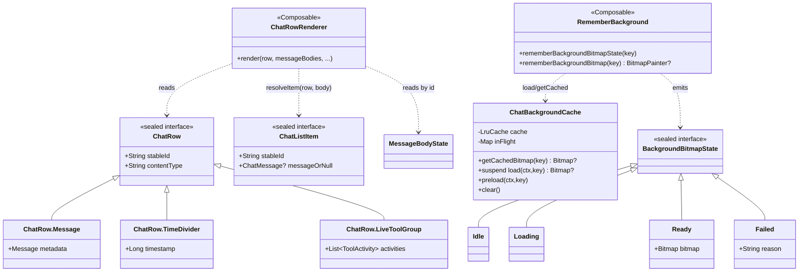
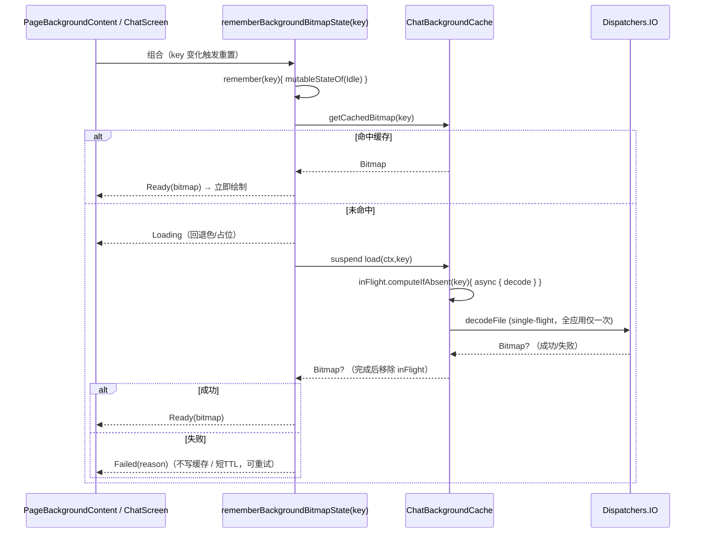
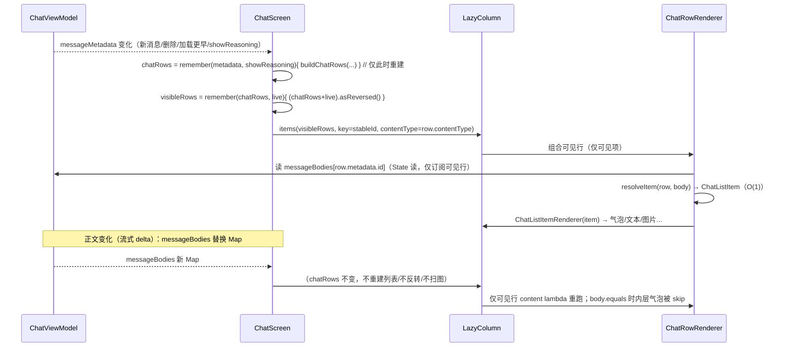
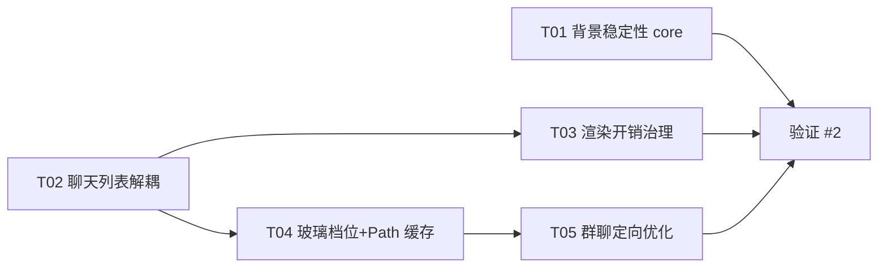

# 予念 YuNian · 聊天页性能与稳定性优化 · 架构设计

> 作者：软件架构师（高见远） ｜ 版本：v2（含第二轮增量） ｜ 范围：`feature:chat` + `core:ui-common` + `feature:groupchat`
>
> **第二轮增量（Part C）**：用户已就 4 项待决策答复 → ①T04 修订（取消滚动期玻璃降级、复用 `glassIntensity` 作档位强度）；②背景失败静默自动重试；③新增 **T05 群聊页（`feature:groupchat`）解耦优化**。详见文末 `Part C：增量设计（第二轮）`。
> 目标：解决①大量消息时渲染卡顿、滚动不流畅；②背景概率性加载失败/不完整。
> 约束：Kotlin + Compose；feature 不得依赖 feature；core 不得依赖 feature；**架构最小变更原则**。

---

## 0. 复核说明（与主理人侦察摘要的差异）

已实际 Read 全部关键文件（`ChatScreen.kt`、`ChatViewModel.kt`、`ChatListItem.kt`、`ChatListItemRenderer.kt`、`ChatMessageFrame.kt`、`ChatBackgroundCache.kt`、`ChatBackground.kt`、`GlassSurface.kt`、`AppBubbleShape.kt`、`JellyEntrance.kt`、`GlassPageScaffold.kt`、`ChatMessageParts.kt`、`HardwareInfo.kt`、`YuNianApplication.kt`）。逐条判定见 §1。

**需要推翻/修正的一处关键路由判定：**

> 主理人摘要：`ChatMessageFrame.kt:76-83` → `core/ui-common/.../glass/GlassSurface.kt`，每条气泡走 `drawBackdrop + vibrancy() + blur(24.dp) + lens(16.dp)`。
>
> **修正（推翻路由，结论不变）**：气泡走的是 `AppBubbleShape.appBubbleGlass`（`AppBubbleShape.kt:53-94`），效果为 `vibrancy() + blur(20.dp)`，**没有 lens**（lens 只支持 `CornerBasedShape`，气泡是 `Generic` 形状，会抛异常，见 `AppBubbleShape.kt:49-52`）。`GlassSurface.drawGlass`（`blur(24)+lens(16)`）用于顶栏/卡片/弹窗（`GlassTopBar`/`GlassCard`/各 feature 页面），**不用于聊天气泡**。
> 结论不变：每个可见气泡一次离屏模糊采样，仍是 GPU 重成本；只是成本参数与影响面需要按真实路由评估（`appBubbleGlass` 还被 `feature:groupchat/GroupChatScreen.kt:1117` 复用，签名改动必须向后兼容）。

**“逐条诊断”中还有两处需要补充精度**（详见 §1）：
- `rememberBackgroundBitmap` 的 stale 缺陷**仅在“切换到已缓存的另一个 key”时暴露**（切到未缓存 key 时会走 `LaunchedEffect` 覆盖，反而正确）。
- `clear()`/LRU `recycle()` 的调用点不止缓存内部：`YuNianApplication.onTrimMemory`（L137/L142）与 `onTerminate`（L160）在**界面仍可能正在绘制**时调用 `clear()` → 直接命中“recycled bitmap”崩溃。

---

## Part A：系统设计

### 1. 根因诊断（逐条判定）

#### 1.1 高频消息渲染链路

| # | 线索 | 判定 | 依据与说明 |
|---|------|------|-----------|
| R1 | `ChatScreen.kt:342` `chatItems = remember(messageMetadata, messageBodies, showReasoning) { toChatListItems(...) }`，任一正文状态变化即全量 O(n) 重建 | **确认** | `ChatViewModel` 中 `_messageBodies.value = _messageBodies.value + updates`（L417/L454/L469/L475）每次产出**新 Map 实例**；`observeCachedMessages` 亦如此（L417）。`toChatListItems`（`ChatListItem.kt:133-161`）对每条 metadata 做 `toChatListItem()`→含 `stickerNameOrNull()`、`isSystemTipContent()`（多次 `contains`）、`ToolActivityCodec.decode(content)`（`ChatListItem.kt:166-171`）、`ReasoningUiProjector.project()`。**流式节流后每 ~50ms/20 字**（`StreamDeltaThrottle`）触发一次全量重建。首选瓶颈成立。 |
| R2 | `ChatScreen.kt:346` `chatImagePaths = remember(chatItems) { mapNotNull...distinct() }` 每次全量扫描 | **确认** | 仅被 `FullscreenImageViewer`（L1159-1168）消费。属“为偶发用途付全量 O(n)+distinct 代价”。 |
| R3 | `ChatScreen.kt:366` `visibleChatItems = remember(chatItems, liveToolGroup) { (chatItems + liveToolGroup).asReversed() }` | **确认** | 额外一次 `+`（O(n) 复制）与 `asReversed()`（O(n) 反转）；叠加 R1 后形成“每次正文变化 → 两次 O(n) 列表操作”。 |
| R4 | `ChatScreen.kt:846-848` `items(items = visibleChatItems, key = { it.stableId })` **缺 contentType** | **确认** | 异构列表（文本/图片/语音/表情/工具卡/时间线/系统提示）无 `contentType`，LazyColumn 无法按类型复用 composition 槽位，滚动时分配/测量抖动增大。 |
| R5 | `ChatScreen.kt:515-524 / 589-607 / 496-504` 多处 `snapshotFlow { listState.layoutInfo ... }` | **确认** | 实为 3 个独立观察者：L496 `derivedStateOf` 读 `layoutInfo`（被 L508 `snapshotFlow` 消费）、L515 读 `visibleItemsInfo`、L589 读 `visibleItemsInfo`+`totalItemsCount`。滚动时各自 map 一遍 `visibleItemsInfo`。 |
| R6 | `ChatListItemRenderer.kt:42` 每条消息外层包 `CompositionLocalProvider` | **确认** | 每项多两个 `staticCompositionLocalOf` provide 节点（L42-45 提供 `LocalCompanionAvatarClick/UserAvatarClick`）。可整体上提一次。 |
| R7 | `ChatMessageFrame.kt:58-71` 每条消息构造 `bubblePathFactory` lambda，绘制期 `buildBubblePath` 重建 Path | **确认** | `bubblePathFactory` 每次组合新建（L58）；`appBubbleBackground`（`AppBubbleShape.kt:96-127`）与 `appBubbleGlass` 回退分支均在 **draw phase** 调 `buildBubblePath` 重建 Path。 |
| R8 | 每气泡离屏模糊采样 | **确认（路由修正）** | 见 §0。`appBubbleGlass` = `drawBackdrop(vibrancy + blur(20.dp))`，`ChatMessageFrame.kt:76-83`。消息多时掉帧主因之一成立。 |
| R9 | `JellyEntrance` 用 graphicsLayer 形变（符合“不改布局”） | **确认** | `JellyEntrance.kt:50-58` 仅 `graphicsLayer`，不参与布局。 |
| R10 | `ChatScreen.kt:851-852` `jellyShouldAnimate` 在**组合期**对 `jellySeenIds` 做 `add()` 副作用 | **确认（补充风险）** | `jellyShouldAnimate`（L1273-1291）内的 `seen.add(item.stableId)`（L1290）在组合期执行。普通 `HashSet` 不触发重组，但**违反组合纯度 / 非可重启安全**：若该帧组合被取消/回滚，id 已入集 → 动画被误吞。建议移到 `LaunchedEffect` 化。 |
| R11 | ViewModel 三流分离与分页参数 | **确认** | `_messageMetadata`/`_messageBodies`/`_messages` 三流（L81-91）；`CHAT_PAGE_SIZE=80`、`CHAT_LOAD_MORE_SIZE=50`、`MAX_UI_MESSAGES=200`。`loadVisibleMessageBodies`（L459）先整批置 `Loading` 再整批回填 → 每次整 Map 替换（L469/L475）。 |

**补充发现（主理人摘要未覆盖）**

| # | 问题 | 依据 | 影响 |
|---|------|------|------|
| A1 | `glassIntensity`（`ChatScreen.kt:670-675`、`GroupChatScreen.kt:359`）计算后**未见任何消费点**（全仓仅两处声明） | 疑似死代码 | 可作为气泡玻璃强度降级的现成挂钩（T04 复用） |
| A2 | `LaunchedEffect(..., visibleChatItems)` 以**整张表**为 key（L481、L515、L609） | `visibleChatItems` 每次正文变化即变 → 三个 effect 重启 | L515 重启后 `snapshotFlow` 重新订阅并**立即再发一次**当前可见集，叠加 R1 形成“加载→重建→重启→再发”的抖动回路；L609 每次重启还做 `visibleChatItems.indexOfFirst`（O(n)）。 |
| A3 | 背景解析 `LaunchedEffect`（L640-661）一次性写 5 个 state（L654-658） | 单次背景/主题切换触发多轮重组 | 叠加 L708 `key(resolvedBgKey, isCustomBg, customBgPainter, chatBgGradient, backgroundColor)` 重建 `rememberLayerBackdrop` → 整屏玻璃重绘。 |
| A4 | `handleChatIntent`（`ChatScreen.kt:452`）**未 `remember`**，捕获会变化的值（`quoteReply`/`companionData`/`userName`） | 作为 item content lambda 的捕获项不稳定 | 破坏 Compose 的 item 跳过（skipping）→ 页面级任何重组都可能让**所有可见项**重组（进而重跑气泡模糊）。属 R8 的放大器。 |
| A5 | `customBgPainter` 条件调用（L626-628） | 同一调用点跨 key 复用 memo | 切换两个自定义背景时保留上一张 painter，**放大背景缓存 stale 缺陷**（§1.2 B1）。 |
| A6 | `PageBackgroundContent` 组合期调用 `onPainterReady()`（`ChatBackground.kt:202`） | 组合期执行回调 | 若调用方在回调里写 state → 重组环风险（当前调用方为空实现，低危） |

#### 1.2 背景异步加载链路

| # | 线索 | 判定 | 依据与说明 |
|---|------|------|-----------|
| B1 | `rememberBackgroundBitmap`：`var bitmap by remember { mutableStateOf(null) }` **未以 key 为 remember 键** | **确认（补充精确触发条件）** | `ChatBackgroundCache.kt:110`。追踪：key=A 已缓存 → 首组 `bitmap==null` → 取 A（L112-114）。key 切到**已缓存**的 B → `remember {}` 保留旧值（非 null）→ `if (bitmap==null)` 不成立（L112）→ 不更新；`LaunchedEffect(B)` 因 `getCachedBitmap(B)!=null` 直接跳过（L117-124）→ **显示 A 的残留图**。仅在“切到已缓存 key”时触发（切到未缓存 key 会覆盖，正确）。`maxCacheSize=3` 使“两个 key 都缓存”很常见。 |
| B2 | 组合期 `bitmap = ChatBackgroundCache.getCachedBitmap(key)` 赋 mutableState | **确认** | L112-114：非 key 感知、每次重组（bitmap 为 null 时）执行，属组合期写 state 反模式。 |
| B3 | `loadBitmap` 把失败缓存为 `cache[key]=null`，`getCachedBitmap` 无法区分“未加载/失败” | **确认** | `ChatBackgroundCache.kt:41`、L70 写 null；`getCachedBitmap`（L30-32）对“未加载”和“失败”都返回 null → 展示端（`PageBackgroundContent` L194-205）落到纯色回退，且同 key 内**不再重试** → “资源加载不完整”。 |
| B4 | `clear()`（L81-86）与 LRU 淘汰（L60-64）`recycle()` 仍被 `BitmapPainter` 持有的位图 | **确认（最高危）** | `recycle()` 在 L63/L83；位图经 `remember(bitmap){ BitmapPainter(bitmap.asImageBitmap()) }`（L127-129）被绘制层持有。`clear()` 调用点：`YuNianApplication.onTrimMemory`（L137/L142，**界面可能仍在前台绘制**）与 `onTerminate`（L160）。LRU 淘汰：`maxCacheSize=3`（L28），用户在设置页预览 3+ 张自定义背景后回到第 1 张即触发淘汰当前显示位图。→ `Canvas: trying to use a recycled bitmap` 崩溃 / 偶发绘制异常。 |
| B5 | `preload()` 与组合读并发**无 single-flight** | **确认** | `loadBitmap` 仅“查缓存”在锁内（L35-37），解码在锁外（L45-67）；`preload`（L75-79）与 `rememberBackgroundBitmap` 的 `LaunchedEffect` 可对同一 key 并发解码 → 同图多次解码、内存峰值/OOM → “偶发加载失败”。 |
| B6 | `resolveEffectiveChatBackgroundKey` 三态语义 | **确认** | `ChatBackground.kt:246-254`：`useGlobalBackground=true` 用全局 key；否则用会话 key（空则回落全局）。逻辑正确，本次不改。 |

**结论：**
- **崩溃类（P0）**：B4（recycle 在用位图）。
- **“加载不完整/随机异常”主因（P0）**：B1（残留旧图）+ B3（失败不重试）+ B5（并发解码）。
- **卡顿主因（P0/P1）**：R1/R3（全量重建+反转）叠加 A4/R8（可见项无法跳过 + 每气泡模糊）。

---

### 2. 优化方案设计

两条链路分别给出方案与取舍。**核心原则：新增独立类/独立派生，尽量不扩展已有耦合类；`core:ui-common` 改动保持签名向后兼容。**

#### 2.1 链路一：高频消息渲染

**方案 R1：把“列表结构”与“正文内容”解耦（推荐，核心改动）**

现状问题本质：ChatListItem 把**正文**（`ChatMessage`）直接嵌进列表项，因此**任何一条正文变化都必须重建整张表**。

设计：引入**结构行**模型，列表只依赖 `messageMetadata` 与 `showReasoning`；正文由**行内读取** `messageBodies[id]`。

```kotlin
// 新增 ChatRow（feature:chat）
@Immutable
sealed interface ChatRow {
    val stableId: String
    val contentType: String          // 供 LazyColumn 按类型复用
    data class Message(val metadata: Message) : ChatRow {          // 消息行（含正文未就绪）
        override val stableId = "message-${metadata.id}"
        override val contentType = metadata.type.toContentType()
    }
    data class TimeDivider(val timestamp: Long) : ChatRow {
        override val stableId = "time-divider-$timestamp"
        override val contentType = "divider"
    }
    data class LiveToolGroup(val activities: List<ToolActivity>) : ChatRow {
        override val stableId = "tool-activity-live"
        override val contentType = "tool"
    }
}

fun buildChatRows(metadata: List<Message>, showReasoning: Boolean): List<ChatRow>
```

- `buildChatRows` **复刻** `toChatListItems(metadata, bodies, showReasoning)` 的结构部分：REASONING 且 `!showReasoning` 时 `continue`（不产生分隔线、不推进 `previousTimestamp`，与 `ChatListItem.kt:142-143` 完全一致）；时间分隔线阈值 `5min`（`TIME_DIVIDER_INTERVAL_MILLIS`）。
- **关键正确性保证**：`stableId` 现为 `"message-$id"`（`ChatListItem.kt:212-217`，`id != 0` 时与 kind 无关），**结构行与正文行的 stableId 完全一致** → “Loading→Ready”不换 key，行身份稳定、不触发布局跳变。
- **取舍**：放弃“在列表里直接拿到 `ChatMessage`”，改为行内解析。收益是列表实例只在**结构性变化**（新消息、撤回、regenerate、加载更早、切 showReasoning）时变化，彻底消除流式 delta 的整表重建；代价是行内需要一次 `body → ChatListItem` 的 O(1) 解析（含 TOOL_ACTIVITY decode / reasoning project，按 kind 记忆化）。

**为什么选“按 item 粒度读取”而非“增量 diff”或“嵌入式订阅”：**

| 方案 | 说明 | 结论 |
|------|------|------|
| A. 增量 diff（自己算 LCS） | 需维护旧新表、处理分隔线联动 | 复杂度高、收益与 B 接近，**不选** |
| B. **结构/内容解耦 + 行内读取**（本方案） | 列表只在结构变化时重建；正文变化只影响可见行 | **选**：改动集中在 ChatScreen 与两个新类，风险可控 |
| C. 每 id 独立 `SnapshotStateMap` 真粒度订阅 | 行内只订阅本 id | 需改 ViewModel 暴露形态、跨线程写快照态，波及面大；**暂不选**，列为后续演进 |

> 关于 B 的边界说明（诚实标注）：`messageBodies` 是 `State<Map<...>>`，Compose 的读订阅以 **State 粒度** 计，行内读 `messageBodies[id]` 仍会在 Map 被替换时使**可见行**重跑 content lambda；但**非可见行不组合**，且当该行解析出的 `MessageBodyState`（data class）与上次 `equals` 时，其内层重组件（气泡）可被 Compose skip。故 B 把代价从 **O(n) 整表 + 全屏重组** 降到 **O(可见行) 轻量 wrapper**。若后续仍需再降，可平滑升级到方案 C（新增 `SnapshotStateMap` 旁路，不破坏 B）。

**方案 R2：`contentType` 划分**

- 行 `contentType` 由 `metadata.type` 决定（`text/image/voice/video/file/reasoning/tool/divider/tool-live`）。`metadata.type` 对固定 id 恒定 → 满足“同一 key 的 contentType 不可变”的契约。
- 说明：正文实际 kind（如 TEXT 内容实为表情包/系统提示）可能与该粗粒度不一致，但**只影响复用池命中率，不影响正确性**；无需在组合前预解析正文。

**方案 R3：列表项渲染开销治理（依赖 R1）**

1. **上提 CompositionLocal**：把 `LocalCompanionAvatarClick/UserAvatarClick` 的 `CompositionLocalProvider` 从 `ChatListItemRenderer.kt:42-45` **上提到 ChatScreen 包裹 LazyColumn 一次**（两者均为 `staticCompositionLocalOf`，语义等价，见 `ChatMessageParts.kt:15-16`），删除逐项提供。
2. **稳定化 item 回调**：`handleChatIntent`（A4）改为 `remember` + `rememberUpdatedState` 包装依赖，使传入 `items` 的 lambda 捕获项稳定 → 恢复 Compose skipping，避免“任一页面状态变化 → 所有可见项重组”。
3. **派生下沉到结构变化**：`chatImagePaths`（R2）、`streamingReasoningActive`（L559）、`visibleChatItems` 反转（R3）均改为 key 在 `chatRows` 上 → 只随结构变化（变稀疏），不再随 delta 抖动。
4. **jelly 副作用 effect 化**：屏幕级 `LaunchedEffect(messageMetadata)` 计算并发布 `jellyPlayIds: Set<String>`（state）；行内改为 `item.stableId in jellyPlayIds` 只读判断；删除组合期 `seen.add`（R10）。
5. **减少 layoutInfo 观察者**：合并 L515/L589 两个 `snapshotFlow` 为一个读 `layoutInfo` 的流，分发“可见集”与“触顶加载”；`isAtBottom` 保持 `derivedStateOf`（已缓存）。

**方案 R4：液态玻璃按性能档 / 滚动降级（依赖 R1）**

- 现状：LOW 档已关（`LocalChatGlassEnabled = perfTier != LOW`，L758）；MEDIUM/HIGH/ULTRA 全部气泡走模糊（R8）。
- 设计：
  1. **滚动期降级**：新增 `LocalChatGlassScrolling`（**普通 `compositionLocalOf`**，非 static，避免切换时整子树重组）。`listState.isScrollInProgress`（`snapshotFlow` 收边沿，仅手势起止两次变化）驱动其值；`ChatMessageFrame` 在 `glassBackdrop != null && glassEnabled && !isScrolling` 时才用 `appBubbleGlass`，否则回退 `appBubbleBackground`。
  2. **档位强度**：复用现成但闲置的 `glassIntensity`（A1）——`appBubbleGlass` 增加**可选**参数（默认值保持现值 → 对 `GroupChatScreen` 向后兼容）如 `blurRadius`；MEDIUM 用更小 blur（如 12.dp）、LOW 不走玻璃。
  3. **Path 记忆化**：`bubblePathFactory`（R7）用 `remember(isMine, cornerRadius){}`；`appBubbleBackground` 回退分支改用 `drawWithCache` 按 `size` 缓存 Path（`AppBubbleShape.kt:96-127`）
- 取舍：滚动期关闭玻璃会造成视觉“闪烁感”；采用“仅手势起止切换 + 回退为同色实底（视觉连续）”缓解，且仅影响**正在滚动的瞬间**，与“滚动流畅”诉求一致。此为常见折中（iOS 亦如此）。

**不做/暂不做**：不改 `ChatListItem` 类型语义（保持既有文案与测试可编译）；不改 ViewModel 的分页与三流结构（避免触碰消息时序，遵守 AGENTS.md 的“消息管线/时序”约束）。

#### 2.2 链路二：背景异步加载（核心：无 recycle 的安全缓存 + single-flight + 显式状态机）

**方案 BG1：缓存去掉 `recycle()`，改为“只丢引用”的预算缓存（修 B4）**

- 移除 `clear()`（L83）与 LRU（L63）中的 `recycle()`；改为仅从缓存移除引用，交由 GC 回收。
- 用 `android.util.LruCache<String, Bitmap>`（或 `LinkedHashMap`）按“**条目数 + 总字节**”双限（如 ≤4 张 / ≤24MB）实现 LRU；淘汰只 `remove`，**永不 `recycle`**。
- 说明：`recycle()` 与 Compose 绘制生命周期冲突，无法在缓存层安全判定“已无绘制者”，故彻底弃用是唯一稳妥解。

**方案 BG2：新增显式加载状态机 + key 感知的 `remember`（修 B1/B2/B3）**

新增（core:ui-common）：

```kotlin
sealed interface BackgroundBitmapState {
    data object Idle : BackgroundBitmapState
    data object Loading : BackgroundBitmapState
    data class Ready(val bitmap: Bitmap) : BackgroundBitmapState
    data class Failed(val reason: String?) : BackgroundBitmapState
}

/** 新 API：暴露完整状态，供需要 loading/失败重试 UI 的调用方使用 */
@Composable
fun rememberBackgroundBitmapState(key: String): BackgroundBitmapState

/** 兼容 API：签名不变（BitmapPainter?），内部委托 state 版本 */
@Composable
fun rememberBackgroundBitmap(key: String): BitmapPainter?
```

实现要点：
- 用 `remember(key) { mutableStateOf(初始状态) }` —— **key 变化即重置**，杜绝残留旧图（B1）。
- `LaunchedEffect(key)`：命中缓存 → `Ready`；未命中 → `Loading` → `withContext(IO)` 调 `ChatBackgroundCache.load(...)` → `Ready/Failed`；**不在组合期写 state**（B2）。
- `Failed` 不进入位图缓存（或仅带短 TTL 记入 `failedKeys`，避免快速重组反复解码），保证可重试（B3）。

**方案 BG3：single-flight（修 B5）**

- `ChatBackgroundCache` 维护 `inFlight: ConcurrentHashMap<String, Deferred<Bitmap?>>`；`suspend fun load(...)` 用 `computeIfAbsent { scope.async { decode() } }`，完成后移除表项；`preload` 与组合读共用同一入口 → 同一 key 只解码一次。

**方案 BG4：背景解析状态收敛（修 A3，低风险增强）**

- 把 `ChatScreen` 的 5 个分散 state（L621-625）收敛为 `data class ResolvedChatBackground(key, color, brush, isCustom)` 单一 state，一次写入 → 减少重组轮次；`key(...)`（L708）维持不变但入参更稳定。

**方案 BG5：`customBgPainter` 调用（修 A5）**

- 保持 `rememberBackgroundBitmap(customBgKey)`，但在 BG2 的 key 感知修复后，切换自定义背景不再残留。建议将条件调用改为**始终调用**（非 custom 时传 `""` 并让函数返回 null），减少条件组合组的进入/退出抖动。

**波及面（core:ui-common）**：`rememberBackgroundBitmap` / `PageBackgroundContent` 的调用方为 `app/MainScreen.kt:186`、`GlassPageScaffold.kt:71`、`ChatScreen.kt:627`、`GroupChatScreen.kt:320`。BG1–BG3 **修内部、保签名**，调用方零改动；`feature:groupchat` 自动受益。`ChatBackground.kt` 的 `PageBackgroundContent` 可选择性接入 state 版以改善回退表现（可选）。

---

### 3. 文件清单（新增 / 修改）

**新增**

| 路径 | 意图 |
|------|------|
| `feature/chat/src/main/java/com/yunian/ai/feature/chat/ui/viewmodel/ChatRow.kt` | 结构行模型 `ChatRow` + `buildChatRows()` + `toContentType()` |
| `feature/chat/src/main/java/com/yunian/ai/feature/chat/ui/message/ChatRowRenderer.kt` | 行级渲染：`(ChatRow, MessageBodyState) → ChatListItem → ChatListItemRenderer`；承载行内正文解析与记忆化 |
| `core/ui-common/src/main/java/com/yunian/ai/uicommon/component/BackgroundBitmapState.kt` | `BackgroundBitmapState` sealed 状态 + `rememberBackgroundBitmapState()` + 兼容 `rememberBackgroundBitmap()` |

**修改**

| 路径 | 改动意图 |
|------|---------|
| `core/ui-common/.../component/ChatBackgroundCache.kt` | 去 `recycle()`；LruCache（条目+字节双限）；`load()` 改 suspend + single-flight；失败不缓存（或短 TTL）；`getCachedBitmap` 语义保留 |
| `core/ui-common/.../component/ChatBackground.kt` | `PageBackgroundContent` 可选接入 state 版（loading 回退/失败重试）；`resolveEffectiveChatBackgroundKey` 不动 |
| `feature/chat/.../ui/screen/ChatScreen.kt` | 用 `chatRows` 替换 `toChatListItems`；`items` 加 `contentType`；上提 CompositionLocal；稳定化 `handleChatIntent`；`jellyPlayIds` effect 化；合并 layoutInfo 观察者；背景解析状态收敛；滚动玻璃开关 |
| `feature/chat/.../ui/message/ChatListItemRenderer.kt` | 删除逐项 `CompositionLocalProvider`（上提后） |
| `feature/chat/.../ui/message/ChatMessageFrame.kt` | `bubblePathFactory` `remember`；读取滚动期玻璃开关；可选 blur 强度参数 |
| `core/ui-common/.../theme/AppBubbleShape.kt` | `appBubbleBackground` 回退分支 `drawWithCache` 缓存 Path；`appBubbleGlass` 增加**带默认值**的可选参数（向后兼容 groupchat） |
| `feature/chat/.../ui/screen/ChatScreen.kt`（A1） | 复用闲置 `glassIntensity` 驱动气泡玻璃强度（或删除该死代码，二选一，需决策） |

> **不做修改**：`ChatViewModel.kt`（B 方案下无需改三流；避免触碰消息时序）；`ChatListItem.kt` 的既有类型与两种 `toChatListItems` 重载**保留**（向后兼容，可择机清理）。

---

### 4. 数据结构与接口

```kotlin
// ---- feature:chat / ChatRow.kt ----
@Immutable
sealed interface ChatRow {
    val stableId: String
    val contentType: String
    data class Message(val metadata: Message) : ChatRow
    data class TimeDivider(val timestamp: Long) : ChatRow
    data class LiveToolGroup(val activities: List<ToolActivity>) : ChatRow
}

fun buildChatRows(metadata: List<Message>, showReasoning: Boolean): List<ChatRow>
fun MessageType.toContentType(): String

// ---- feature:chat / ChatRowRenderer.kt ----
@Composable
fun ChatRowRenderer(
    row: ChatRow,
    messageBodies: Map<Long, MessageBodyState<ChatMessage>>, // 行内读取：messageBodies[row.metadata.id]
    companionData: CompanionEntity?,
    userAvatar: String?, userName: String,
    onIntent: (ChatIntent) -> Unit,
    adaptiveSizing: AdaptiveSizing,
    isDarkTheme: Boolean,
    onRetryBody: (Long) -> Unit,
    autoCollapseReasoning: Boolean,
    jellyEntrance: Boolean,
    modifier: Modifier = Modifier,
)

// 行 → 既有 ChatListItem（O(1)，仅 TOOL_ACTIVITY / REASONING 分支含记忆化解码）
private fun resolveItem(row: ChatRow, body: MessageBodyState<ChatMessage>?): ChatListItem

// ---- core:ui-common / BackgroundBitmapState.kt ----
sealed interface BackgroundBitmapState {
    data object Idle : BackgroundBitmapState
    data object Loading : BackgroundBitmapState
    data class Ready(val bitmap: Bitmap) : BackgroundBitmapState
    data class Failed(val reason: String?) : BackgroundBitmapState
}

@Composable fun rememberBackgroundBitmapState(key: String): BackgroundBitmapState
@Composable fun rememberBackgroundBitmap(key: String): BitmapPainter?   // 签名不变

// ---- core:ui-common / ChatBackgroundCache.kt ----
object ChatBackgroundCache {
    fun getCachedBitmap(key: String): Bitmap?          // 保留（兼容）
    suspend fun load(context: Context, key: String): Bitmap?   // 新增 suspend + single-flight
    fun preload(context: Context, key: String)         // 复用 load 的 single-flight
    fun clear()                                        // 仅清引用，不 recycle
}
```

**类图**



---

### 5. 关键调用时序

**5.1 背景加载新流程（key 感知 + single-flight + 状态机）**



**5.2 列表项订阅新流程（结构稳定 + 行内正文读取）**



---

## Part B：任务分解

> 说明：本项目为**存量工程改造**（非新建），故“首个任务=项目基础设施”不适用；改为**先做独立的 core:ui-common 稳定性修复（T01，可并行、无依赖），再做 feature:chat 渲染重构**。任务数 = 4（≤5），每个任务 ≥3 个文件。验证任务见 §风险与验收，对应团队任务列表 #2。

### 6. 所需依赖 / 新增三方包

**无新增三方依赖**。全部使用既有栈：
- `androidx.compose.foundation.lazy.items(contentType=...)`（已在用 foundation）
- `android.util.LruCache`（Android SDK 内置）
- `kotlinx.coroutines`（`async/awaitAll`、`ConcurrentHashMap`）（已在用）

### 7. 任务列表（按依赖顺序）

| 任务 | 名称 | 涉及文件 | 依赖 | 优先级 | 验收要点 |
|------|------|---------|------|--------|---------|
| **T01** | 背景异步加载稳定性重构（core 层） | 新增 `core/ui-common/.../component/BackgroundBitmapState.kt`；改 `ChatBackgroundCache.kt`；改 `ChatBackground.kt`（PageBackgroundContent 适配，可选） | 无 | **P0** | ① 去掉所有 `recycle()`；`clear()`/淘汰只丢引用；② `rememberBackgroundBitmap` 以 key 为 remember 键，切换两个**已缓存**自定义背景**不再残留旧图**；③ `load()` 为 suspend + single-flight，同一 key 并发只解码一次；④ 失败不再永久 null 缓存，可重试；⑤ `onTrimMemory` 触发 `clear()` 时**不再崩溃**；⑥ 回归：主界面 / 二级页（`GlassPageScaffold`）/ `feature:groupchat` 背景正常 |
| **T02** | 聊天列表“结构/内容”解耦 + contentType | 新增 `ChatRow.kt`、`ChatRowRenderer.kt`；改 `ChatScreen.kt` | 无（与 T01 并行） | **P0** | ① 列表实例仅在 `messageMetadata/showReasoning` 变化时重建，流式 delta **不重建**；② `items` 带 `contentType`；③ Loading→Ready **stableId 不变、不闪跳**；④ 时间分隔线/系统提示/reasoning 折叠行为与旧实现**逐项一致**（对拍 `toChatListItems` 输出）；⑤ 滚动历史/跳转定位/未读计数正常 |
| **T03** | 列表项渲染开销治理 | 改 `ChatScreen.kt`、`ChatListItemRenderer.kt`、`ChatMessageFrame.kt` | T02 | **P0/P1** | ① `LocalCompanionAvatarClick/UserAvatarClick` 上提至列表外层一次（逐项 provider 删除）；② `handleChatIntent` 稳定化，页面状态变化**不再令全部可见项重组**；③ `chatImagePaths`/`streamingReasoningActive`/反转列表仅在结构变化时计算；④ jelly 副作用移到 `LaunchedEffect`，无组合期 `add()`；⑤ 合并 layoutInfo 观察者，滚动期不重复 O(n) |
| **T04** | 液态玻璃降级 + 气泡 Path 缓存 | 改 `ChatScreen.kt`、`ChatMessageFrame.kt`、`core/ui-common/.../theme/AppBubbleShape.kt` | T02 | **P1** | ① 滚动（`isScrollInProgress`）期间可见气泡回退实底，起止各切换一次；② MEDIUM 档 blur 强度下降、LOW 档走实底；③ `bubblePathFactory` 记忆化、回退 Path 用 `drawWithCache` 复用；④ `appBubbleGlass` 新参数**有默认值**，`feature:groupchat` 编译/表现不变 |

### 8. 共享知识（Shared Knowledge）

- **模块边界**：T01 只改 `core:ui-common`，其调用方（app/chat/groupchat）签名不动；T02–T04 只改 `feature:chat`（T04 额外改 `core:ui-common/theme/AppBubbleShape.kt`，必须**向后兼容** groupchat）。
- **stableId 契约**：正/负非零 id 一律 `"message-$id"`；时间线 `"time-divider-$ts"`；实时工具组 `"tool-activity-live"`。**同一 key 的 `contentType` 必须恒定**（由 `metadata.type` 派生）。
- **正文状态**：`MessageBodyState = Loading | Ready<T> | Error`（`core/common`）；`Message` / `ChatMessage` 均为 `data class` → 依赖 `equals` 做 Compose skip。
- **perfTier**：`HardwareInfo.tier`（LOW/MEDIUM/HIGH/ULTRA）；LOW 关液态玻璃（`LocalChatGlassEnabled = perfTier != LOW`）。**切勿**把滚动开关做成 `staticCompositionLocalOf`（切换会重组整棵子树），用普通 `compositionLocalOf`。
- **背景 key 语义**：`custom_`=自定义图片、`color_`=自定义纯色、其余=预设；`resolveEffectiveChatBackgroundKey` 三态语义**保持不变**。
- **构建**：改动 `core:ui-common` 后建议 `./gradlew clean assembleDebug`（AGENTS.md L139）。

### 9. 待明确事项 / 风险

**需主理人 / 用户决策**
1. **滚动期关闭气泡玻璃**是否可接受（T04 的核心取舍）？若要求“滚动时仍保留玻璃”，则改为“仅降低 blur 强度/降低更新频率”，收益下降。
2. **A1 闲置 `glassIntensity`**：复用（作为档位强度）还是删除死代码？
3. **失败重试策略**：BG2/BG3 的失败是否提供“点击重试”UI，还是仅静默重试？影响是否需要暴露 `rememberBackgroundBitmapState`。
4. 是否需要顺带把 `feature:groupchat` 的同源渲染问题一并优化（本次范围默认仅 chat；但 T01/T04 的 core 改动会让 groupchat **自动受益**，其列表未做 R1 重构）。

**回归风险（重点：core:ui-common 波及面）**
- `rememberBackgroundBitmap` / `PageBackgroundContent` 被 `MainScreen`、`GlassPageScaffold`、`ChatScreen`、`GroupChatScreen` 共用 → T01 必须**保签名、保语义**，对齐“未加载/失败/就绪”三态在各调用方的既有表现（回退纯色、渐变）。
- `appBubbleGlass` 被 chat + groupchat 共用 → T04 新参数必须带默认值。
- `LocalChatGlassEnabled/Backdrop` 语义被 chat + groupchat 共用（`AppBubbleShape.kt:261-262`）→ **不改其语义**，另立滚动开关。
- `ChatListItem` 与两种 `toChatListItems` 重载**保留**，避免破坏既有测试（`StreamDeltaThrottleTest` 等）与潜在引用。
- 消息**时序/分页**完全不动（不改 ViewModel），规避 AGENTS.md 的“消息管线/typing时序”冲突面。

**未决/需验证**
- N1：`buildChatRows` 与旧 `toChatListItems` 的**逐项对拍**（建议以单测覆盖：reasoning 折叠、时间分隔线边界 5min、tool activity、local id=0 的 stableId 分支）——这是 T02 的验收前置。
- N2：R1 方案 B 的收益需用实测（滚动帧率 / 重组次数）确认是否已达目标；若不足，按 §2.1 方案 C 平滑升级。
- N3：低端机（LOW）在“正文逐行加载 + 大量历史”场景下的真实掉帧仍需真机验证。

---

## 附：验收测试建议（对应团队任务 #2）

- **稳定性**：连续切换 ≥4 个自定义背景（触发 LRU 淘汰）× 期间触发 `onTrimMemory` → 无 “recycled bitmap” 崩溃、无残留旧图。
- **卡顿**：200 条历史 + 高频流式回复（每 50ms delta）持续滚动 30s → 帧率稳定、无整表重建（可用 `PerformanceTrace`/Profiler 观察重组次数）。
- **正确性对拍**：reasoning 折叠开关、5 分钟分隔线边界、系统提示、表情包、工具卡片、撤回/regenerate 后列表正确。
- **跨模块回归**：主界面背景、二级页玻璃、groupchat 气泡外观不变。

---

# Part C：增量设计（第二轮）

> 前置：T01（背景稳定性）与 T02（聊天列表结构/内容解耦）已由工程师按 v1 设计开工，本 Part **不重复设计**这两项。
> 本轮新增/修订：**T04 修订** + **T05 新增**。已实际 Read `feature/groupchat`（`GroupChatScreen.kt`、`GroupChatViewModel.kt`）与相关 `build.gradle.kts`。

## C.0 用户决策落地摘要

| 决策 | 落地 |
|------|------|
| ①滚动期**完全不动玻璃** | **取消** v1 中 T04 的「`LocalChatGlassScrolling` + `isScrollInProgress` 滚动期回退实底」整段方案 |
| ②`glassIntensity` 复用为档位强度挂钩 | **采纳**：接线到气泡 blur 半径（见 C.1.3），HIGH/ULTRA 保持现值 |
| ③背景失败静默自动重试，无「点击重试」UI | 维持 v1 的 BG2/BG3；`rememberBackgroundBitmapState` 仍可暴露但调用方**不接 UI**；`Failed` 仅内部短 TTL，不阻塞重试 |
| ④范围扩大到群聊 | 新增 **T05**（见 C.2） |

## C.1 T04 修订（气泡渲染成本，零观感变化）

### C.1.1 作废项（重要）

- ~~滚动期玻璃降级~~：删除 `LocalChatGlassScrolling`（普通 `compositionLocalOf`）+ `listState.isScrollInProgress` 边沿开关 + `ChatMessageFrame` 内的 `!isScrolling` 判断。**滚动过程中玻璃表现完全不变。**

### C.1.2 `glassIntensity` 原始意图判定

- 定义处：`ChatScreen.kt:670-675`、`GroupChatScreen.kt:359-364`，取值 `ULTRA=1.0 / HIGH=0.85 / MEDIUM=0.5 / LOW=0.2`。
- **全仓无任何消费点**（grep 仅命中这两处声明本体）→ 属**死代码**。
- 值域为 0..1 且随档位单调下降 → **可推断的原始意图 = 液态玻璃强度系数（1.0 满强度 → 0.2 弱强度）**，但从未接线，也无注释说明用途。
- 判定：**意图 = 档位玻璃强度系数；状态 = 未接线死代码**。故“复用”即“把它真正接到气泡玻璃强度上”。

### C.1.3 档位 → 气泡 blur 映射表

| tier | `glassIntensity` | 现状气泡 blur | **修订后** | 是否观感变化 |
|------|-----------------|--------------|-----------|-------------|
| ULTRA | 1.0 | `blur(20.dp)` | **`blur(20.dp)`** | 无（零变化） |
| HIGH | 0.85 | `blur(20.dp)` | **`blur(20.dp)`** | 无（零变化） |
| MEDIUM | 0.5 | `blur(20.dp)` | **`blur(12.dp)`** | 有（降级，符合决策②） |
| LOW | 0.2 | 走实底 `appBubbleBackground` | 走实底（不变） | 无（`LocalChatGlassEnabled=false`，`glassIntensity` 不参与） |

**映射公式（保证 HIGH/ULTRA 零变化）**：
`blurRadius = 20.dp * (if (intensity >= 0.85f) 1f else intensity.coerceAtLeast(0.6f))`
→ ULTRA 20dp、HIGH 20dp、MEDIUM 12dp、LOW 12dp（但 LOW 不生效）。实现上直接按 tier 映射（`bubbleBlurRadiusFor(tier)`）更直观，`glassIntensity` 作为其概念输入。

### C.1.4 冲突判定（团队 Lead 的疑问）

**结论：HIGH/ULTRA 上不冲突。** 「复用 glassIntensity」只在 **MEDIUM/LOW** 生效，而 HIGH/ULTRA 精确保持 `blur(20.dp)` 与现有 `vibrancy()` 不变 → 高端机**零观感变化**，与「完全不动玻璃」一致；决策①只约束“滚动过程”，二者不矛盾。

**最保守实现（若用户真想要「除 LOW 外全部零变化」）**：`bubbleBlurRadiusFor()` 对 MEDIUM 也返回 `20.dp` → 此时 `glassIntensity` 复用退化为 **no-op**，建议**直接删除该死代码**（`ChatScreen.kt:670`、`GroupChatScreen.kt:359`）而非接线，并明确记录“不降级 MEDIUM”。二选一由用户拍板；**默认按 C.1.3 执行**。

### C.1.5 T04 实现要点

1. **core：`appBubbleGlass` 新增带默认值参数** `blurRadius: Dp = 20.dp`（默认值 = 现值 → `feature:groupchat` 不传即不变，向后兼容）。
2. **core：Path 记忆化**：`appBubbleGlass` 的**回退分支**（`AppBubbleShape.kt:83-92`）与 `appBubbleBackground`（L96-127）由 `drawBehind` 改 `drawWithCache`，按 `size` 缓存 `buildBubblePath` 结果（尺寸不变则不重建 Path）。**此项为纯收益，且 groupchat 的 Path 成本随之自动下降（无需改 groupchat 的 lambda）。**
3. **core：新增** `fun bubbleBlurRadiusFor(tier: HardwareInfo.Tier): Dp`（放 `AppBubbleShape.kt` 或 `GlassSurface.kt`）。
4. **chat：`ChatMessageFrame`** `:58-71` 的 `bubblePathFactory` 改 `remember(isMine, cornerRadius)` 复用；气泡玻璃调用传 `blurRadius = bubbleBlurRadiusFor(HardwareInfo.tier)`（`HardwareInfo` ∈ core:common，feature:chat 可访问，无需新 CompositionLocal；如需可测性可改用 `compositionLocalOf` 默认 20dp，但非必需）。
5. **chat：`ChatScreen`** 删除死代码 `glassIntensity`（L670-675），强度统一由 `bubbleBlurRadiusFor` 决定。

### C.1.6 T04 文件清单 + 验收

| 文件 | 改动 |
|------|------|
| `core/ui-common/.../theme/AppBubbleShape.kt` | `appBubbleGlass` 加 `blurRadius: Dp = 20.dp`；两处回退分支改 `drawWithCache`；新增 `bubbleBlurRadiusFor(tier)` |
| `feature/chat/.../ui/message/ChatMessageFrame.kt` | `bubblePathFactory` 记忆化；传 `blurRadius` |
| `feature/chat/.../ui/screen/ChatScreen.kt` | 删除死代码 `glassIntensity`（L670-675） |

**验收**：① HIGH/ULTRA 气泡视觉**逐像素不变**（blur 仍 20dp、vibrancy 不变）；② MEDIUM blur 降为 12dp（若采用保守版则也不变）；③ 滚动过程中玻璃**无任何变化**；④ groupchat 编译与外观不变（默认参数）；⑤ Path 在尺寸不变时不再每帧重建。

## C.2 T05 新增（群聊页列表解耦）

### C.2.1 逐条判定（同 R 格式）

**先给关键结论：群聊列表已经是“行内读正文”模式，chat 的 R1「列表结构嵌正文 → delta 全量重建」在群聊 *不成立/不适用*。**
证据：`GroupChatScreen.kt:439` `items(messageMetadata, key = { it.id })`，正文在 **item lambda 内部**读取：`messageBodies[metadata.id] ?: MessageBodyState.Loading`（L440）。列表身份只依赖 `messageMetadata`，不依赖 `messageBodies` → 正文变化（含每次 `_messageBodies` 整 Map 替换，`GroupChatViewModel.kt:201/207/218`）只影响可见项，**不触发整表重建**。

| # | 线索 | 判定 | 依据 |
|---|------|------|------|
| G1 | 列表缺 `contentType`（`GroupChatScreen.kt:439`） | **确认（但收益≈0）** | 见 C.2.3：群聊所有项都渲染 `GroupChatBubble`，且正文 kind 依赖 body、metadata 无 type → 只能取稳定常量/`isFromUser`，无法按 text/image/sticker 分区复用。建议加 `contentType = "group_message"` 仅为契约正确，不作为收益点。 |
| G2 | `groupImagePaths = remember(messageMetadata, messageBodies)`（L188-195）全量扫描随正文变 | **确认** | key 含 `messageBodies` → 每次正文变化 O(n) `mapNotNull`+`distinct`。仅被图片预览器消费（L838-855）。与 chat R2 同源。 |
| G3 | 每气泡 `pathFactory` lambda 每次组合新建 + draw 期重建 Path（L1120-1146） | **确认** | `appBubbleGlass` 每次组合收到新 lambda，Path 在 draw 期重建。与 chat R7 同源。**注意：由 T04 的 core `drawWithCache` 改动可自动缓解**（尺寸不变则缓存）。 |
| G4 | 每气泡离屏模糊（L1117 `appBubbleGlass`） | **确认** | 同 chat R8（`vibrancy()+blur(20.dp)`）。按决策①**不做滚动降级**；按决策②仅做档位 blur 映射。 |
| G5 | `companions.find { it.id == message.companionId }`（L458）对**每条可见消息**线性查找 | **新发现（确认）** | `companions` 是 `List`，`find` 为 O(members)。渲染复杂度 = O(可见消息数 × 群成员数)，群成员多时不可忽视。 |
| G6 | item lambda 捕获不稳定回调：`onImageClick = { path -> previewImagePath = path }`（L463）每次组合新建；并捕获 `companions/userAvatar/userName` | **新发现（确认）** | 与 chat A4 同源，破坏 Compose skipping → 页面级重组易令可见项重跑。 |
| G7 | `lastMessageId` effect（L298-304）每次新消息 `animateScrollToItem(size-1)`，且含调试 `Log.d("HIIR", ...)`；`size-1` 未计入 `isRegenerating` 追加项 | **新发现（低危确认）** | 建议移除调试日志；索引偏移为潜在（轻微）定位问题，非性能主因。 |

**不适用项**：R1（结构嵌正文全量重建）、R3（asReversed 反转）——群聊无此类结构；R5（多 layoutInfo 观察者）——群聊仅 1 处（L289-296）且未以整表为 key，**良好**；R10（jelly 组合期副作用）——群聊无 `jellyEntrance`。

**群聊不存在的能力**（因此 T05 无需覆盖）：无时间分隔线、无系统提示、无 reasoning、无 tool activity；`@提及` 是**正文字符串内联**（`MentionEnhancer` 写入 content），非独立 UI 组件。

### C.2.2 `ChatRow` 归属决策（团队 Lead 的核心问题）

**依赖边界事实（已核验）**：
- `Message` / `MessageType` / `GroupMessage` ∈ **`core:database`**（`Message.kt:22`、`MessageType.kt:7`、`GroupMessage.kt:8`）。
- `ToolActivity` ∈ **`feature:chat`**（`AiToolLoopRunner.kt:42`）。
- `core:ui-common` 目前**仅依赖** `:core:common`（`core/ui-common/build.gradle.kts:29`）。

| 选项 | 评估 | 结论 |
|------|------|------|
| A. 下沉 `core:ui-common` | 需引用 `Message`（→ 新增 `core:ui-common → core:database` 依赖，触发 core 依赖图变化 + 全量重编）**且**引用 `ToolActivity`（`feature:chat`）→ **违反“core 不得依赖 feature”硬约束** | **否决** |
| B. 下沉 `core:domain` | 零依赖，无法引用 `Message`/`ToolActivity`；需重造并行 DTO → 重复模型、过度设计 | 不推荐 |
| C. `feature:groupchat` 自实现一份 | 群聊**已是行内读取模式**，根本不需要 `ChatRow` | **不必要** |

**推荐：`ChatRow` 保持在 `feature:chat`，不下沉、不移植。**
- **对已开工的 T02 的影响：无**（无需迁移步骤，工程师可继续按 v1 实施）。
- 群聊改为**定向优化**（G2/G5/G6 + 消费 T04 的 core blur/Path helper），而非“复用 ChatRow”。这也更符合最小变更原则：不为一个不需要结构行的模块引入跨模块抽象。

### C.2.3 `contentType` 诚实评估（群聊）

- 群聊每条消息都渲染 `GroupChatBubble`（差异在 `isUser`/companion），Loading/Error/Regenerating 是同 key 下的临时变体。
- 真正的“内容类型”（text/image/sticker）**依赖正文**，而 `metadata`（`GroupChatViewModel.toMetadataMessage()` L182-190）**不含 `type`/`content`**；`contentType` 又必须对同一 key 恒定 → 无法按内容类型分区。
- **结论：`contentType` 对群聊收益接近 0**。加 `contentType = if (metadata.isFromUser) "user" else "ai"`（或常量 `"group_message"`）**只为契约正确/一致性**，不列为性能收益点；真正的收益点是 G2/G5/G6 与 G3/G4（由 T04 的 core 改动带来）。

### C.2.4 T05 文件清单 + 有序任务分解 + 验收

**文件清单**

| 文件 | 改动意图 |
|------|---------|
| `feature/groupchat/.../ui/GroupChatScreen.kt` | ① `items` 加 `contentType`（契约正确）；② `groupImagePaths` 改为**按需计算**（仅在预览激活时扫描，或 `derivedStateOf` 且仅预览引用）；③ 预建 `companionMap = remember(companions){ companions.associateBy { it.id } }` 替换 `companions.find`（G5）；④ 稳定化 item 回调（`onImageClick` 用 `remember`/`rememberUpdatedState`，G6）；⑤ `GroupChatBubble` 的 `pathFactory` `remember(isUser)`，`appBubbleGlass` 传 `blurRadius = bubbleBlurRadiusFor(perfTier)`（G3/G4，消费 T04 core helper）；⑥ 删除 `Log.d("HIIR", ...)`（G7） |
| `core/ui-common/.../theme/AppBubbleShape.kt` | 复用 T04 的 `bubbleBlurRadiusFor` / `drawWithCache` Path 缓存（**不重复改**，T05 仅消费） |

**任务**

| 任务 | 名称 | 文件 | 依赖 | 优先级 | 验收要点 |
|------|------|------|------|--------|---------|
| **T05** | 群聊页渲染成本定向优化 | `feature/groupchat/.../ui/GroupChatScreen.kt`（消费 T04 的 core helper） | **T04**（气泡 blur/Path 部分；G2/G5/G6 部分本无依赖，随任务一并落地） | **P1** | ① 正文变化不触发任何 O(n) 全量扫描（`groupImagePaths` 按需）；② `companions.find` → O(1) Map 查找；③ item 回调稳定化后，页面级重组不再令全部可见项重跑；④ `pathFactory` 记忆化 + core Path 缓存生效（尺寸不变不重建）；⑤ 档位 blur 映射生效，HIGH/ULTRA 零变化；⑥ **群聊特有维度回归**：多发送者头像/昵称正确、群成员消息归属正确、`@提及` 文本显示正确、用户/AI 气泡左右与配色正确、图片预览、表情包、撤回/重新生成、初始滚动到底 & 新消息自动下滑 |

### C.2.5 任务依赖图（T01–T05）



> 说明：T01 与 T02 相互独立、可并行（T02 已开工）。T05 依赖 T04 的 core helper（`bubbleBlurRadiusFor` / `drawWithCache` Path 缓存）；G2/G5/G6 三项列表侧优化与 T04 无耦合，可随 T05 一并落地。任务总数 = 5（符合 ≤5 约束）。

### C.2.6 共享知识补充

- **群聊列表已是“行内读正文”**：任何后续改动请**保持** `items(messageMetadata, ...)` + 行内读 `messageBodies[id]` 的这一模式，勿把正文嵌回列表结构。
- **core 依赖红线**：`core:ui-common` 仅可依赖 `core:common`；任何把 `Message`/`GroupMessage`/`MessageType`（core:database）或 `ToolActivity`（feature:chat）引入 `core:ui-common` 的改动**一律禁止**（会破坏分层）。
- **`appBubbleGlass` 兼容契约**：新增参数必须带默认值（默认 = 现状 `blur(20.dp)`），`feature:groupchat` 与 `feature:chat` 两处调用点均需可编译、表现兼容。
- **背景静默重试（决策③）**：`BackgroundBitmapState.Failed` 仅用于内部短 TTL 去抖，**不向用户暴露重试 UI**；调用方（MainScreen/GlassPageScaffold/ChatScreen/GroupChatScreen）无需改动。

### C.2.7 待确认（新增）

- **T04 档位映射二选一**：按 C.1.3（MEDIUM 降到 12dp）执行，还是采用 C.1.4 最保守版（除 LOW 外全部零变化、直接删 `glassIntensity` 死代码）？**默认取 C.1.3。** → 已由用户确认按 **C.1.3** 执行。

---

## Part D：实施与验证记录（第三轮 · 收尾）

### D.1 实施结果（工程师 寇豆码）
- T01–T05 全部落地。四模块编译通过（`core:ui-common` / `feature:chat` / `feature:groupchat` / `app`），`feature:chat:testDebugUnitTest` 全绿。
- T04 档位映射按 **C.1.3 执行**：`ULTRA/HIGH = 20.dp`（与改造前 `blur(20.dp)` 等值）、`MEDIUM/LOW = 12.dp`；`glassIntensity` 死代码直接删除，其概念输入由 `bubbleBlurRadiusFor(tier)` 承接。

### D.2 实现偏离（与设计不一致处，**以此为准**）
1. **jelly 副作用 effect 化（偏离 R10 字面，已验证正确）**：设计原方案由 `LaunchedEffect(messageMetadata)` 发布 `jellyPlayIds`。但 `Modifier.jellyEntrance` 用 `remember { play }` 在**首次组合时锁存** play，而新行出现与 key 变化发生在**同一帧的组合期**，effect 在组合之后才 run → 若由 effect 发布，新行首帧读到旧值并锁存 `play=false`，**入场动画会整体失效**。实现改为：`jellyPlayIds` 在屏幕级 `remember(visibleRows, watermark, enabled, tick)` **组合期同步计算**（位于 LazyColumn 之前，保证新行首帧可读）；「已播放」标记放到**行级 effect** 上报（组合期零写共享状态）。语义与旧实现逐条对齐：只弹一次、滚动回收不重播、水位线以下（历史）不弹、滚动中滚入的合格新消息仍弹、实时工具卡出现即弹。
2. **`ChatRowRenderer` 新增 `onJellyPlayed: (String) -> Unit`**（默认空实现，预览安全）。
3. **头像点击回调上提**：`LocalCompanionAvatarClick` / `LocalUserAvatarClick` 的 provider 上提到 `ChatScreen` 列表外层一次（`remember(companionId)` + `rememberUpdatedState` 包裹，避免 static local 值漂移导致整棵子树重组）；`ChatRowRenderer` / `ChatListItemRenderer` 的 `onCompanionAvatarClick` / `onUserAvatarClick` 参数已收敛删除，改由 `ChatMessageAvatar` 直读 CompositionLocal。
4. **保留同步 `loadBitmap(context, key)`**：`WindowMainBackground.kt:53`（`createDrawable`）同步调用（设计文档未列），按文档删除会导致 app 编译失败。已保留其原同步语义，另新增挂起 `load`（single-flight）供 Compose 侧，二者共享 decode + 缓存。
5. **`chatImagePaths` / `groupImagePaths` 改为「预览激活时按需计算」**（`previewModels`，未激活短路 `emptyList()`），而非把 key 挂到结构变化——因为路径来源于正文 `linkString`，语义上必须依赖正文；改按需后正文 delta 不再触发 O(n) 扫描，且预览器顺序/索引语义与旧实现一致（按消息顺序 + `distinct()`）。
6. **未采纳 BG5**（强制无条件调用 `rememberBackgroundBitmap`）：BG2 的 key 感知修复已消除残留旧图，保持 `ChatScreen` 现状以最小化改动。
7. `PageBackgroundContent` 未改（设计中标为「可选接入」），遵循最小变更；`rememberBackgroundBitmap` 非 Ready 时返回 null，既有纯色回退行为完全保留。
8. 群聊 `items` 增加 `contentType = { "group_message" }`（架构师判定收益≈0，仅作契约正确）。

### D.3 验证结论（QA 严过关 · 独立验证）
- 命令：`./gradlew :core:ui-common:compileDebugKotlin :feature:chat:compileDebugKotlin :feature:groupchat:compileDebugKotlin :app:compileDebugKotlin :feature:chat:testDebugUnitTest --offline` → **BUILD SUCCESSFUL**（222 tasks）。
- 测试：解析 `test-results/testDebugUnitTest/*.xml`（10 文件）→ **total = 96 / failures = 0 / errors = 0 / skipped = 0**（含工程师 7 例 + QA 独立补测 8 例对拍；合计本特性对拍 15 例）。
- **变异测试**：把 `ChatRow.kt:81` 的 `>=` 故意改为 `>` → **3 例失败** → 证明对拍测试**非空转**、能真实抓住边界回归；已还原 `>=` 并复跑全绿。
- 关键核实结论：
  - single-flight 的 `inFlight.remove(key, deferred)` 位于 `try/finally`（`ChatBackgroundCache.kt:92-96`），成功/失败/异常/取消均移除；空 key / 非自定义 / 命中缓存在 `computeIfAbsent` 之前 return，**无「key 永久卡住」路径**；
  - 生产代码 `recycle()` **零残留**（已 grep 确认）；LRU 淘汰仅 `iterator.remove()`，当前界面持有的位图由 `Ready` state 自身持有，**淘汰不影响显示、不崩溃**（B4 修复）；
  - `remember(key)` 重置语义成立：切到「已缓存的另一个 key」时初始即 `Ready(新位图)` → **旧图零残留**（B1 根因消除）；
  - jelly 同步计算方案**确实保住动画语义**，无重复播放、组合期零写共享状态；
  - `bubbleBlurRadiusFor`：ULTRA/HIGH 精确 = `20.dp`（与改造前等值）；`appBubbleGlass` 默认参数使 groupchat 不传时行为不变。
- 路由判定：**NoOne**（无源码缺陷；1 处测试代码自身期望值算错由 QA 自修，未回流工程师）。

### D.4 已知遗留（低危，供后续决策）
- **实时工具卡滚动回收后再滚回会重播一次入场果冻**：`ChatRowRenderer` 的 `LaunchedEffect` 仅对 `ChatRow.Message` 上报 `onJellyPlayed`（`ChatRowRenderer.kt:56-58`），而 `jellyQualifiesForEntrance` 对 `ChatRow.LiveToolGroup` 恒返回 true（`ChatScreen.kt:1344`）→ 该 id 永不进 `jellyPlayedIds`。影响面极小（工具卡仅生成过程中出现、列表自动跟随底部、stableId 固定），且与源码注释「出现即弹、不做幂等锁」的声明一致。**若需消除**：把 `LiveToolGroup` 一并纳入 `onJellyPlayed` 上报，或对其按水位线做一次性判定。
- **未验证项（无真机/模拟器，QA 已诚实标注为「未验证」）**：
  1. 真机帧率 / 滚动流畅度实测（200 条 + 高频流式）；
  2. HIGH/ULTRA 逐像素截图 diff（当前为「代码级等价」，非像素比对）；
  3. 背景 LRU 淘汰的运行时内存行为（纯 JVM 测试无法覆盖 Android `BitmapFactory`/`Context`）；
  4. 群聊特有维度（多发送者归属 / @提及 / 图片预览 / 撤回）的运行态回归。

### D.5 回归自查清单（上线前建议人工过一遍）
- [ ] 大量历史消息上下滚动，帧率与手势跟手度（真机）
- [ ] 连续切换 ≥4 个自定义背景（触发 LRU 淘汰）并在后台/前台切换 → 无崩溃、无残留旧图
- [ ] 聊天页流式回复期间滚动 → 无卡顿、气泡玻璃观感与改造前一致
- [ ] 群聊：多成员消息头像/昵称、@提及、图片预览、撤回、重新生成
- [ ] 主界面 / 二级页（GlassPageScaffold）背景与玻璃表现不变
