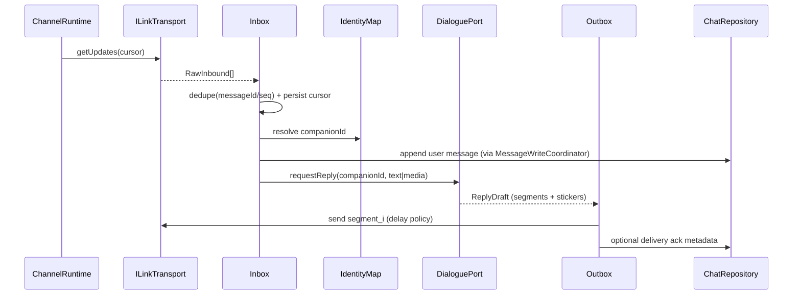
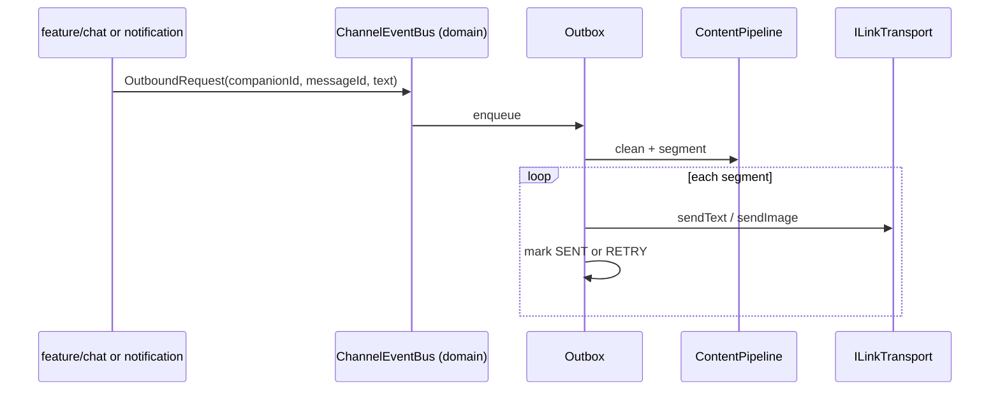

# 微信聊天机器人通道 — 重构架构设计

> 状态：**S0–S10 已落地**（ilink SDK、会话客户端与消息映射归 core；Native 凭证密封完成）  
> 日期：2026-07-25  
> 分支上下文：`security/architecture-upgrade`  
> 约束：feature 互不依赖；业务不进 Native；STREAMING/时间线语义不污染微信通道

### 已锁定决策（2026-07-20）

| # | 议题 | 决定 |
|---|------|------|
| 1 | 模块形态 | **A**：新建 `:core:wechat` + 瘦 `:feature:wechat` |
| 2 | DialoguePort | **app 适配现有 AI**（ServiceRegistry），禁止 feature→feature |
| 3 | 分段 | 与 App 同 **`MessageSegmenter.SplitMode.SIMPLE`** |
| 4 | 切片进度 | **S0–S10** 已落地（ilink SDK、会话客户端与消息映射归 core；凭证密封完成） |
| 5 | Native | **不下沉协议**；仅 `core:security` 的凭证密封使用 Native |

### S0 交付物

| 路径 | 说明 |
|------|------|
| `core/domain/.../wechat/*` | 枚举、App↔微信对齐、领域模型、端口接口、`WeChatChannelArchitecture` 进度常量 |
| `core/wechat/` | 新建模块：Wire 中性模型、`WeChatInboundMapper`、`WeChatLegacyM0Bridge`、`WeChatOutboundSegmenter`（SIMPLE 规则） |
| `core/wechat/src/test/...` | 类型对齐 / 入站映射 / 分段 单测 |
| `settings.gradle.kts` | `include(":core:wechat")` |
| `feature/wechat` | 依赖 `core:domain` + `core:wechat` |

### S1+S2 交付物（Outbox + Inbox 运行时）

| 路径 | 说明 |
|------|------|
| Room v36 | `wechat_outbox` + `wechat_inbox_dedupe`；`MIGRATION_35_36` |
| `WeChatOutboxCoordinator` | SIMPLE 分段入队 + 持久化 drain + 重试退避 |
| `WeChatInboxCoordinator` | insertIgnore 去重 + per-user 串行 Channel（**禁止** activeReplyJobs skip） |
| `WeChatTransportPort` / `SdkWeChatTransport` | core 不依赖 ilink；feature 注入 SDK |
| `M0WireAdapter` | feature M0 → domain 入站 |
| feature 接线 | Repository / Bridge / ProactiveReceiver / PollingService / ServiceLocator |
| `WeChatChannelArchitecture` | 进度常量（当前 S5） |

### S3 交付物（DialoguePort + Bridge 去 AI）

| 路径 | 说明 |
|------|------|
| `app/.../wechat/WeChatDialoguePortImpl.kt` | 安全过滤 / 落库 / AI / 记忆；返回 `WeChatDialogueResult` |
| `YuNianApplication` | `ServiceRegistry.registerSingleton(WeChatDialoguePort)` |
| `WeChatChatBridge` | 仅映射 / CDN / Outbox / 表情；经 DialoguePort 生成回复 |
| `WeChatDialogueResult.assistantMessageId` | 可选助手消息 id，供 Outbox source / 内容回写 |

### S4 交付物（Transport 会话稳定）

| 路径 | 说明 |
|------|------|
| `WeChatSdkClientManager` | contextToken **热更新**内存池；禁无脑 rebuild；鉴权失败才 force；恢复 heartbeat |
| `WeChatChannelRuntime` | 主轮询租约 + 失败指数退避 |
| `WeChatPollingService` | 持有主租约的监督循环 |
| `WeChatPollingWorker` | FGS 存活时跳过 getUpdates，仅 drain Outbox |
| `WeChatChannelArchitecture` | 曾 `SLICE=4`，`transport-session-stability` |

### S5 交付物（映射管理 UI + 可观测性）

| 路径 | 说明 |
|------|------|
| `WeChatIdentityMapPortImpl` + `ServiceRegistry` | 映射 CRUD 端口绑定（复用 TokenStore/MappingManager） |
| `WeChatSettingsScreen` / `WeChatViewModel` | 映射始终可见、空状态、手动添加；通道健康卡片 |
| `WeChatChannelRuntime` / OutboxDao / Coordinator | 健康快照、失败原因码、SecureLog、近期失败查询 |
| `WeChatChannelArchitecture` | 曾 `SLICE=5`，`identity-map-observability` |

### S6 交付物（删除 Broadcast 主路径）

| 路径 | 说明 |
|------|------|
| `WeChatOutboundPortImpl` + `ServiceRegistry` | App→微信出站端口（映射 / 清洗 / Outbox） |
| `WeChatProactiveSync` | domain 侧异步 enqueue 入口，替代 `sendBroadcast` |
| `WeChatContentCleaner` | 出站文本清洗迁入 `core:wechat` |
| chat / groupchat / notification | 调用 `WeChatProactiveSync`，不再发 Intent |
| 删除 | `WeChatProactiveMessageReceiver`、`SWechatProactiveMessageReceiver`、`WeChatBroadcast*`、Manifest `SEND_PROACTIVE` |
| `WeChatChannelArchitecture` | 曾 `SLICE=6`，`outbound-port-no-broadcast` |

### S7 交付物（表情字节 Outbox 化）

| 路径 | 说明 |
|------|------|
| `WeChatStickerMaterializer` | asset/本地表情 → 可读本地路径（cache 落盘或复用文件） |
| `WeChatMessageRepository.enqueueStickerOutbound` | 物化后走 IMAGE Outbox |
| `WeChatChatBridge` | AI 回复表情串行入队 + drain；删除 `loadStickerBytes` 直发 |
| `WeChatOutboundPortImpl` | 纯 `[name]` 表情物化后 `enqueueImageOutbound` |
| `WeChatStickerMaterializerTest` | 本地复用 / cache 写入 / 缺字节失败 |
| `WeChatChannelArchitecture` | `SLICE=7`，`sticker-outbox` |

### S8 交付物（表情缓存生命周期）

| 路径 | 说明 |
|------|------|
| `WeChatOutboxDao.listMediaLocalPaths` | 查询仍由 Outbox 记录引用的媒体路径 |
| `WeChatOutboxCoordinator` | 清理过期记录后，删除超过保护期且无引用的受管缓存文件 |
| `WeChatServiceLocator` | 仅注入 `wechat_outbox_stickers` 目录，限制删除边界 |
| `WeChatOutboxCoordinatorTest` | 被引用文件保留 / 过期无引用删除 / 新文件保留 |
| `WeChatChannelArchitecture` | `SLICE=8`，`sticker-cache-lifecycle` |

### S9a 交付物（ilink 依赖与消息映射归属）

| 路径 | 说明 |
|------|------|
| `core:wechat/build.gradle.kts` | 持有并向适配层暴露 ilink SDK 依赖 |
| `IlinkMessageMapper` | SDK `WeixinMessage` → core `WireWeChatMessage` |
| `WeChatSdkMessageMapper` | feature 仅保留 wire → 旧 `M0` 兼容转换 |
| Mapper tests | core 协议字段测试 + feature 兼容行为测试 |

### S9 交付物（ilink 会话客户端归属）

| 路径 | 说明 |
|------|------|
| `core:wechat/IlinkSessionStore` | 账户、cursor、contextToken 的中性持久化端口 |
| `core:wechat/IlinkClientManager` | 登录、恢复、轮询、发送、CDN 下载、contextToken 热更新与重建 |
| `core:wechat` | 独占 ilink SDK 依赖；SDK 类型不再向 feature 暴露 |
| `feature:wechat` | 仅保留 `WeChatTokenStore` 适配、中性 wire 到 `M0–M7` 兼容转换 |

### S10 交付物（Native 凭证密封）

| 路径 | 说明 |
|------|------|
| `core:security/NativeCredentialSealer` | `lyc1:` 版本化 SM4-GCM 凭证信封；旧的未加前缀值保持可读，以便首次后续写入迁移 |
| `NativeBridge` / `native-bridge.cpp` | JNI `sealCredential` / `unsealCredential`；共享逻辑只接收字节与 AAD，不接触微信协议、JSON 或 SDK |
| `WeChatSecureStore` | Android Keystore `EncryptedSharedPreferences` 外层内存放 native 密封信封；`account_json` 与 `context_tokens_json` 作为各自 AAD，禁止密文跨记录互换 |
| `NativeCredentialSealerTest` | Android 运行时覆盖轮转、错误 AAD、篡改拒绝及旧值兼容 |

S10 已完成；协议、业务和 ilink Client 均继续留在 Kotlin core。密封仅增强持久化数据的防护，SDK 使用凭证时仍会在 JVM 内存中短暂出现明文。

**出站路径**：chat/notification → **WeChatProactiveSync** → OutboundPort → Outbox → Transport  
**入站路径**：poll → M0→domain → Inbox 去重 → per-user 串行 → Bridge → **DialoguePort** → Outbox；SharedFlow 仅 UI 旁路  
**表情路径**：tag / `[name]` → Materializer → IMAGE Outbox → drain → Transport.sendImage  

---

## 0. 结论先行

| 问题 | 判断 |
|------|------|
| 是否「修理不如重构」 | **是**。当前是 God Class + 多入口 + 无可靠投递语义的石山 |
| 是否已用 ilink | **已用** `io.github.lith0924:wechat-ilink-sdk:2.3.3`，不是从零发明协议 |
| 重构目标 | **删除业务石山**，保留/收紧 ilink 适配层，拆成可单测的原子模块 |
| Native 下沉 | **默认不下沉协议与业务**；仅可选下沉「凭证密封 / 完整性」类安全能力 |
| 开工条件 | 本文评审通过后，按切片 0→N 实施；**禁止**在未批准前大面积改代码 |

---

## 1. 现状诊断（基于代码，非猜测）

### 1.1 模块与依赖

```
:feature:wechat
  → core:common, database, network, ui-common
  → wechat-ilink-sdk
  ✗ 未声明 core:domain（却通过 ServiceRegistry / AiServiceProvider 使用 domain）
```

入口分散：

| 入口 | 职责 |
|------|------|
| `WeChatPollingService` (FGS) | 循环 `pollMessages()` |
| `WeChatPollingWorker` | 15min 兜底 |
| `WeChatAiReplyWorker` | 后台 AI 回复（失败回退） |
| ~~`WeChatProactiveMessageReceiver`~~ | **S6 已删**；改 `WeChatOutboundPort` / `WeChatProactiveSync` |
| `WeChatChatBridge` | 映射 + 过滤 + AI + 入库 + 回发 + 表情 + 识图 |
| `WeChatServiceLocator` | 手写单例 DI |

### 1.2 用户症状 ↔ 根因映射

| 症状 | 根因（代码级） |
|------|----------------|
| 微信→App 慢 | 长轮询 + 失败固定 delay；`contextToken` 变更强制 `stale` 重建 client；AI 与收件串在同一路径 |
| App→微信 慢 | 主动同步走 Broadcast + goAsync 9.5s 硬超时；发送前可能 `rebuildFromStoredSession`；无出站队列 |
| 漏消息 | `_incomingMessages` `DROP_OLDEST`；同用户 `activeReplyJobs` **跳过**并发入站；无持久化 inbox / 去重游标语义不完整 |
| 微信端无分词 | App 内 `MessageSegmenter` 只在 `feature/chat` 终态路径；微信出站 **整段 `sendText` 一次** |
| 双路径不一致 | 微信入站自建 AI 管线（非流式、无 turn/timeline）；App 内聊天走另一套 Finalizer + 分段 + 广播 |

### 1.3 石山特征

1. **God Class**：`WeChatChatBridge` 同时承担通道、对话、安全、记忆、媒体  
2. **旁路 AI**：不复用 chat 生成管线 / 分段 / 时间线元数据  
3. **旁路 IPC**：feature 间靠 `WeChatBroadcast` 字符串 Intent，无可靠投递、无重试账本  
4. **会话脆弱**：`heartbeatEnabled=false`；token 更新即整 client 重建  
5. **文档过期**：`docs/wechat-known-issues.md` 仍写「无 FGS」，与现码不符  

### 1.4 已有可保留资产

- ilink SDK 封装骨架：`WeChatSdkClientManager` / `WeChatSdkMessageMapper`  
- 登录 QR / ResumeContext / cursor / contextToken 存储  
- 入站策略雏形：`WeChatIncomingMessagePolicy`  
- 用户映射：`WeChatUserMappingManager`  
- Shell 组件路由：`SWechat*`（安全壳）  
- 通用分段：`core/common` → `MessageSegmenter`  

**重构策略：协议适配可演进保留；业务编排整层替换。**

---

## 2. 目标与非目标

### 2.1 目标

1. **可靠入站**：不丢、可重放、可去重（至少进程内 + 磁盘游标/消息 id）  
2. **可靠出站**：队列化、可重试、支持 **分段发送**（复用 `MessageSegmenter`）  
3. **低耦合**：微信通道 **不内嵌完整 AI 对话实现**；通过 domain 端口调用「对话服务」  
4. **原子模块**：每个模块单职责、可单测、可独立替换 SDK  
5. **与 App 聊天体验对齐**：分段、清洗、表情策略一致（可配置）  
6. **可观测**：结构化日志（SecureLog）、投递状态、失败原因码  

### 2.2 非目标（本重构不做）

- 不做微信官方企业号/公众号全量能力  
- 不把群聊微信同步做成第一优先级（可预留接口）  
- 不把 REASONING/时间线语义塞进微信协议层  
- 不在 Native 重写 HTTP/ilink  
- 不修改仓库锁定的 JDK/Gradle/镜像配置  

---

## 3. 目标架构

### 3.1 分层（严格依赖方向）

```
:app
  └─ :feature:wechat          # UI + Android 运行时绑定（FGS/Receiver 壳）
        └─ :core:wechat        # 新建：通道领域实现（无 Compose）
              ├─ :core:domain  # 端口：WeChatChannel / DialogueGateway / Mapping
              ├─ :core:database
              ├─ :core:common
              └─ wechat-ilink-sdk（仅 core:wechat 可见）

:feature:chat / :feature:notification
  └─ 只依赖 domain 端口或 common 事件契约
  ✗ 禁止依赖 :feature:wechat
  ✗ 禁止再靠隐式 Broadcast 作为唯一投递（可保留兼容一层）
```

> 若希望更少模块：可先在 `feature/wechat` 内按 package 原子化，**接口仍上提到 `core:domain`**。  
> **推荐最终形态**：`:core:wechat` + 瘦 `:feature:wechat`，与 chat/localmodel 一致。

### 3.2 原子模块（逻辑边界）

| 模块 ID | 名称 | 职责 | 禁止做的事 |
|---------|------|------|------------|
| **W0** | `WeChatSession` | 登录/登出、ResumeContext、凭证读写 | 消息业务、AI |
| **W1** | `ILinkTransport` | SDK 适配：getUpdates / sendText / sendImage / downloadMedia | 策略、DB、UI |
| **W2** | `Inbox` | 入站规范化、去重、持久游标、有序投递 | 调 AI、发微信 |
| **W3** | `Outbox` | 出站队列、分段、重试、背压、投递状态 | 收消息、AI |
| **W4** | `IdentityMap` | wechatUserId ↔ companionId 映射 CRUD | 协议、AI |
| **W5** | `ContentPipeline` | 清洗 / 表情剥离 / 分段（委托 MessageSegmenter） | 网络、SDK |
| **W6** | `DialoguePort` | 调用 domain「生成回复」端口（实现可在 app 绑定到 chat 能力） | 直接 new AiService |
| **W7** | `ChannelRuntime` | FGS 监督循环、退避、健康检查、与 WorkManager 兜底 | UI |
| **W8** | `WeChatUi` | 绑定页、设置、映射管理 | 协议细节 |

### 3.3 核心数据流

#### A. 微信 → 予念（入站）



要点：

- **收件与 AI 解耦**：Inbox 先落库/入队，再异步请求 Dialogue  
- **同用户并发**：队列串行处理，**禁止**「已有 job 则丢弃」  
- **去重键**：优先 `message_id`，次选 `(fromUserId, seq, create_time_ms, contentHash)`  

#### B. 予念 → 微信（出站 / 主动同步）



要点：

- 用 **domain 级事件总线 / 端口** 替代「唯一依赖 Broadcast」  
- 过渡期可保留 Broadcast → Outbox 适配器  
- **分段**：`MessageSegmenter.split(text, SIMPLE)` + 段间延迟（可配置，默认 300–800ms）  
- Outbox **持久化**（Room 表或 DataStore 队列），进程杀不死即丢  

### 3.4 domain 端口（S0 已落文件）

实现位置：`core/domain/src/main/java/com/yunian/ai/domain/wechat/`

| 文件 | 内容 |
|------|------|
| `WeChatPorts.kt` | `WeChatChannelGateway` / `WeChatOutboundPort` / `WeChatDialoguePort` / `WeChatIdentityMapPort` |
| `WeChatModels.kt` | `WeChatInboundMessage` / `WeChatOutboundRequest` / `WeChatOutboundSegment` / Dialogue 请求结果等 |
| `WeChatEnums.kt` | `WeChatContentKind`（wire 1–5）/ `AppContentType` / 投递与连接状态 |
| `WeChatAppTypeAlignment.kt` | App↔微信双向映射；REASONING 不同步；AI 仅 TEXT/IMAGE |
| `WeChatChannelArchitecture.kt` | `SLICE=0` 与锁定常量 |

映射实现：`core/wechat/.../map/*`（Wire / Legacy M0 字段桥 / SIMPLE 分段）。

绑定位置（**S3 已完成**）：`YuNianApplication` / `ServiceRegistry` → `WeChatDialoguePortImpl`；Bridge 经 `ServiceRegistry.get(WeChatDialoguePort)` 调用。

### 3.5 持久化草案

| 表/存储 | 用途 |
|---------|------|
| 现有 TokenStore（演进） | 账号、cursor、contextToken、开关 |
| `wechat_inbox_dedupe` | 已处理 messageId / hash，TTL 7d |
| `wechat_outbox` | 待发送段：status=PENDING/SENDING/SENT/FAILED，retryCount，nextAttemptAt |
| `wechat_user_map` | 显式映射表（可从 DataStore JSON 迁出） |

不把微信协议 payload 当聊天主模型；聊天仍走 `ChatMessage` / MessageWriteCoordinator。

### 3.6 运行时与保活

```
ChannelRuntime (FGS, dataSync)
  ├─ Transport loop: getUpdates → Inbox
  ├─ Outbox worker: drain queue
  └─ Health: consecutive failures → exponential backoff (cap)
WorkManager (15min)
  └─ 仅当 FGS 死亡 / 未登录跳过 / 进程被杀后的唤醒
BootReceiver
  └─ 已登录则拉起 FGS + 调度 Worker
```

规则：

- **单一监督循环**，禁止 Service / Worker / Bridge 三处各自 `getUpdates` 无协调  
- Transport 层 **串行化** SDK 调用（单 Mutex 会话），避免边收边重建 client  
- `contextToken` 更新：**热更新 ConversationContext**，禁止无脑 full rebuild（除非 SDK 强制）  

### 3.7 与 chat 模块的边界（关键）

| 能力 | 归属 |
|------|------|
| 分段文案 | `core:common` MessageSegmenter（已有） |
| 入库 / 加密 | `core:database` MessageWriteCoordinator |
| AI 生成、工具循环、时间线 | **不在 wechat 内复制**；经 `WeChatDialoguePort` |
| 微信协议、cursor、CDN | `core:wechat` |
| UI 绑定/设置 | `feature:wechat` |

微信通道 **默认非流式出站**（ilink 文本一次一段）；App 内流式 UI 与微信无关。

---

## 4. 删除 / 替换清单（石山拆除）

| 现状 | 处置 |
|------|------|
| `WeChatChatBridge` God Class | **删除**；逻辑拆入 Inbox/Outbox/DialoguePort/ContentPipeline |
| `WeChatProactiveMessageReceiver` 作为唯一出站 | **S6 已删**；`WeChatOutboundPort` → Outbox |
| `activeReplyJobs` 跳过策略 | **删除**；改为 per-user 串行队列 |
| `SharedFlow DROP_OLDEST` 当主通道 | **删除主路径依赖**；仅可选 UI 通知 |
| 微信内嵌 `aiServiceProvider.sendMessage` | **删除**；走 DialoguePort |
| 重复 `cleanAiContentForWechat` 与 chat 清洗 | **合并**到 ContentPipeline |
| `WeChatServiceLocator` 膨胀 | 收敛为 Runtime 工厂或 ServiceRegistry |
| 过期 `wechat-known-issues.md` | 重构后重写为「已关闭问题」 |

保留并收紧：

- `WeChatSdkClientManager` → 变为 `ILinkTransport` 实现（去业务）  
- `WeChatTokenStore` / SecureStore → Session  
- Shell `SWechat*` 路由  

---

## 5. Native 下沉收益评估

### 5.1 候选与收益

| 候选 | 收益 | 成本/风险 | 建议 |
|------|------|-----------|------|
| ilink HTTP/长轮询进 Native | 几乎无延迟收益；调试困难 | NDK 维护、崩溃面、与 SDK 重复 | **不做** |
| 出站/入站队列进 Native | 无实质收益 | 与 Room/WorkManager 双源 | **不做** |
| botToken / contextToken 密封存储 | 提升凭证抗抽取 | 与现有 security 密钥体系对接 | **已完成（S10）** |
| 证书钉扎 / 请求完整性 | 安全增强 | 已有 network 拦截器模式 | 优先 Kotlin 层复用 |
| 保活/防杀 | Native **不能**绕过 Android 后台限制 | 误导投入 | **不做**；靠 FGS+Worker |

### 5.2 结论

> **微信通道重构的主收益在架构与投递语义，不在 Native。**  
> 协议与业务 **100% 留在 Kotlin**；Native 仅在安全切片需要时密封凭证，且通过 `core:security` 既有通道，**禁止**新建 `wechat.cpp` 业务库。

与 Timeline 硬约束一致：**时间线/通道语义不下沉 Native**。

---

## 6. 切片实施计划

| 切片 | 内容 | 状态 / 验收 |
|------|------|-------------|
| **S0** | 双端类型对齐：domain 契约 + core:wechat 映射 + 单测；不改运行时 | **已完成**；产品行为不变 |
| **S1** | Outbox 表 + 分段发送接入主动同步 | **已完成**；SIMPLE 分段 + 持久化 drain |
| **S2** | Inbox 去重 + 串行 per-user + 去掉 DROP/跳过 | **已完成**；insertIgnore + per-user Channel |
| **S3** | 拆除 Bridge AI；DialoguePort 绑定 | **已完成**；`WeChatDialoguePortImpl` + Bridge 去 AI |
| **S4** | Transport 会话稳定（禁无脑 rebuild、统一监督循环） | **已完成**；热更新 + 主租约 + 退避 |
| **S5** | 映射管理 UI + 可观测性 | **已完成**；IdentityMapPort + 健康快照 + 设置页 |
| **S6** | 删除兼容层 Broadcast 主路径；更新文档/测试 | **已完成**；OutboundPort + ProactiveSync |
| **S7** | 表情物化本地路径后入 Outbox（可重试） | **已完成**；Materializer + Bridge/Outbound 入队 |
| **S8** | Outbox 引用感知的表情缓存清理 | **已完成**；仅清理无引用、过期的受管文件 |
| **S9** | ilink SDK、消息映射和会话客户端迁入 core | **已完成**；feature 仅保留存储适配和旧模型兼容 |
| **S10** | 凭证 native 密封 | **已完成**；Keystore 外层 + `lyc1:` SM4-GCM 内层，AAD 绑定逻辑记录名 |

后续切片需另行评审。

---

## 7. 风险与决策点

### 7.1 已拍板

见文首「已锁定决策」。

### 7.2 仍待后续切片拍板

1. **主动同步可靠性**  
   - Outbox 持久化是否必须 Room？（推荐是）  
   - 失败是否通知用户？

2. **媒体**  
   - S1 是否含图片入站/出站，还是文本优先？

3. **段间延迟**  
   - 默认 300–800ms 是否可接受？

4. **Native 凭证密封**  
   - 与 security 切片并行时机？

---

## 8. 成功指标（可测）

| 指标 | 现状（定性） | 目标 |
|------|--------------|------|
| 入站端到端（微信发→App 可见） | 秒级～分钟级不稳 | P95 < 3s（网络正常、FGS 存活） |
| 出站端到端（App 发→微信可见） | 广播超时/整段 | P95 < 3s + 分段到达 |
| 漏消息率（同用户连发 20 条） | 存在跳过/丢缓冲 | 0 漏（允许乱序校正） |
| 微信侧气泡数 | 常 1 整段 | 与 App 分段策略一致 |
| feature 依赖 | wechat 隐式用 domain | 显式 domain；无 feature→feature |

---

## 9. 评审检查表

- [x] 同意「删除 Bridge 石山、原子模块」方向  
- [x] 模块形态 **A**（`:core:wechat`）  
- [x] DialoguePort：**app 适配现有 AI**  
- [x] 分段：**SIMPLE**；本轮范围：**类型对齐**  
- [x] Native：**不下沉协议**  
- [x] S0 已完成  
- [ ] 批准 **S1+S2**（或你指定下一切片）后再写运行时

---

## 附录 A — 当前关键文件索引

- `feature/wechat/.../WeChatChatBridge.kt` — 石山主体  
- `feature/wechat/.../WeChatMessageRepository.kt` — 收件+策略+触发回复  
- `feature/wechat/.../WeChatSdkClientManager.kt` — ilink 会话  
- `feature/wechat/.../WeChatPollingService.kt` — FGS  
- ~~`feature/wechat/.../WeChatProactiveMessageReceiver.kt`~~ — **S6 已删**  
- `core/common/.../MessageSegmenter.kt` — 分段（微信未用）  
- ~~`core/common/.../wechat/WeChatBroadcast*.kt`~~ — **S6 已删**；改 `WeChatProactiveSync`  
- `gradle/libs.versions.toml` — `wechatIlinkSdk = 2.3.3`  

## 附录 B — 与 Timeline 架构的关系

- 微信通道是 **外部 Channel**，不是 TimelineEvent 传输层  
- 入站落库的用户/助手消息可带 `turnId`（可选，S3+），但 **STREAMING 不进微信、不进 Room 微信表**  
- REASONING **默认不同步到微信**
